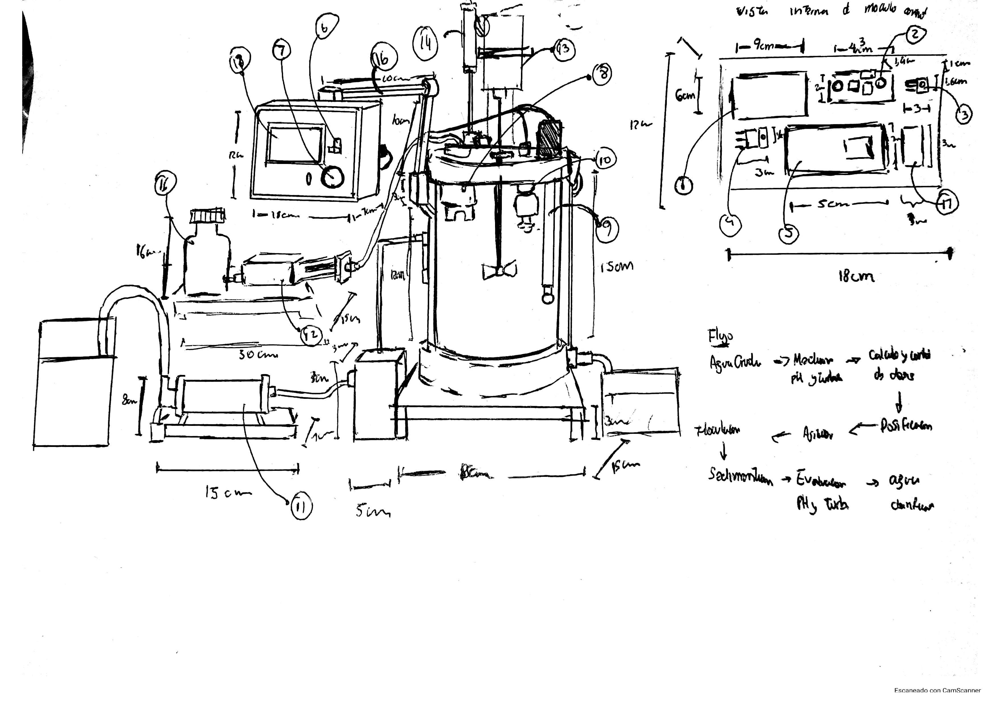
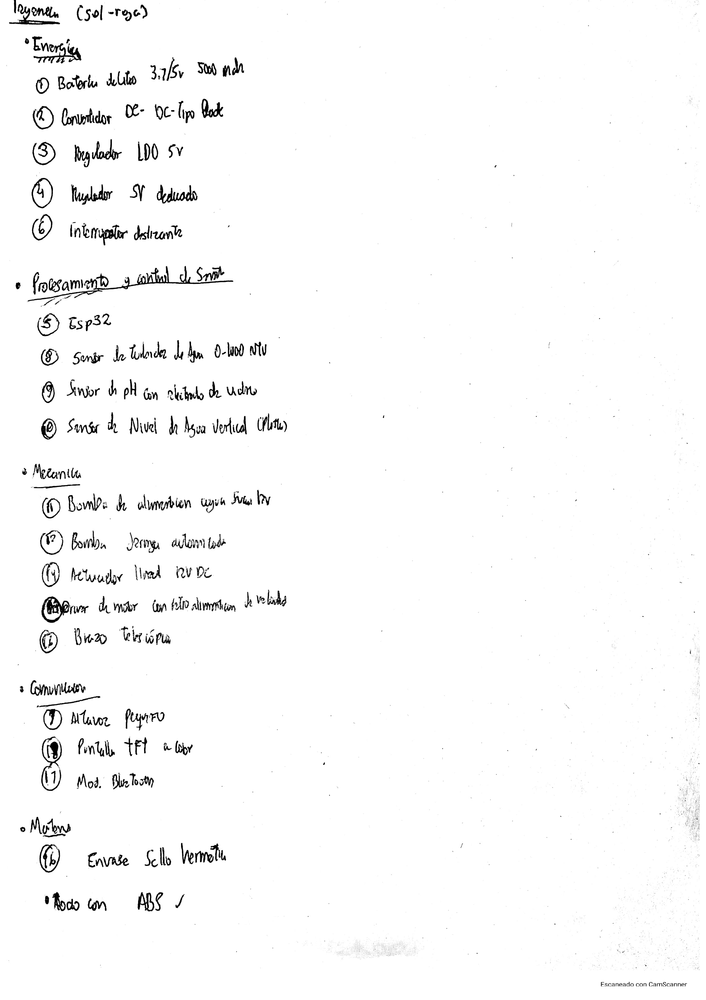
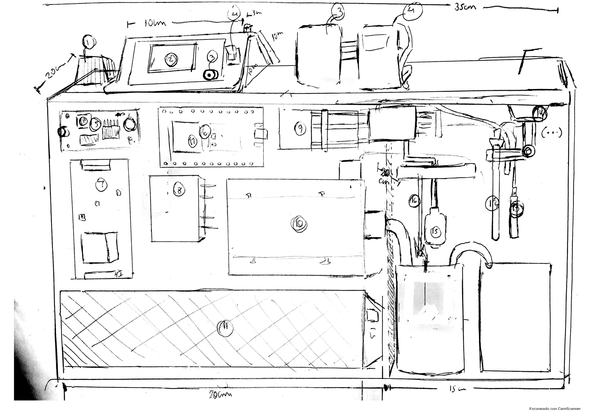
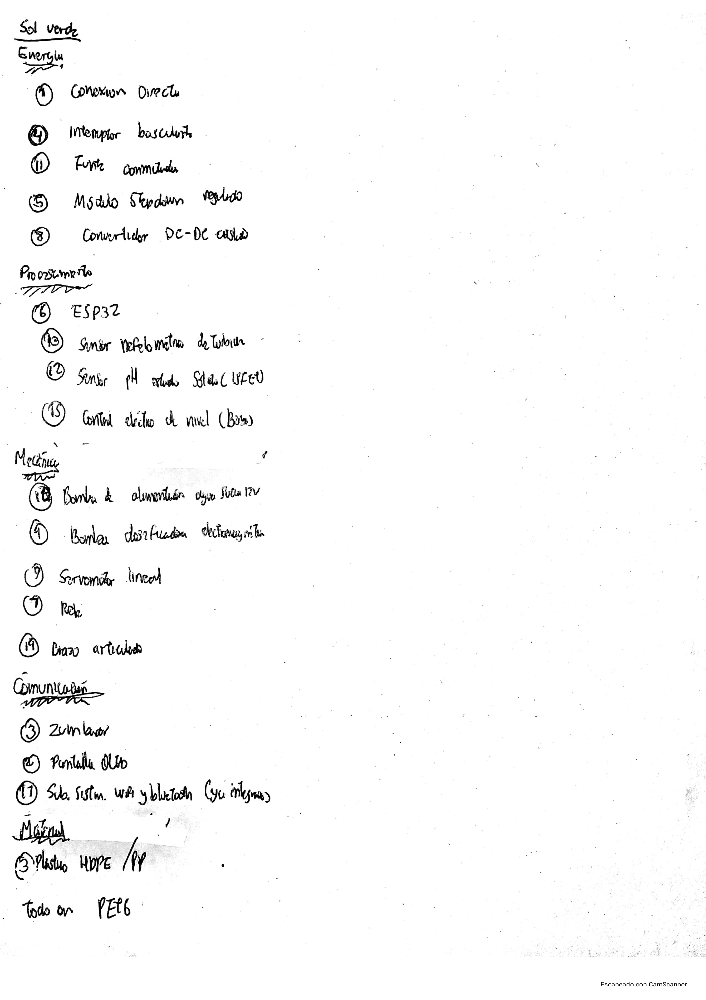
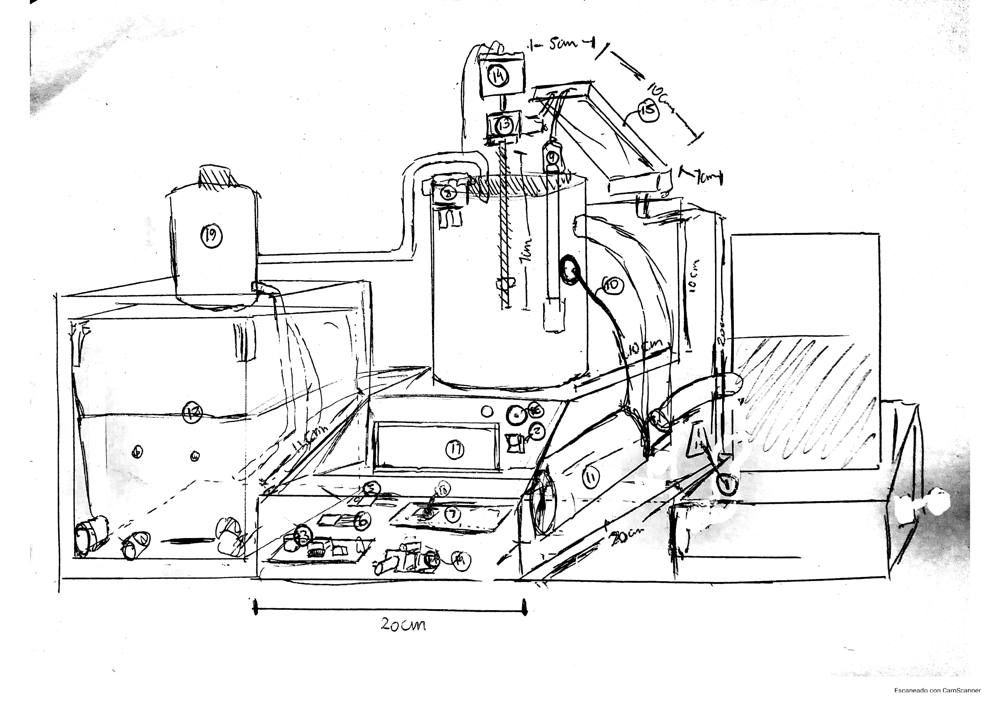
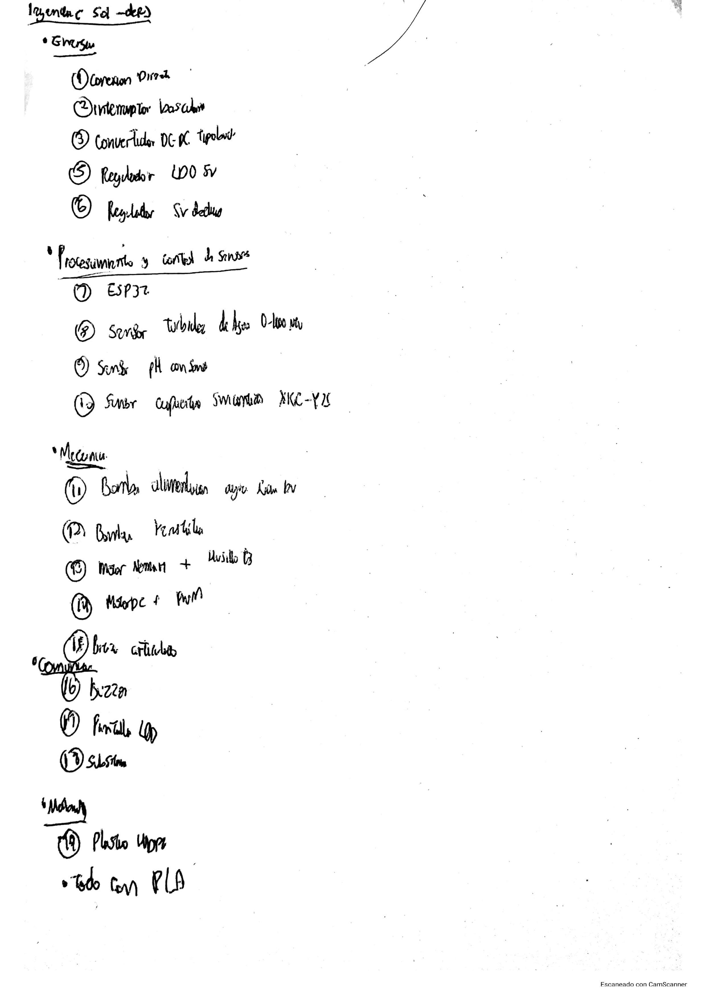
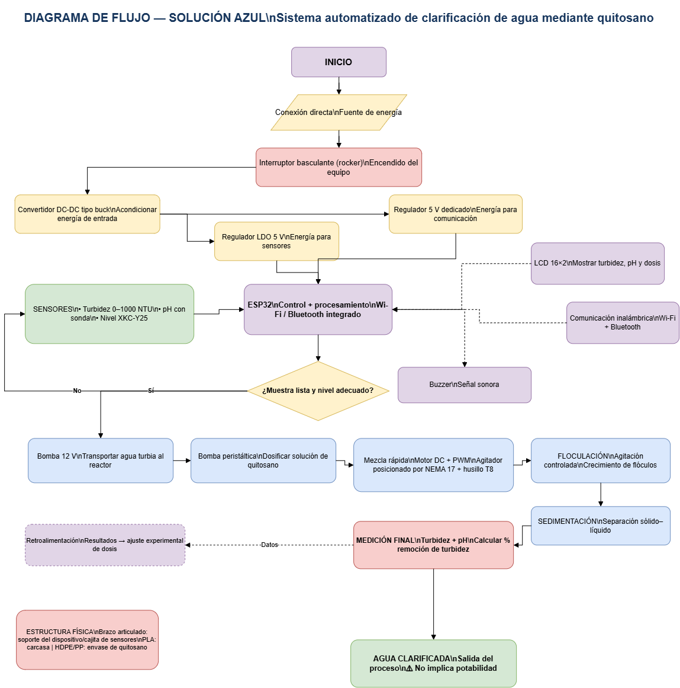

# Bocetos y Diagrama de Flujo

Esta sección contiene la documentación gráfica de las **tres alternativas de solución** desarrolladas durante el proceso de diseño del Proyecto Integrador. Las propuestas fueron representadas mediante bocetos conceptuales y listas de componentes, permitiendo comparar sus características y seleccionar la alternativa más adecuada.

Las alternativas desarrolladas son:

1. **Solución Roja**
2. **Solución Verde**
3. **Solución Azul**

A partir de la evaluación de las alternativas, la **Solución Azul** fue seleccionada como propuesta final. Por ello, esta sección también incluye su diagrama de flujo de funcionamiento en formato editable y como imagen de referencia.

---

## 🔴 Solución Roja

La **Solución Roja** corresponde a la primera alternativa conceptual desarrollada.

El boceto permite visualizar la configuración general propuesta y la distribución de sus principales componentes.

### Boceto



### Lista de componentes



---

## 🟢 Solución Verde

La **Solución Verde** corresponde a la segunda alternativa conceptual desarrollada.

Esta propuesta presenta una configuración diferente respecto a la Solución Roja, permitiendo evaluar otra forma de integrar los componentes necesarios para el funcionamiento del sistema.

### Boceto



### Lista de componentes



---

## 🔵 Solución Azul

La **Solución Azul** corresponde a la tercera alternativa desarrollada y fue seleccionada como la **solución final** del proceso de diseño.

El boceto representa la configuración física propuesta, mientras que la lista complementaria identifica los principales componentes considerados en esta alternativa.

### Boceto



### Lista de componentes



---

# 🔄 Diagrama de flujo – Solución Azul

Una vez seleccionada la **Solución Azul**, se elaboró un diagrama de flujo para representar de manera secuencial su funcionamiento.

El diagrama permite visualizar la lógica general de operación de la solución, mostrando las principales etapas y decisiones involucradas en el proceso.

## Archivo editable

El diagrama se encuentra disponible en formato `.drawio`, permitiendo modificar posteriormente sus elementos mediante Draw.io.

**Archivo:** `Diagrama_Flujo_Solucion_Azul.drawio`

## Vista previa

También se incluye una versión en formato `.png` para facilitar su visualización directamente desde el repositorio.



---

# 📊 Resumen de las alternativas

| Alternativa       | Representación | Lista de componentes | Estado                    |
| ----------------- | -------------- | -------------------- | ------------------------- |
| 🔴 Solución Roja  | `Boceto1.jpg`  | `Boceto1_lista.jpg`  | Alternativa conceptual    |
| 🟢 Solución Verde | `Boceto2.jpg`  | `Boceto2_lista.jpg`  | Alternativa conceptual    |
| 🔵 Solución Azul  | `Boceto3.jpg`  | `Boceto3_lista.jpg`  | **Solución seleccionada** |

---

# 📁 Archivos de la sección

```text
├── Boceto1.jpg
├── Boceto1_lista.jpg
├── Boceto2.jpg
├── Boceto2_lista.jpg
├── Boceto3.jpg
├── Boceto3_lista.jpg
├── Diagrama_Flujo_Solucion_Azul.drawio
├── Diagrama_Flujo_Solucion_Azul.drawio.png
└── README.md
```

---

## 🎯 Propósito de esta sección

Esta carpeta reúne la evidencia gráfica del **proceso de generación y selección de alternativas de diseño**.

Los tres primeros conjuntos de archivos corresponden a las alternativas **Roja, Verde y Azul**, respectivamente. La documentación permite visualizar las diferencias entre las propuestas y los componentes considerados en cada una.

Finalmente, se presenta el **diagrama de flujo de la Solución Azul**, correspondiente a la alternativa seleccionada para continuar con el desarrollo del Proyecto Integrador.

La información relacionada con el **problema, objetivos, alcance, funcionamiento general y fundamentos del proyecto** se encuentra en el `README.md` principal del repositorio.
