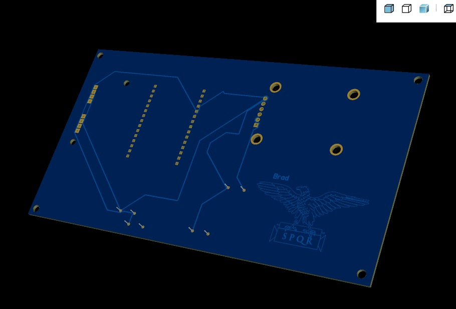

# Actividad de Brad Cárdenas

Se realizó el esquemático del **ESP32 junto con el sensor de pH PH-4502C y el sensor de turbidez**, mostrando sus conexiones de alimentación, tierra y señales.

### Esquema:

### PCB:

### 3D:
#### Frontal:

#### Desde atrás:

### ARCHIVO ZIP:
En este link se podrá visualizar la carpeta Zip: [Gerber_PCB1_2026-09-02_Brad.zip](https://github.com/BeyondNate/PI_Equipo_05/blob/main/Proyecto_Integrador/Talleres/Semana03-EasyEDA/Brad_Cardenas_EasyEDA/Gerber_PCB6_2026-09-02.zip)

### PDF EasyEDA:
[EsquematicoBrad2.pdf](https://github.com/BeyondNate/PI_Equipo_05/blob/main/Proyecto_Integrador/Talleres/Semana03-EasyEDA/Brad_Cardenas_EasyEDA/EsquematicoBrad2.pdf)
