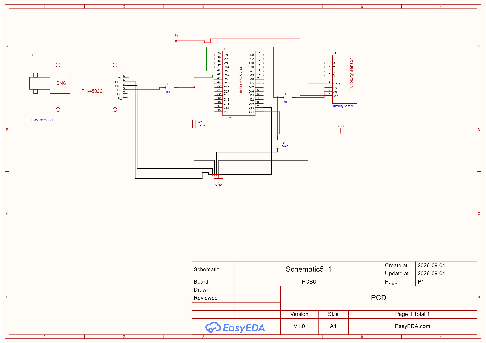
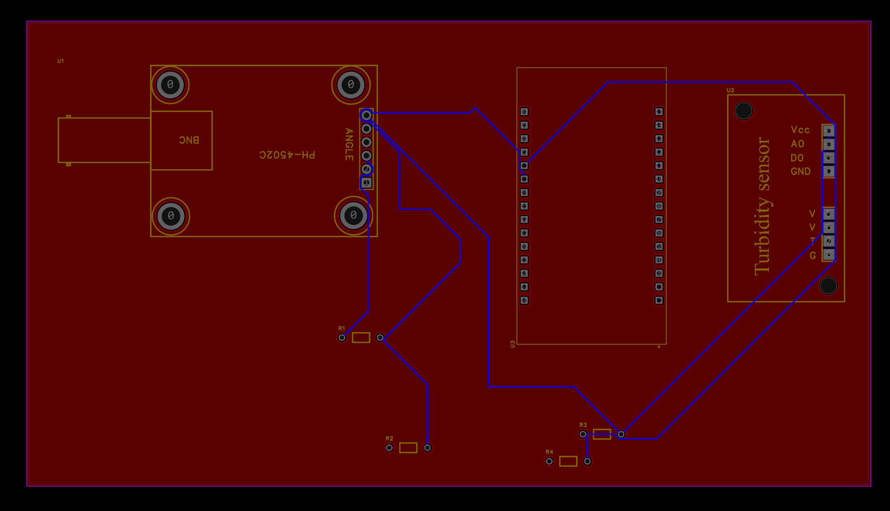
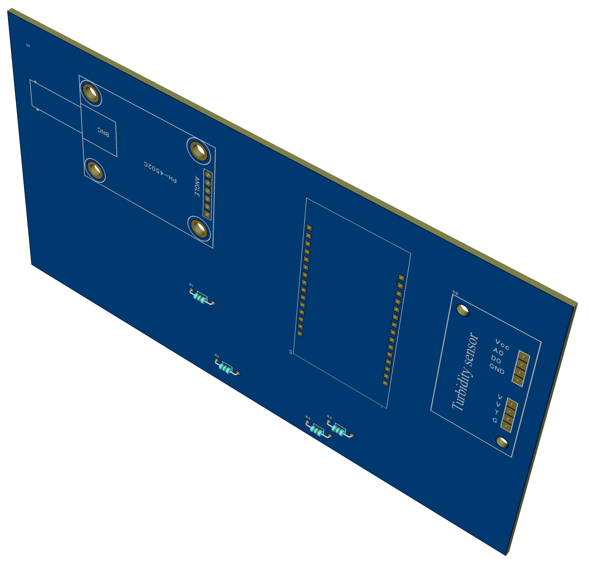

# Actividad de Brad Cárdenas

Se realizó el esquemático del **ESP32 junto con el sensor de pH PH-4502C y el sensor de turbidez**, mostrando sus conexiones de alimentación, tierra y señales.

### Esquema:

### PCB:

### 3D:

