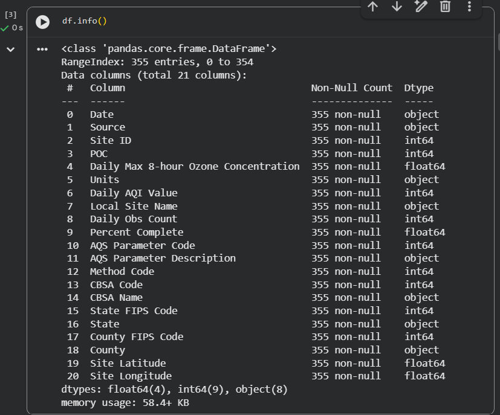

# Informe: Análisis mediante Regresión Lineal

## 1. Metodología

### 1.1. Exploración del conjunto de datos

Se utilizó un conjunto de datos relacionado con la calidad del aire, que contiene **355 registros y 21 variables**. Entre las variables disponibles se encuentran la concentración máxima de ozono en 8 horas, el valor diario del AQI, cantidad de observaciones, porcentaje de datos completos y diferentes datos relacionados con la ubicación de la estación de medición.
Para conocer la estructura de los datos se utilizaron funciones básicas de `pandas`, principalmente `head()`, `info()` y `describe()`.

```python
df.head()
df.info()
df.describe().round(1)
```

La función `head()` permitió observar los primeros registros, mientras que `info()` permitió identificar la cantidad de registros, variables y tipos de datos. Finalmente, `describe()` permitió obtener estadísticas descriptivas como promedio, desviación estándar, valores mínimos y máximos.

**Imagen 1 – Exploración inicial del conjunto de datos**



*Figura 1. Primeros registros del conjunto de datos.*

---

### 1.2. Análisis exploratorio y correlación

Se realizó un análisis exploratorio para observar visualmente las relaciones entre las variables. Para ello se utilizó `pairplot()` de la biblioteca `seaborn`.

```python
sns.pairplot(df)
```

Este gráfico permite observar mediante diagramas de dispersión la relación entre las diferentes variables numéricas del conjunto de datos.

**Imagen 2 – Relaciones entre variables**


*Figura 2. Relaciones entre las variables del conjunto de datos.*

También se realizó un análisis de correlación con el objetivo de identificar relaciones lineales entre las variables y determinar cuáles podrían ser utilizadas para el modelo de regresión.

**Imagen 3 – Matriz de correlación**


*Figura 3. Matriz de correlación de las variables analizadas.*

---

### 1.3. Preparación de los datos

Para construir el modelo se separaron las variables independientes, representadas por **X**, y la variable objetivo, representada por **y**.

Posteriormente, los datos fueron divididos en:

* **70 % para entrenamiento**, utilizado para ajustar el modelo.
* **30 % para prueba**, utilizado para evaluar las predicciones.

## La división se realizó mediante `train_test_split()` utilizando `random_state=123` para mantener la reproducibilidad de los resultados.

### 1.4. Regresión lineal

Se utilizó `LinearRegression()` para construir el modelo de regresión lineal.

```python
lm = LinearRegression()
lm.fit(x_train, y_train)
```

El modelo permite estimar una relación lineal entre las variables de entrada y la variable objetivo. Después del entrenamiento se obtuvieron la intersección y los coeficientes del modelo mediante:

```python
print(lm.intercept_)
print(lm.coef_)
```

## Los coeficientes permiten observar la dirección de la relación entre cada variable independiente y la variable objetivo.

### 1.5. Evaluación del modelo

Después de entrenar el modelo se realizaron predicciones utilizando los datos de prueba:

```python
predictions = lm.predict(x_test)
```

Los valores reales y predichos fueron comparados mediante un gráfico de dispersión. Esto permite observar qué tan cercanas se encuentran las predicciones respecto a los valores reales.

**Imagen 4 – Valores reales vs. valores predichos**


*Figura 4. Comparación entre los valores reales y los valores predichos por el modelo.*

También se analizaron los residuos, definidos como la diferencia entre el valor real y el valor predicho. El análisis de residuos permite identificar posibles patrones en los errores del modelo.
**Imagen 5 – Análisis de residuos**


*Figura 5. Distribución de los residuos obtenidos por el modelo.*

---

### 1.6. Análisis complementario con datos artificiales

Como complemento del análisis, se generó un conjunto de datos artificiales utilizando `make_regression()`.

Se utilizaron **100 muestras, 6 características y 3 características informativas**, además de un nivel de ruido y una semilla aleatoria para mantener la reproducibilidad.

```python
x, y, coef = make_regression(
    n_samples=100,
    n_features=6,
    n_informative=3,
    random_state=20,
    shuffle=False,
    noise=20,
    coef=True
)
```

---

### 1.7. Árbol de decisión

Sobre los datos artificiales también se utilizó un `DecisionTreeRegressor` con una profundidad máxima de 5.

```python
tree_model = tree.DecisionTreeRegressor(
    max_depth=5,
    random_state=10
)
```

El modelo realizó predicciones sobre los datos de prueba y se calculó el **error cuadrático medio (MSE)**. Además, se obtuvo la importancia relativa de las características utilizadas por el árbol.
**Imagen 6 – Importancia de las características**


*Figura 6. Importancia relativa de las características en el árbol de decisión.*

---

### 1.8. Mínimos cuadrados

Finalmente, se utilizó `statsmodels` para ajustar un modelo mediante el método de mínimos cuadrados ordinarios (OLS).

```python
Xs = sm.add_constant(X)
stat_model = sm.OLS(y, Xs)
stat_result = stat_model.fit()
print(stat_result.summary())
```

El resumen generado permite observar los coeficientes y diferentes medidas estadísticas relacionadas con el modelo.

---

## 2. Resultados

La exploración inicial permitió identificar un conjunto de **355 registros y 21 columnas**. La información disponible corresponde principalmente a mediciones de ozono y datos asociados a una estación de calidad del aire.

Las estadísticas descriptivas mostraron que la concentración máxima diaria de ozono en 8 horas presenta valores entre aproximadamente **0.0 y 0.1 ppm**, mientras que el valor diario del AQI presenta valores entre **8 y 67**.

A partir del análisis exploratorio se pudieron visualizar las relaciones entre las variables mediante `pairplot()` y el análisis de correlación.

El modelo de regresión lineal fue entrenado utilizando el 70 % de los datos y posteriormente evaluado con el 30 % restante. Se obtuvieron los coeficientes del modelo y se realizaron predicciones sobre los datos de prueba.

La comparación entre valores reales y predichos permitió evaluar visualmente el comportamiento del modelo, mientras que el análisis de residuos permitió observar la distribución de los errores.

Como análisis complementario, los datos artificiales permitieron estudiar el comportamiento de un árbol de decisión. Este modelo generó predicciones y permitió calcular el MSE, además de identificar la importancia relativa de las características.

---

## 3. Discusión

El análisis permitió aplicar diferentes etapas de un proceso de regresión: exploración de datos, análisis de relaciones, preparación de variables, entrenamiento, predicción y evaluación.

El uso de gráficos facilitó la interpretación de los datos y permitió observar visualmente las relaciones entre las variables. Asimismo, el análisis de residuos permitió complementar la evaluación del modelo, ya que no solamente se consideraron las predicciones, sino también los errores obtenidos.

El uso de datos artificiales permitió realizar una segunda prueba controlada y observar cómo un árbol de decisión puede identificar características importantes para realizar sus predicciones.

---

## 4. Conclusiones

* Se realizó una exploración inicial del conjunto de datos utilizando `head()`, `info()` y `describe()`.
* Se analizaron las relaciones entre las variables mediante gráficos y correlación.
* Se construyó un modelo de regresión lineal utilizando una división de 70 % para entrenamiento y 30 % para prueba.
* Se obtuvieron los coeficientes del modelo y se realizaron predicciones sobre los datos de prueba.
* El análisis de residuos permitió complementar la evaluación del modelo.
* Se generaron datos artificiales mediante `make_regression()` para realizar un análisis adicional.
* Se utilizó un árbol de decisión para obtener predicciones, calcular el MSE y analizar la importancia de las características.
* Finalmente, se utilizó el método de mínimos cuadrados mediante `statsmodels` como complemento del análisis.

---

## 5. Referencias

[1] G. Milla, *Regresion_lineal_2_Gael_Milla*, Jupyter Notebook, 2026.
