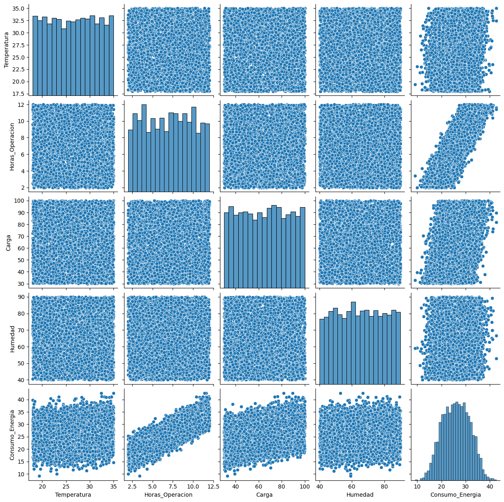
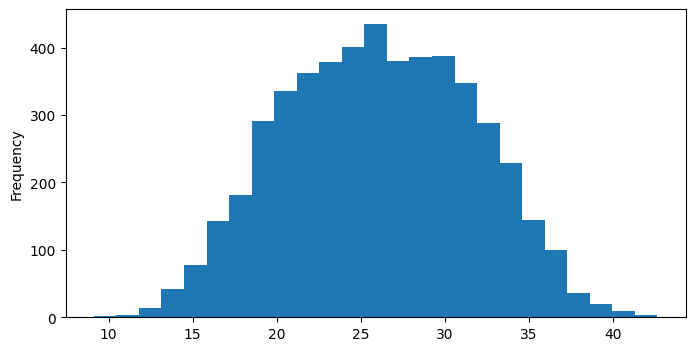
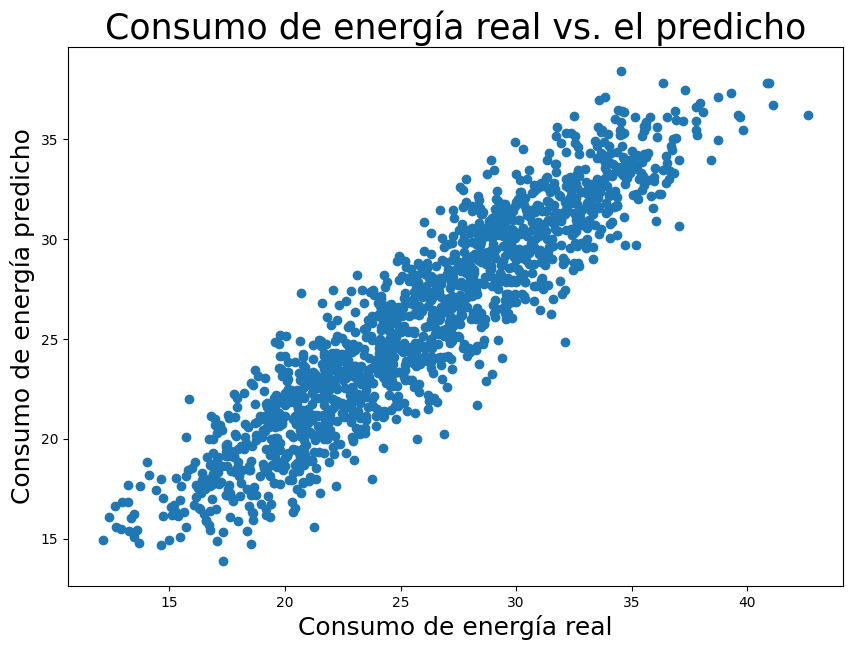
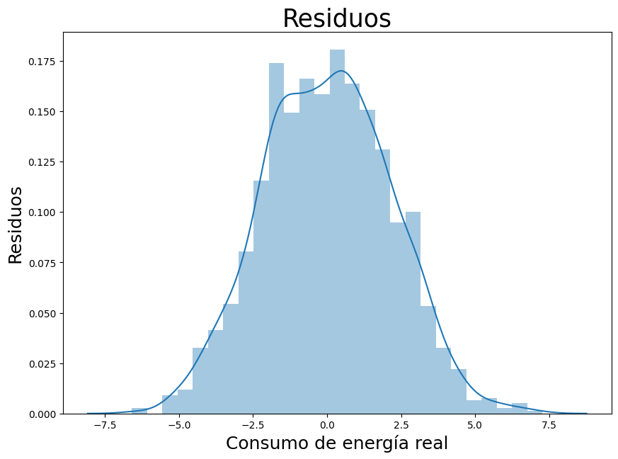

# 📊 Análisis de Regresión Lineal

## 📌 Descripción

En este proyecto se desarrolla un análisis de **regresión lineal** utilizando un conjunto de datos relacionado con el **consumo de energía**.

El trabajo incluye el análisis exploratorio de los datos, estudio de correlaciones, construcción de un modelo de regresión lineal y evaluación de sus predicciones mediante errores y residuos.

Además, se realiza un análisis complementario utilizando datos artificiales, un **árbol de decisión** y el método de **mínimos cuadrados**.

---

## 🎯 1. Objetivo

El objetivo principal es analizar la relación entre diferentes variables y el **consumo de energía**, utilizando técnicas de regresión para construir un modelo capaz de realizar predicciones.

Durante el desarrollo se busca:

* Explorar y comprender el conjunto de datos.
* Identificar relaciones entre las variables.
* Determinar qué variables presentan mayor relación con el consumo.
* Entrenar un modelo de regresión lineal.
* Evaluar las predicciones obtenidas.
* Analizar los residuos del modelo.
* Complementar el análisis con otros métodos de regresión.

---

## 📊 2. Exploración y análisis de datos

Primero se realiza una exploración inicial del conjunto de datos mediante:

* Visualización de los primeros registros.
* Información general de las variables.
* Estadísticas descriptivas.
* Gráficos de distribución.
* Gráficos de dispersión entre variables.

Esto permite conocer la estructura de los datos antes de aplicar el modelo.

### 🔎 Visualización de los datos

Aquí se pueden observar las relaciones y distribuciones de las variables:

<p align="center">
  
</p>

> **Figura 1.** Relaciones entre las variables del conjunto de datos.

### 📈 Distribución del consumo de energía

<p align="center">
  
</p>

> **Figura 2.** Distribución de la variable `Consumo_Energia`.

---

## 🔗 3. Análisis de correlación

Se calcula la correlación entre las variables numéricas para identificar cuáles presentan una relación más fuerte con el **consumo de energía**.

### 🔥 Matriz de correlación

<p align="center">
  
</p>

> **Figura 3.** Matriz de correlación de las variables.

A partir del análisis realizado en el notebook, se observa que:

* **Horas de operación** presenta una relación lineal positiva fuerte con el consumo de energía.
* **Carga** presenta una relación positiva, aunque menor.
* **Temperatura** presenta una relación débil.
* **Humedad** presenta una relación débil.

Por ello, las **horas de operación** destacan como una de las variables con mayor relación lineal con el consumo de energía.

---

## 🤖 4. Regresión lineal

Para realizar las predicciones se construye un modelo de **Regresión Lineal**.

Las variables se dividen en:

* **X:** características o variables independientes utilizadas como entrada.
* **y:** variable objetivo correspondiente al `Consumo_Energia`.

Los datos se dividen en:

| Conjunto         | Proporción | Uso               |
| ---------------- | ---------: | ----------------- |
| 🟦 Entrenamiento |       70 % | Ajustar el modelo |
| 🟩 Prueba        |       30 % | Evaluar el modelo |

Se utiliza `random_state=123` para mantener reproducible la división de los datos.

### ⚙️ Entrenamiento

El modelo se ajusta utilizando los datos de entrenamiento para obtener los coeficientes de la regresión.

De manera general, el modelo busca representar el consumo mediante una combinación lineal de las variables de entrada:

$$
y = \beta_0 + \beta_1x_1 + \beta_2x_2 + ... + \beta_nx_n
$$

Los coeficientes permiten interpretar cómo cambia el consumo estimado cuando cambia cada variable, manteniendo constantes las demás.

### 📋 Coeficientes del modelo

En esta parte del notebook se muestran el intercepto y los coeficientes obtenidos por el modelo.

> 📌 **Resultado importante:** los coeficientes permiten identificar la dirección y magnitud de la relación entre cada variable y el consumo de energía.

---

## 📈 5. Evaluación del modelo y análisis de residuos

Después del entrenamiento, el modelo se utiliza para realizar predicciones sobre los datos de prueba.

Se comparan los valores reales con los valores predichos para observar el comportamiento de la regresión.

### 🎯 Valores reales vs. predichos

<p align="center">
  
</p>

> **Figura 4.** Comparación entre los valores reales y las predicciones del modelo.

### 📉 Análisis de residuos

Los **residuos** representan la diferencia entre el valor real y el valor predicho:

$$
Residuo = Valor\ real - Valor\ predicho
$$

Su análisis permite observar si existen patrones en los errores del modelo.

<p align="center">
  
</p>

> **Figura 5.** Análisis gráfico de los residuos del modelo.

El análisis de residuos complementa la evaluación de las predicciones y permite observar el comportamiento de los errores generados por la regresión.

---

## 🧪 Análisis complementario

Como parte adicional del notebook, se generan datos artificiales mediante `make_regression` para experimentar con otros métodos de aprendizaje supervisado.

### 🌳 Árbol de decisión

Se utiliza un **árbol de decisión para regresión** y se analiza la importancia de las características utilizadas por el modelo.

<p align="center">
  
</p>

> **Figura 6.** Importancia de las características obtenida mediante el árbol de decisión.

### 📐 Mínimos cuadrados

Finalmente, se utiliza el método de **mínimos cuadrados** mediante `statsmodels` para ajustar un modelo lineal y obtener un resumen estadístico de los resultados.

---

# 📝 6. Conclusiones

* Se realizó un análisis exploratorio del conjunto de datos relacionado con el consumo de energía.
* La matriz de correlación permitió identificar las variables que presentan una mayor relación lineal con el consumo.
* Se construyó un modelo de regresión lineal utilizando datos de entrenamiento y prueba.
* Los coeficientes obtenidos permiten analizar la relación de las variables con el consumo de energía.
* Las predicciones y el análisis de residuos permiten evaluar el comportamiento del modelo.
* Como análisis complementario, se utilizaron datos artificiales para aplicar un árbol de decisión y el método de mínimos cuadrados.

---

## 📁 Estructura del proyecto

```text
📦 Regresion-Lineal
├── 📄 README.md
├── 📓 Regresion_lineal.ipynb
├── 📊 Data_PI_regresion.csv
└── 📁 images
    ├── pairplot.png
    ├── distribucion_consumo.png
    ├── matriz_correlacion.png
    ├── real_vs_predicho.png
    ├── residuos.png
    └── importancia_caracteristicas.png
```

## 💻 Tecnologías utilizadas

* 🐍 Python
* 📓 Jupyter Notebook
* 🐼 Pandas
* 🔢 NumPy
* 📊 Matplotlib
* 🎨 Seaborn
* 🤖 Scikit-learn
* 📈 Statsmodels

---

## 📓 Notebook

El desarrollo completo del análisis, incluyendo el código, gráficos y resultados, se encuentra en:

**[`Regresion_lineal_Gael_Milla.ipynb`](Regresion_lineal_Gael_Milla.ipynb)**

**[`Archivo_Collab`](https://colab.research.google.com/drive/1VcyBfTJJZqV9J3jwgej07EC25tePN866#scrollTo=DIT9NijPDA67)**


