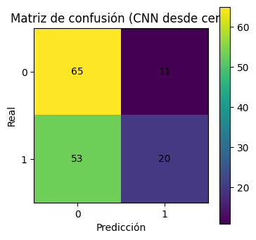
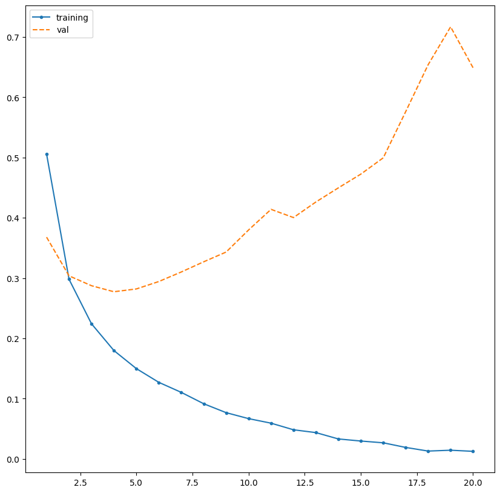
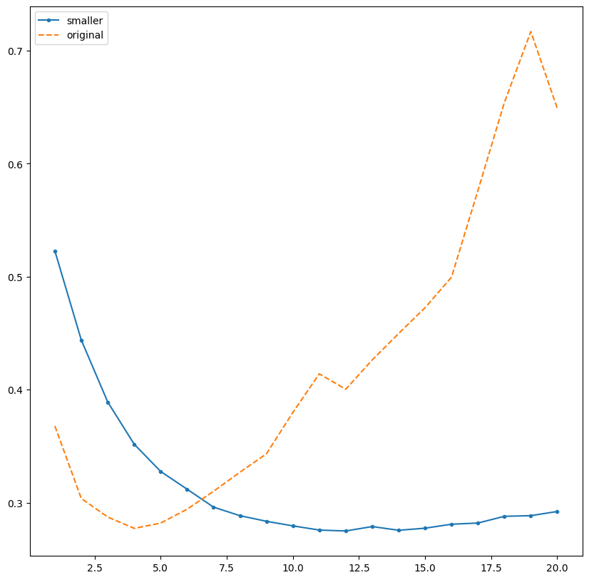

# 🧠 Redes Neuronales: CNN, Keras y Perceptrón

## 1. Introducción

En esta actividad se trabajaron tres conceptos relacionados con las redes neuronales: **CNN, Keras y Perceptrón**. Se realizaron ejemplos de clasificación de imágenes, clasificación de texto y problemas sencillos de clasificación.

---

## 2. 🖼️ CNN

Una **CNN (Convolutional Neural Network)** es un tipo de red neuronal utilizada principalmente para trabajar con imágenes. Su función es aprender características de las imágenes, como bordes, formas y patrones, para después poder clasificarlas.

De forma sencilla:

```text
Imagen → Características → Patrones → Clasificación
```

En el notebook se trabaja con imágenes de **TrashNet**, utilizando **PyTorch**.

### Códigos importantes

Para seleccionar si se utilizará GPU o CPU:

```python
device = torch.device("cuda" if torch.cuda.is_available() else "cpu")
```

Para convertir las imágenes a tensores:

```python
transform_basic = T.Compose([
    T.ToTensor()
])
```

También se crea una CNN mediante una clase:

```python
class SimpleCNN(nn.Module):
    ...
```

La red utiliza capas de convolución, activación y pooling.

**Imágenes de TrashNet**
<p align="center">
  
</p>

La imagen muestra ejemplos del conjunto de datos TrashNet, donde las imágenes están clasificadas en categorías como glass y plastic. Estas imágenes son utilizadas como datos de entrada para entrenar la CNN.

**Matriz de confusión**
<p align="center">
  
</p>

La matriz de confusión muestra los resultados de clasificación de la CNN. Se puede observar que el modelo clasificó correctamente 65 casos de la clase 0 y 20 de la clase 1, aunque también tuvo algunas predicciones incorrectas.

---

## 3. 🔄 Data Augmentation y Transfer Learning

En el notebook también se prueban técnicas para mejorar el entrenamiento.

El **Data Augmentation** modifica ligeramente las imágenes para generar mayor variedad en los datos. Por ejemplo:

```python
T.RandomRotation(degrees=10)
```

También se utiliza **Transfer Learning**, aprovechando un modelo que ya fue entrenado previamente:

```python
resnet = models.resnet18(
    weights=models.ResNet18_Weights.DEFAULT
)
```

Esto permite adaptar un modelo existente a nuestro problema en lugar de entrenarlo completamente desde cero.

```python
import torchvision.models as models

transform_tl_train = T.Compose([
    T.Resize((224, 224)),
    T.RandomRotation(degrees=10),
    T.RandomAffine(degrees=0, translate=(0.05, 0.05)),
    T.ToTensor(),
    T.Lambda(lambda x: x.repeat(3, 1, 1))
])

transform_tl_eval = T.Compose([
    T.Resize((224, 224)),
    T.ToTensor(),
    T.Lambda(lambda x: x.repeat(3, 1, 1))
])

train_dataset_tl = DataClass(root=DATA_DIR, split="train", transform=transform_tl_train)
val_dataset_tl = DataClass(root=DATA_DIR, split="val", transform=transform_tl_eval)
test_dataset_tl = DataClass(root=DATA_DIR, split="test", transform=transform_tl_eval)

train_loader_tl = DataLoader(train_dataset_tl, batch_size=64, shuffle=True, num_workers=2, pin_memory=True)
val_loader_tl = DataLoader(val_dataset_tl, batch_size=64, shuffle=False, num_workers=2, pin_memory=True)
test_loader_tl = DataLoader(test_dataset_tl, batch_size=64, shuffle=False, num_workers=2, pin_memory=True)

next(iter(train_loader_tl))[0].shape
```

---

## 4. 🛠️ Keras

**Keras** es una herramienta que facilita la creación y entrenamiento de redes neuronales.

En el notebook se utiliza para clasificar reseñas de películas del dataset **IMDB**, determinando si una reseña es positiva o negativa.

Primero se cargan los datos:

```python
(train_data, train_labels), (test_data, test_labels) = \
    imdb.load_data(num_words=10000, index_from=3)
```

Después se crea un modelo utilizando `Sequential` y capas `Dense`:

```python
model = models.Sequential()
model.add(layers.Dense(16, activation='relu'))
```

Finalmente, el modelo se configura con:

```python
model.compile(
    optimizer='rmsprop',
    loss='binary_crossentropy',
    metrics=['accuracy']
)
```

Aquí se define cómo se entrenará el modelo y cómo se medirá su desempeño.

También se utilizó **Dropout** para ayudar a reducir el sobreajuste:

```python
layers.Dropout(...)
```

**Gráfica del análisis del resultado**

<p align="center">
  
</p>

* Azul: error del modelo en entrenamiento
* Anaranjado: error sobre datos de validación

Vemos que la *curva anaranjada* no cae al final...
> Sobreajuste: la red está aprendiendo demasiado bien los datos de entrenamiento y pierde capacidad de generalización."

**Comparando con un modelo más pequeño**

<p align="center">
  
</p>

* Con la muestra original hubo un sobreajuste
* Con la muestra más pequeña el mínimo de pérdida se mantiene durante más épocas y el incremento posterior es mucho menor

> Existe sobreajuste, pero es menos pronunciado

---

## 5. ⚪ Perceptrón

El **Perceptrón** es uno de los modelos más básicos de una red neuronal. Recibe entradas, las combina utilizando **pesos y bias**, y genera una salida mediante una función de activación.

<p align="center">
  
</p>

```text
Entradas → Pesos + Bias → Función de activación → Salida
```

En el notebook se utiliza una función escalón:

```python
def step_function(x):
    ...
```

También se prueba el perceptrón con ejemplos de compuertas lógicas como **AND, OR y XOR**.

Por ejemplo, para AND:

```text
0 AND 0 → 0
0 AND 1 → 0
1 AND 0 → 0
1 AND 1 → 1
```

Estos ejemplos permiten entender cómo el perceptrón puede separar diferentes clases mediante una frontera de decisión.

**Compuerta OR y AND**

<p align="center">
  
</p>

La gráfica muestra las fronteras de decisión que utiliza el perceptrón para separar los resultados de las compuertas OR y AND. En ambos casos, los puntos pueden separarse mediante una línea, por lo que un perceptrón puede resolver estos problemas.

**Compuerta XOR**

<p align="center">
  
</p>

* Los círculos blancos son los casos donde XOR = 0
* Cada línea representa la frontera de una neurona

En XOR, el perceptrón intenta separar las clases mediante fronteras de decisión, pero los puntos no pueden separarse correctamente con una sola línea.

La idea es:
* 1 perceptron --> no puede resolver XOR
* 2 perceptrones + una capa de salida --> sí pueden

---

## 6. 🔗 ¿Qué relación tienen?

Los tres conceptos están relacionados, pero cumplen funciones diferentes:

| Concepto      | ¿Qué es?                     | Uso principal                        |
| ------------- | ---------------------------- | ------------------------------------ |
| 🧠 Perceptrón | Modelo básico de neurona     | Clasificaciones sencillas            |
| 🖼️ CNN       | Tipo de red neuronal         | Principalmente imágenes              |
| 🛠️ Keras     | Herramienta para crear redes | Entrenar modelos de redes neuronales |

En resumen, el **Perceptrón** ayuda a entender la base de las redes neuronales, una **CNN** permite trabajar con problemas más complejos como imágenes y **Keras** facilita la creación y entrenamiento de estos modelos.

---

## 7. 💭 ¿Qué entendí?

Entendí que una red neuronal aprende a partir de ejemplos para poder realizar predicciones. El perceptrón representa una forma básica de este funcionamiento, utilizando entradas, pesos y una función de activación.

También entendí que las CNN están más orientadas al procesamiento de imágenes y que Keras facilita la creación y entrenamiento de modelos de redes neuronales.

---

## 8. 💧 Aplicación a nuestro proyecto

Nuestro proyecto busca automatizar la **clarificación de agua mediante una solución de quitosano en ácido acético**, utilizando sensores de **pH y turbidez**.

De los tres conceptos, considero que el **Perceptrón** sería el más aplicable como una primera aproximación, ya que nuestros datos principales serían valores numéricos obtenidos de los sensores.

Podríamos utilizar como entradas:

```text
pH + Turbidez
      ↓
 Perceptrón
      ↓
 Clasificación / decisión
```

Por ejemplo, el modelo podría aprender a clasificar determinadas condiciones del agua a partir de los valores de pH y turbidez.

Una CNN tendría más sentido si nuestro proyecto trabajara directamente con **imágenes**, mientras que Keras podría ser utilizado como herramienta para implementar el modelo, pero no sería el modelo en sí.
