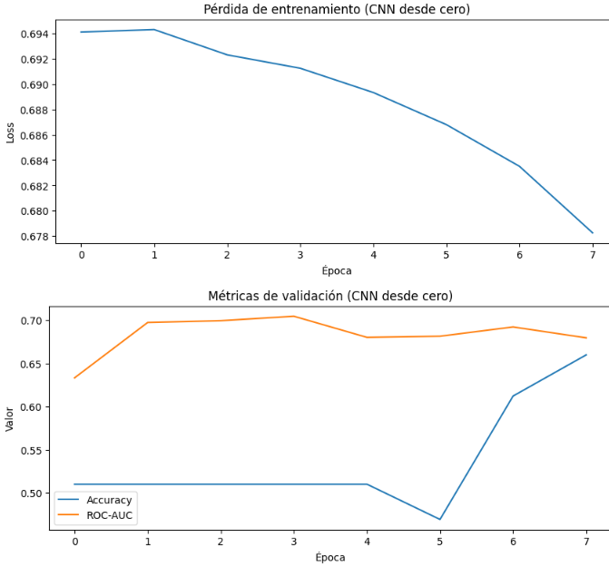
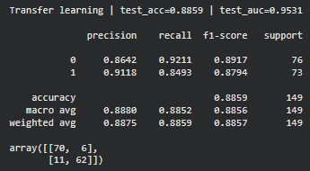
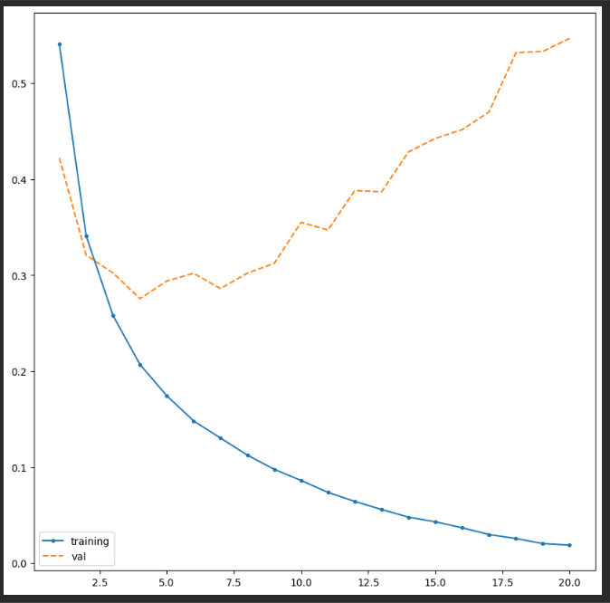
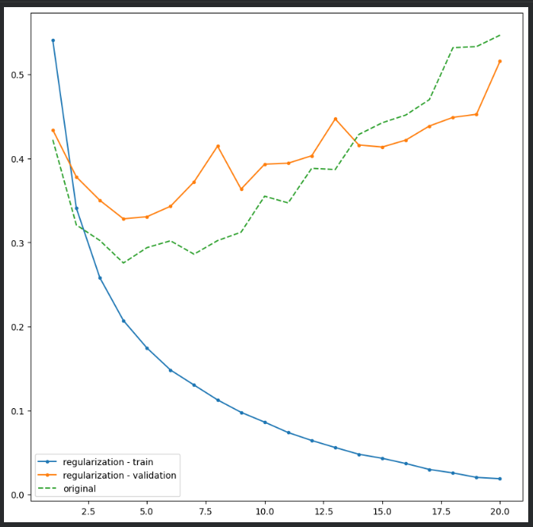
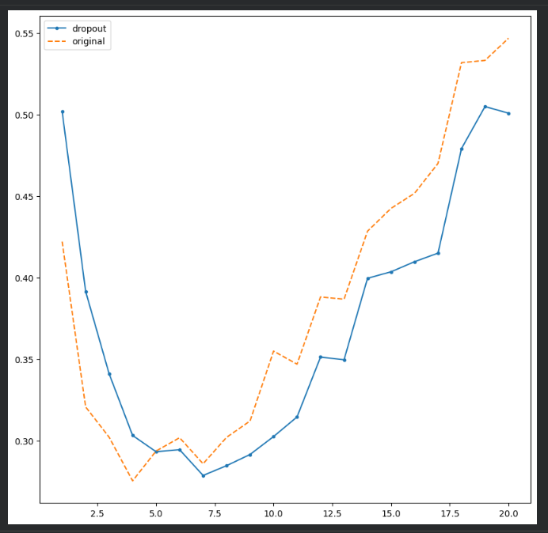

# Redes Neuronales

En este repositorio se presentan ejercicios sobre redes neuronales, trabajando con **CNN, Keras y Perceptrón**.

---

# 1. CNN

## Clasificación de imágenes

Se trabaja con imágenes de **vidrio y plástico**. El dataset se divide en:

* 70 % entrenamiento
* 15 % validación
* 15 % prueba

Las imágenes se convierten a escala de grises antes de entrar a la CNN.


### Interpretación

Los datos se preparan en diferentes grupos para entrenar y evaluar el modelo.

### Importancia

Permite comprobar si la CNN puede clasificar imágenes que no utilizó durante el entrenamiento.

---

## CNN desde cero

Se construye una CNN utilizando capas convolucionales, `ReLU` y `MaxPool`.

```python
class SimpleCNN(nn.Module):
    def __init__(self, num_classes):
        super().__init__()

        self.features = nn.Sequential(
            nn.Conv2d(1, 16, kernel_size=3, padding=1),
            nn.ReLU(),
            nn.MaxPool2d(2),

            nn.Conv2d(16, 32, kernel_size=3, padding=1),
            nn.ReLU(),
            nn.MaxPool2d(2),

            nn.Conv2d(32, 64, kernel_size=3, padding=1),
            nn.ReLU(),
            nn.AdaptiveAvgPool2d((1, 1))
        )

        self.classifier = nn.Sequential(
            nn.Flatten(),
            nn.Linear(64, num_classes)
        )
```

### Interpretación

La CNN extrae características de las imágenes y después las utiliza para decidir si pertenecen a vidrio o plástico.

### Importancia

Las CNN permiten trabajar directamente con imágenes y aprender características de ellas.

---

## Entrenamiento

Durante el entrenamiento se observa la evolución de la pérdida y de las métricas de validación.



### Interpretación

La pérdida disminuye durante el entrenamiento, mientras que la accuracy de validación mejora progresivamente.

### Importancia

Estas métricas permiten observar si el modelo está aprendiendo correctamente.

---

## Data Augmentation

Se aplican pequeñas modificaciones a las imágenes, como rotaciones y desplazamientos.

```python
transform_aug = T.Compose([
    T.RandomRotation(degrees=10),
    T.RandomAffine(
        degrees=0,
        translate=(0.05, 0.05)
    ),
    T.ToTensor()
])
```

### Resultados

| Modelo             | Accuracy | ROC-AUC |
| ------------------ | -------: | ------: |
| CNN                |  55.03 % | 61.91 % |
| CNN + Augmentation |  56.38 % | 64.11 % |

### Interpretación

El modelo mejora ligeramente después de aplicar Data Augmentation.

### Importancia

Permite entrenar con diferentes variaciones de las imágenes.

---

## Transfer Learning

Se utiliza una **ResNet18** previamente entrenada y se realiza fine-tuning.

### Resultado

* Accuracy: **86.58 %**
* ROC-AUC: **95.62 %**



### Interpretación

El modelo con Transfer Learning obtuvo mejores resultados que la CNN entrenada desde cero.

### Importancia

Permite aprovechar características que el modelo ya aprendió anteriormente.

---

# 2. Keras

## Clasificación de reseñas

Se utiliza Keras para clasificar reseñas de películas como **positivas o negativas**.

Antes de entrenar la red, las reseñas se convierten a vectores numéricos.

```python
def vectorizar(sequences, dim=10000):
    results = np.zeros((len(sequences), dim))

    for i, sequence in enumerate(sequences):
        results[i, sequence] = 1

    return results
```

### Interpretación

Las reseñas se transforman en números para que puedan ser procesadas por la red.

### Importancia

Las redes neuronales necesitan datos numéricos para poder aprender.

---

## Construcción de la red

Se utiliza una red `Sequential` con dos capas ocultas y una capa de salida.

```python
model = models.Sequential()

model.add(
    layers.Dense(
        16,
        activation='relu',
        input_shape=(10000,)
    )
)

model.add(
    layers.Dense(
        16,
        activation='relu'
    )
)

model.add(
    layers.Dense(
        1,
        activation='sigmoid'
    )
)
```

### Interpretación

Las capas `ReLU` procesan la información y `sigmoid` genera la salida para clasificar la reseña.

### Importancia

Keras facilita la creación y entrenamiento de redes neuronales.

---

## Sobreajuste

Durante el entrenamiento se comparan los resultados del modelo con los datos de entrenamiento y validación.



### Interpretación

Cuando el modelo mejora en entrenamiento pero empeora en validación, aparece sobreajuste.

### Importancia

Permite identificar cuándo el modelo está aprendiendo demasiado los datos de entrenamiento.

---

## Regularización y Dropout

Se utilizan técnicas para reducir el sobreajuste.

```python
layers.Dropout(0.5)
```

También se aplica regularización L2.





### Interpretación

Dropout desactiva algunas neuronas durante el entrenamiento y L2 limita los pesos del modelo.

### Importancia

Estas técnicas ayudan a que el modelo generalice mejor.

---

## Predicción

El modelo finalmente realiza predicciones sobre datos nuevos.

```python
predictions = model.predict(x_test)
predictions[10]
```

El resultado mostrado en el ejercicio alcanza aproximadamente **99.4 % para una reseña positiva**.

### Interpretación

El modelo utiliza lo aprendido para clasificar una nueva reseña.

### Importancia

Demuestra cómo una red neuronal puede utilizarse para realizar predicciones.

---

# 3. Perceptrón

## Funcionamiento

El perceptrón recibe entradas, utiliza pesos y un bias, y produce una salida mediante una función de activación.

```python
def perceptron(inputs, weights, bias, activation_func):
    weighted_sum = np.dot(inputs, weights) + bias
    output = activation_func(weighted_sum)

    return output
```

### Interpretación

El perceptrón combina las entradas y utiliza el resultado para tomar una decisión.

### Importancia

Es un modelo sencillo que permite entender la base de una neurona artificial.

---

## Funciones de activación

Se utilizan una función escalón y `tanh`.

```python
def step_function(x):
    return 1 if x >= 0 else 0

def tanh_activation(x):
    return np.tanh(x)
```

### Interpretación

La función escalón produce `0` o `1`, mientras que `tanh` produce valores entre `-1` y `1`.

### Importancia

La función de activación determina la salida del perceptrón.

---

## AND y OR

El perceptrón puede representar operaciones lógicas como AND y OR.

### AND

```text
(0, 0) → 0
(0, 1) → 0
(1, 0) → 0
(1, 1) → 1
```

### OR

```text
(0, 0) → 0
(0, 1) → 1
(1, 0) → 1
(1, 1) → 1
```

### Interpretación

El perceptrón puede producir correctamente las salidas de AND y OR utilizando diferentes pesos y bias.

### Importancia

Estos ejemplos ayudan a entender cómo el perceptrón toma decisiones a partir de sus entradas.

---

## XOR

En XOR se obtiene:

```text
(0, 0) → 0
(0, 1) → 1
(1, 0) → 1
(1, 1) → 0
```


### Interpretación

Un solo perceptrón no puede resolver correctamente el problema XOR.

### Importancia

Esto muestra una limitación del perceptrón simple y explica la necesidad de utilizar redes con más capas.

---

# Conclusión

El **Perceptrón** permite comprender los conceptos básicos de una neurona artificial.

**Keras** facilita la construcción de redes neuronales para problemas como la clasificación de texto.

Las **CNN** permiten trabajar con imágenes y extraer características automáticamente. En este ejercicio, el uso de **Transfer Learning** produjo mejores resultados que entrenar una CNN desde cero.
