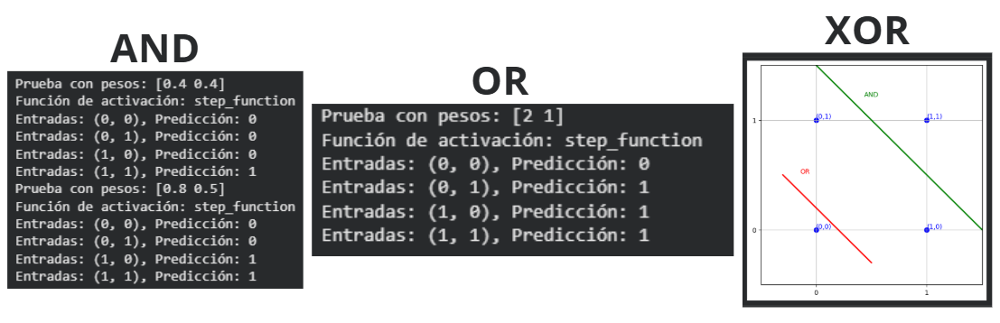
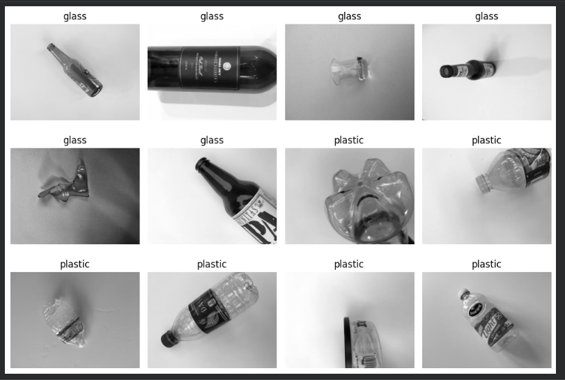

# Perceptrón, Keras y CNN

## 1. Perceptrón

El perceptrón es una neurona artificial que recibe entradas, las multiplica por pesos y utiliza una función de activación para producir una salida.

```python
def perceptron(inputs, weights, bias, activation_func):
    total = np.dot(inputs, weights) + bias
    return activation_func(total)
```

### Funciones importantes

* `np.dot()` calcula la combinación ponderada entre entradas y pesos.
* `bias` permite desplazar el resultado de la neurona.
* `activation_func()` transforma el resultado en la salida del perceptrón.

### Interpretación

El perceptrón representa la operación básica de una neurona artificial. La información de entrada se combina mediante los pesos y posteriormente se transforma mediante una función de activación.


---

## 2. AND, OR y XOR

Las compuertas lógicas permiten observar qué problemas puede resolver un perceptrón simple.

```python
# Ejemplo conceptual
AND = [0, 0, 0, 1]
OR  = [0, 1, 1, 1]
XOR = [0, 1, 1, 0]
```

### Interpretación

AND y OR pueden separarse mediante una única frontera lineal, por lo que un perceptrón puede aprenderlas.

XOR no es linealmente separable. Por eso, un único perceptrón no puede resolverlo correctamente y se necesitan capas adicionales.



---

## 3. Red neuronal con Keras

Keras permite construir una red neuronal mediante capas.

```python
model = Sequential([
    Dense(64, activation="relu"),
    Dense(32, activation="relu"),
    Dense(1, activation="sigmoid")
])
```

### Funciones importantes

| Función        | Importancia                                                                   |
| -------------- | ----------------------------------------------------------------------------- |
| `Sequential()` | Permite construir la red como una secuencia de capas.                         |
| `Dense()`      | Crea una capa totalmente conectada.                                           |
| `ReLU`         | Introduce no linealidad y permite aprender relaciones más complejas.          |
| `Sigmoid`      | Convierte la salida en un valor entre 0 y 1, útil para clasificación binaria. |
| `compile()`    | Configura cómo se entrenará el modelo.                                        |
| `fit()`        | Entrena la red utilizando los datos.                                          |
| `evaluate()`   | Evalúa el modelo con datos separados.                                         |
| `predict()`    | Genera predicciones para nuevos datos.                                        |

### Interpretación

La red utiliza varias capas para transformar progresivamente los datos. Las capas ocultas permiten aprender características más complejas que las que podría aprender un único perceptrón.


---

## 4. CNN para clasificación de imágenes

Una CNN está diseñada para trabajar con imágenes. En este proyecto se utiliza para clasificar imágenes en dos categorías:

* `glass = 0`
* `plastic = 1`

El dataset se divide en:

* 70 % entrenamiento
* 15 % validación
* 15 % prueba

La división permite entrenar el modelo y posteriormente comprobar su comportamiento con datos que no utilizó durante el entrenamiento.


### Interpretación

Las capas convolucionales permiten detectar características visuales de la imagen. Conforme avanza la red, estas características pueden combinarse para realizar la clasificación final.

---

## 5. Preparación de las imágenes

El dataset utiliza una clase personalizada:

```python
class TrashDataset(Dataset):
```

Las imágenes se cargan y se convierten a escala de grises:

```python
image = Image.open(path).convert("L")
```

### Interpretación

La conversión a `"L"` transforma la imagen a un solo canal de intensidad. Esto mantiene la entrada compatible con una CNN configurada para recibir un canal, como `Conv2d(1, 16, ...)`.



---

## 6. División del dataset

```python
train_ratio = 0.70
val_ratio = 0.15
```

La parte restante corresponde al conjunto de prueba.

### Interpretación

Los tres conjuntos cumplen funciones diferentes:

* **Train:** utilizado para aprender los parámetros del modelo.
* **Validation:** utilizado para comprobar el comportamiento durante el desarrollo.
* **Test:** utilizado para realizar la evaluación final con datos que no participaron en el entrenamiento.

La implementación del dataset realiza esta separación para cada clase y utiliza una semilla para mantener una partición reproducible.


---

## 7. Funciones principales de la CNN

| Función / elemento | Importancia                                             |
| ------------------ | ------------------------------------------------------- |
| `Dataset`          | Define cómo se obtienen las imágenes y sus etiquetas.   |
| `__len__()`        | Indica cuántos ejemplos contiene el dataset.            |
| `__getitem__()`    | Obtiene una imagen y su etiqueta.                       |
| `Conv2d`           | Realiza las operaciones de convolución sobre la imagen. |
| `transform`        | Permite aplicar transformaciones a las imágenes.        |
| `train()`          | Coloca el modelo en modo entrenamiento.                 |
| `eval()`           | Coloca el modelo en modo evaluación.                    |
| `predict()`        | Permite obtener predicciones de nuevos datos.           |

### Interpretación

Estas funciones forman parte del flujo fundamental de una CNN: cargar los datos, transformarlos, entrenar el modelo, evaluarlo y finalmente obtener predicciones.

---

## 8. Flujo general

```text
Imagen
   ↓
Preprocesamiento
   ↓
CNN
   ↓
Extracción de características
   ↓
Clasificación
   ↓
Glass / Plastic
```

### Interpretación

El flujo muestra cómo una imagen pasa desde los datos originales hasta una clasificación. El dataset se encarga de proporcionar la imagen y su etiqueta, mientras que la CNN aprende las características necesarias para distinguir entre las dos clases.


---

## Conclusión

Los conceptos principales estudiados son:

1. **Perceptrón:** base de una neurona artificial.
2. **Funciones de activación:** permiten introducir no linealidad.
3. **Keras:** facilita la construcción y entrenamiento de redes neuronales.
4. **CNN:** permite trabajar directamente con características espaciales de imágenes.
5. **Dataset:** organiza las imágenes, etiquetas y divisiones de entrenamiento, validación y prueba.
6. **Clasificación:** utiliza lo aprendido por la red para distinguir entre `glass` y `plastic`.
