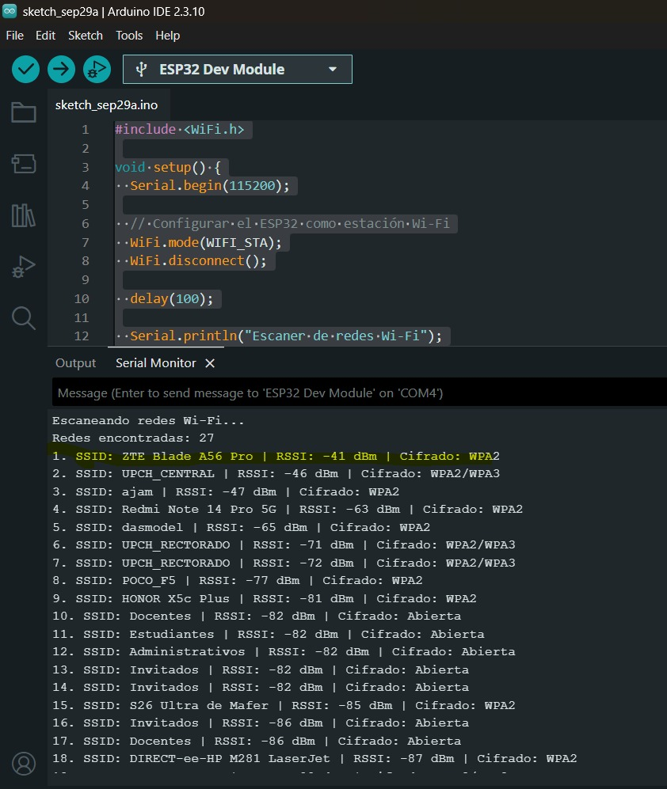
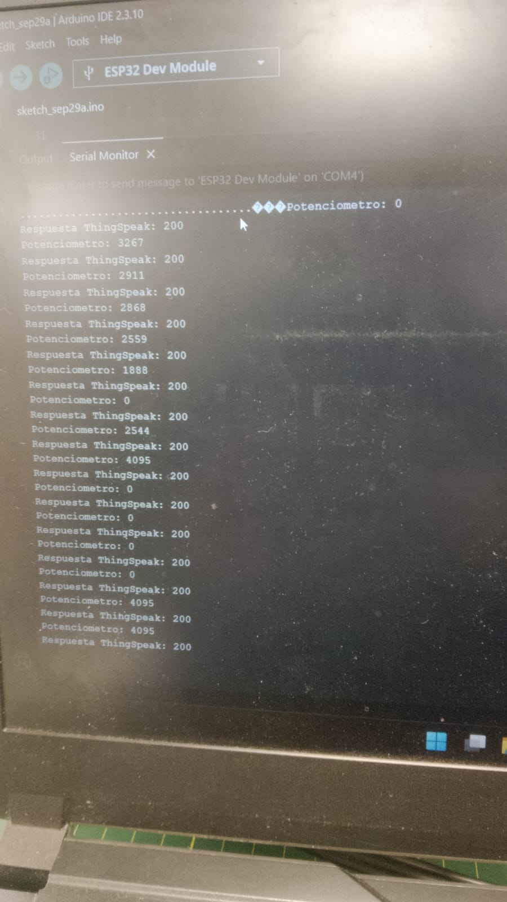
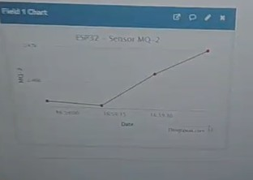

# Taller de Internet de las Cosas (IoT) con ESP32

Repositorio correspondiente al desarrollo de las actividades prácticas del **Taller de Internet de las Cosas (IoT)**.

En este taller se trabaja con el **ESP32 Dev Kit 1**, sensores y plataformas IoT para realizar adquisición de datos, comunicación mediante Wi-Fi y visualización de información en la nube.

Las actividades desarrolladas abarcan desde la lectura de un potenciómetro y el procesamiento de señales analógicas, hasta el envío de datos a plataformas IoT como **Arduino Cloud, ThingSpeak y Ubidots**.

---

## Contenido

- [Objetivos](#-objetivos)
- [Materiales](#-materiales)
- [Actividad 01 - Lectura de un potenciómetro](#-actividad-01---lectura-de-un-potenciómetro-con-esp32)
- [Actividad 02 - Conexión Wi-Fi](#-actividad-02---conexión-wi-fi-mediante-hotspot)
- [Actividad 03 - Envío del potenciómetro a la nube](#-actividad-03---enviando-datos-del-potenciómetro-a-la-nube)
- [Actividad 04 - Envío de datos de un sensor a la nube](#-actividad-04---enviando-datos-de-un-sensor-a-la-nube)
- [Actividad 05 - Envío de datos de un sensor a la nube](#-actividad-05---controlando-un-actuador-led-desde-la-nube--red)
- [Tecnologías y plataformas utilizadas](#-tecnologías-y-plataformas-utilizadas)
- [Resultados](#-resultados)
- [Conclusiones](#-conclusiones)
- [Estructura del repositorio](#-estructura-del-repositorio)

---

# Objetivos

El taller tiene como objetivo desarrollar conocimientos prácticos y teóricos relacionados con el **Internet de las Cosas (IoT)** mediante el uso de dispositivos como el ESP32.

Durante las actividades se trabaja con:

- Configuración y programación del ESP32.
- Adquisición de datos mediante sensores.
- Lectura de señales analógicas.
- Conversión de valores ADC a voltaje.
- Procesamiento y promediado de datos.
- Comunicación mediante Wi-Fi.
- Conexión del ESP32 a una red inalámbrica.
- Envío de información a plataformas IoT.
- Monitoreo de datos en tiempo real mediante plataformas en la nube.

---

# Materiales

Para el desarrollo del taller se utilizaron los siguientes materiales:

- ESP32 Dev Kit 1.
- Arduino Explore IoT Kit.
- Kit de sensores Keyestudio 48 en 1.
- Multímetro.
- Protoboard.
- Cables de conexión.
- Potenciómetro.
- Smartphone utilizado como Hotspot Wi-Fi.

---

# Actividad 01 - Lectura de un potenciómetro con ESP32

## Objetivo

Mejorar el código básico de lectura de un potenciómetro conectado al ESP32 mediante:

1. Promediado de los datos obtenidos.
2. Conversión de los valores del ADC a valores de voltaje.
3. Visualización de los resultados mediante el Monitor Serie.

## Funcionamiento

El potenciómetro se conecta a una entrada analógica del ESP32.

Para esta actividad se utiliza el **GPIO 34** como entrada analógica.

El ESP32 realiza la lectura mediante:

```cpp
analogRead()
```

Posteriormente, se realizan varias lecturas para obtener un promedio y reducir las variaciones de la señal.

Finalmente, el valor obtenido del ADC se convierte a voltaje.

El proceso general es:

```text
Potenciómetro
      │
      ▼
Entrada analógica GPIO 34
      │
      ▼
Lectura ADC
      │
      ▼
Promediado de lecturas
      │
      ▼
Conversión a voltaje
      │
      ▼
Monitor Serie
```

## Circuito


## Código

```cpp
/*
  Actividad 01 - Lectura de potenciometro con ESP32 (promediado + conversion a voltaje)
  Conexion: GND -> GND | VCC -> 3V3 | SIG -> GPIO34 (ADC1_CH6)
*/
const int   POT_PIN      = 34;     // Pin ADC1 (compatible con Wi-Fi)
const int   NUM_MUESTRAS = 32;     // Cantidad de muestras a promediar
const float VREF         = 3.3;    // Voltaje de referencia (V)
const int   ADC_MAX      = 4095;   // 12 bits -> 0..4095

void setup() {
  Serial.begin(115200);
  analogReadResolution(12);                    // Resolucion de 12 bits
  analogSetPinAttenuation(POT_PIN, ADC_11db);  // Rango aprox. 0 - 3.3 V
  Serial.println("Actividad 01: Potenciometro con promediado");
}

void loop() {
  long sumaADC = 0;
  long sumaMv  = 0;

  for (int i = 0; i < NUM_MUESTRAS; i++) {
    sumaADC += analogRead(POT_PIN);
    sumaMv  += analogReadMilliVolts(POT_PIN);  // Lectura con calibracion de fabrica
    delay(2);
  }

  float adcProm = sumaADC / (float)NUM_MUESTRAS;
  float vLineal = adcProm * VREF / ADC_MAX;         // Conversion lineal teorica
  float vCalib  = (sumaMv / (float)NUM_MUESTRAS) / 1000.0;  // Conversion calibrada

  Serial.print("ADC promedio: ");  Serial.print(adcProm, 1);
  Serial.print(" | V (lineal): "); Serial.print(vLineal, 3); Serial.print(" V");
  Serial.print(" | V (calibrado): "); Serial.print(vCalib, 3); Serial.println(" V");

  delay(500);
}
```

## Monitor Serie

En el Monitor Serie se muestran los valores obtenidos del potenciómetro y el voltaje correspondiente.


## Resultado

Se logró obtener una lectura más estable del potenciómetro mediante el promediado de varias mediciones.

Además, los valores obtenidos mediante el ADC fueron convertidos a valores de voltaje para facilitar su interpretación.

---

# Actividad 02 - Conexión Wi-Fi mediante Hotspot

## Objetivo

Crear una red Wi-Fi utilizando un Smartphone como **Hotspot** y conectar el ESP32 a dicha red.

Una vez realizada la conexión, se debe visualizar en el Monitor Serie la **dirección IP asignada al ESP32**.

## Funcionamiento

Para realizar esta actividad se utiliza el Smartphone como punto de acceso Wi-Fi.

El proceso de conexión es:

```text
Smartphone
    │
    │ Hotspot Wi-Fi
    ▼
  ESP32
    │
    ▼
Conexión Wi-Fi
    │
    ▼
Dirección IP
    │
    ▼
Monitor Serie
```

El ESP32 utiliza la biblioteca:

```cpp
#include "WiFi.h"
```

Esta biblioteca permite gestionar la conectividad Wi-Fi del ESP32.

## Configuración del Hotspot

Se habilita el Hotspot del Smartphone y se configura el nombre y contraseña de la red.

## Conexión del ESP32

El ESP32 se conecta a la red Wi-Fi creada mediante el Smartphone.

El circuito de la actividad 2 es la misma que la de la actividad 1.

## Monitor Serie

Una vez establecida la conexión, el Monitor Serie muestra la información correspondiente a la conexión y la dirección IP asignada al ESP32.



## Código

```cpp
#include <WiFi.h>

void setup() {
  Serial.begin(115200);
  WiFi.mode(WIFI_STA);
  WiFi.disconnect();
  delay(100);
  Serial.println("Escaner de redes Wi-Fi");
}

void loop() {
  Serial.println();
  Serial.println("Escaneando redes Wi-Fi...");
  int numeroRedes = WiFi.scanNetworks();
  if (numeroRedes == 0) {
    Serial.println("No se encontraron redes.");
  } else {
    Serial.print("Redes encontradas: ");
    Serial.println(numeroRedes);
    for (int i = 0; i < numeroRedes; i++) {
      Serial.print(i + 1);
      Serial.print(". SSID: ");
      Serial.print(WiFi.SSID(i));
      Serial.print(" | RSSI: ");
      Serial.print(WiFi.RSSI(i));
      Serial.print(" dBm");
      Serial.print(" | Cifrado: ");
      switch (WiFi.encryptionType(i)) {
        case WIFI_AUTH_OPEN: Serial.println("Abierta"); break;
        case WIFI_AUTH_WEP: Serial.println("WEP"); break;
        case WIFI_AUTH_WPA_PSK: Serial.println("WPA"); break;
        case WIFI_AUTH_WPA2_PSK: Serial.println("WPA2"); break;
        case WIFI_AUTH_WPA_WPA2_PSK: Serial.println("WPA/WPA2"); break;
        case WIFI_AUTH_WPA2_ENTERPRISE: Serial.println("WPA2 Enterprise"); break;
        case WIFI_AUTH_WPA3_PSK: Serial.println("WPA3"); break;
        case WIFI_AUTH_WPA2_WPA3_PSK: Serial.println("WPA2/WPA3"); break;
        default: Serial.println("Desconocido"); break;
      }
      delay(10);
    }
  }
  WiFi.scanDelete();
  Serial.println();
  Serial.println("Proximo escaneo en 5 segundos...");
  delay(5000);
}
```


## Resultado

Se logró conectar el ESP32 a la red Wi-Fi creada mediante el Hotspot del Smartphone.

La dirección IP asignada por la red fue visualizada mediante el Monitor Serie.

---

# Actividad 03 - Enviando datos del potenciómetro a la nube

## Objetivo

Enviar y visualizar en tiempo real la variación de un potenciómetro conectado al ESP32 utilizando ThingSpeak, plataforma de Internet de las Cosas.

## Funcionamiento

En esta actividad se combina la adquisición de datos del potenciómetro con la comunicación Wi-Fi y el envío de información a plataformas IoT.

El proceso general es:

```text
Potenciómetro
      │
      ▼
    ESP32
      │
      ▼
Lectura del sensor
      │
      ▼
    Wi-Fi
      │
      |
      ▼               
 ThingSpeak
```

El valor del potenciómetro es enviado periódicamente a las plataformas para poder observar su variación.

## ThingSpeak

ThingSpeak es una plataforma utilizada para recibir y visualizar datos provenientes de dispositivos IoT.

La siguiente imagen muestra la evidencia de los datos del potenciómetro enviados a ThingSpeak.



## Resultado

Se logró enviar la información correspondiente a la variación del potenciómetro hacia la plataforma IoT utilizada:

Los datos pudieron ser observados mediante las interfaces de cada plataforma.

---

# Actividad 04 - Enviando datos de un sensor a la nube

## Objetivo

Enviar a plataformas IoT los datos obtenidos de uno de los sensores disponibles en el **kit Keyestudio**, conectado al ESP32.

Entre los sensores propuestos en el taller se encuentran, por ejemplo:

- LM35.
- LDR.
- Otros sensores disponibles en el kit.

Los datos deben visualizarse en tiempo real utilizando:

- ThingSpeak.

## Funcionamiento

En esta actividad se reemplaza el potenciómetro por un sensor del kit Keyestudio.

El proceso general es:

```text
Sensor Keyestudio
       │
       ▼
      ESP32
       │
       ▼
Lectura del sensor
       │
       ▼
      Wi-Fi
       │
       |
       ▼
  ThingSpeak
```

El ESP32 obtiene las mediciones del sensor y las transmite mediante Wi-Fi a las plataformas IoT.

## ThingSpeak

Evidencia de los datos obtenidos del sensor y enviados a ThingSpeak.



## Código


```cpp
#include <WiFi.h>
#include "ThingSpeak.h"

// ==========================
// DATOS DE WIFI
// ==========================
const char* WIFI_SSID = "UPCH_CENTRAL";
const char* WIFI_PASSWORD = "CAYETANO2022";

// ==========================
// DATOS DE THINGSPEAK
// ==========================
unsigned long CHANNEL_ID = 3515273;
const char* WRITE_API_KEY = "Y8NYGSJWVKEHQE6T";

// ==========================
// SENSOR MQ-2
// ==========================
const int MQ2_PIN = 34;

WiFiClient client;

void setup() {
  Serial.begin(115200);
  delay(1000);

  analogReadResolution(12);

  Serial.println("================================");
  Serial.println("ESP32 + MQ-2 + ThingSpeak");
  Serial.println("================================");

  // Conectar WiFi
  Serial.print("Conectando a WiFi");

  WiFi.begin(WIFI_SSID, WIFI_PASSWORD);

  while (WiFi.status() != WL_CONNECTED) {
    delay(500);
    Serial.print(".");
  }

  Serial.println();
  Serial.println("WiFi conectado");
  Serial.print("IP: ");
  Serial.println(WiFi.localIP());

  // Iniciar ThingSpeak
  ThingSpeak.begin(client);
}

void loop() {

  // Leer sensor MQ-2
  int valorMQ2 = analogRead(MQ2_PIN);

  Serial.print("MQ-2: ");
  Serial.println(valorMQ2);

  // Enviar valor al Field 1
  ThingSpeak.setField(1, valorMQ2);

  int respuesta = ThingSpeak.writeFields(CHANNEL_ID, WRITE_API_KEY);

  if (respuesta == 200) {
    Serial.println("Dato enviado correctamente a ThingSpeak");
  } else {
    Serial.print("Error enviando datos. Codigo HTTP: ");
    Serial.println(respuesta);
  }

  Serial.println("-----------------------------");

  // ThingSpeak requiere aproximadamente 15 s entre actualizaciones
  delay(16000);
}
```
## Resultado

Se logró enviar los datos obtenidos del sensor hacia la plataforma IoT utilizada:

Los datos pudieron ser visualizados mediante la interfaz de la plataforma.

---

# Tecnologías y plataformas utilizadas

| Tecnología / herramienta | Uso |
|---|---|
| ESP32 Dev Kit 1 | Microcontrolador utilizado en las actividades |
| Arduino IDE | Programación del ESP32 |
| C/C++ | Lenguaje utilizado para los programas |
| Wi-Fi | Comunicación inalámbrica |
| ThingSpeak | Plataforma IoT para recepción y visualización de datos |
| GitHub | Almacenamiento y documentación del proyecto |

---
# Actividad 05 - Controlando un Actuador (LED) desde la Nube / Red

## Objetivo
Conectar un LED en uno de los pines digitales del ESP32 y controlar su encendido y apagado de forma remota desde una interfaz web o plataforma IoT, tal como se indica en el taller.

## Funcionamiento

Mediante la conectividad Wi-Fi del ESP32, se habilita un punto de control remoto. El flujo del sistema es el siguiente:

```text
Plataforma Web / Navegador
            │
            │ Orden (Encender / Apagar)
            ▼
        Red Wi-Fi
            │
            ▼
     ESP32 (Servidor)
            │
            ▼
   Pin Digital (GPIO 2)
            │
            ▼
       LED Actuador
```

## Requisitos Específicos

* **Hardware:** 
  * ESP32 Dev Kit 1
  * 1 x LED indicador
  * 1 x Resistencia de $220\,\Omega$
  * Protoboard y cables de conexión (Jumpers)
* **Conexiones:**
  * Ánodo del LED (pata larga) conectado a través de la resistencia de $220\,\Omega$ hacia el **GPIO 2** del ESP32.
  * Cátodo del LED (pata corta) conectado a **GND**.
* **Software:** 
  * Arduino IDE con soporte para ESP32.
  * Librería `#include <WiFi.h>` (nativa).

---

## Circuito


---

## Código

El código implementa un servidor web embebido en el ESP32 para gestionar las peticiones HTTP y conmutar el estado del pin digital:

```cpp
#include <WiFi.h>
#include <PubSubClient.h>

const char* ssid = "ZTE Blade A56 Pro";
const char* password = "702047779448";

const char* mqtt_server = "broker.emqx.io";

const int LED_PIN = 2;

WiFiClient espClient;
PubSubClient client(espClient);

void callback(char* topic, byte* payload, unsigned int length) {

  String mensaje = "";

  for (unsigned int i = 0; i < length; i++) {
    mensaje += (char)payload[i];
  }

  Serial.print("Mensaje recibido: ");
  Serial.println(mensaje);

  if (mensaje == "ON") {
    digitalWrite(LED_PIN, HIGH);
    Serial.println("LED ENCENDIDO");
  }

  if (mensaje == "OFF") {
    digitalWrite(LED_PIN, LOW);
    Serial.println("LED APAGADO");
  }
}

void conectarMQTT() {

  while (!client.connected()) {

    Serial.println("Intentando conectar a MQTT...");

    String clientId = "ESP32-";
    clientId += String(random(0xffff), HEX);

    if (client.connect(clientId.c_str())) {

      Serial.println("MQTT CONECTADO");

      client.subscribe("esp32/led");

      Serial.println("Suscrito a: esp32/led");

    } else {

      Serial.print("Fallo MQTT. Estado: ");
      Serial.println(client.state());

      delay(3000);
    }
  }
}

void setup() {

  Serial.begin(115200);

  pinMode(LED_PIN, OUTPUT);
  digitalWrite(LED_PIN, LOW);

  WiFi.mode(WIFI_STA);
  WiFi.disconnect();
  delay(1000);

  WiFi.begin(ssid, password);

  Serial.print("Conectando al WiFi");

  while (WiFi.status() != WL_CONNECTED) {
    delay(500);
    Serial.print(".");
  }

  Serial.println();
  Serial.println("WiFi conectado");

  Serial.print("IP: ");
  Serial.println(WiFi.localIP());

  client.setServer(mqtt_server, 1883);
  client.setCallback(callback);

  conectarMQTT();
}

void loop() {

  if (!client.connected()) {
    conectarMQTT();
  }

  client.loop();
}
```

## Evidencia de la Interfaz Web

A continuación se muestra la interfaz visualizada desde el navegador al ingresar a la dirección IP asignada al ESP32:


---

## Resultado

Se logró establecer comunicación bidireccional permitiendo enviar comandos desde una interfaz web conectada por Wi-Fi para modificar en tiempo real el estado físico de un LED conectado al ESP32.


# Conceptos trabajados

Durante el desarrollo de las actividades se trabajaron diferentes conceptos relacionados con IoT.

### Adquisición de datos

La adquisición de datos consiste en capturar información del entorno mediante sensores y convertirla en señales que puedan ser procesadas.

```text
Sensor → Señal → ESP32 → Procesamiento → Datos
```

### ADC

El **ADC (Analog to Digital Converter)** permite convertir una señal analógica en un valor digital que puede ser procesado por el ESP32.

En la Actividad 01 se utilizó el ADC para obtener la lectura del potenciómetro.

### Wi-Fi

La comunicación Wi-Fi permite conectar el ESP32 a una red inalámbrica para transmitir y recibir información.

En la Actividad 02 se utilizó un Smartphone como Hotspot para proporcionar conectividad al ESP32.

### IoT

El Internet de las Cosas permite conectar dispositivos físicos a redes para adquirir, transmitir y monitorear datos.

En las Actividades 03 y 04, los datos obtenidos por el ESP32 fueron enviados a plataformas IoT para su visualización.

---

# Resultados generales

A través de las cuatro actividades se desarrolló progresivamente un sistema básico de adquisición y transmisión de datos mediante ESP32.

El proceso puede resumirse de la siguiente manera:

```text
┌──────────────────────┐
│                      │
│    Potenciómetro     │
│                      │
└──────────┬───────────┘
           │
           ▼
┌──────────────────────┐
│        ESP32         │
│                      │
└──────────┬───────────┘
           │
           ▼
┌──────────────────────┐
│        Wi-Fi         │
└──────────┬───────────┘
           │
           ▼
┌──────────────────────┐
│    PLATAFORMA IoT    │
│                      │
│      ThingSpeak      │
└──────────────────────┘
```

Las actividades permitieron pasar de una lectura local mediante el Monitor Serie a la transmisión y visualización de datos mediante plataformas en la nube.

---

# Conclusiones

- Se logró realizar la lectura de un potenciómetro utilizando una entrada analógica del ESP32.
- Se aplicó un promediado de datos para obtener lecturas más estables.
- Se realizó la conversión de valores ADC a valores de voltaje.
- Se estableció una conexión entre el ESP32 y una red Wi-Fi mediante el Hotspot de un Smartphone.
- Se obtuvo y visualizó la dirección IP asignada al ESP32.
- Se enviaron datos del potenciómetro a plataformas IoT.
- Se trabajó con ThingSpeak para visualizar los datos.
- Se realizó la adquisición de datos de un sensor del kit Keyestudio.
- Se enviaron los datos del sensor a plataformas IoT para su monitoreo.

En conjunto, las actividades permitieron comprender el flujo básico de un sistema IoT:

**Adquisición de datos → Procesamiento → Comunicación → Nube → Visualización**
