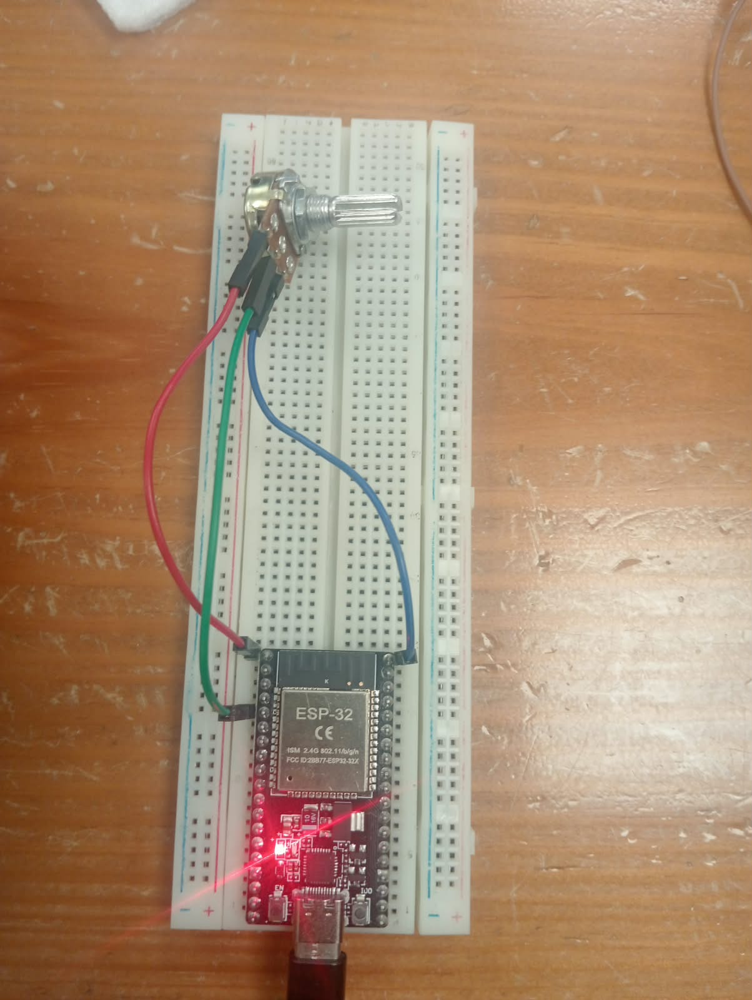
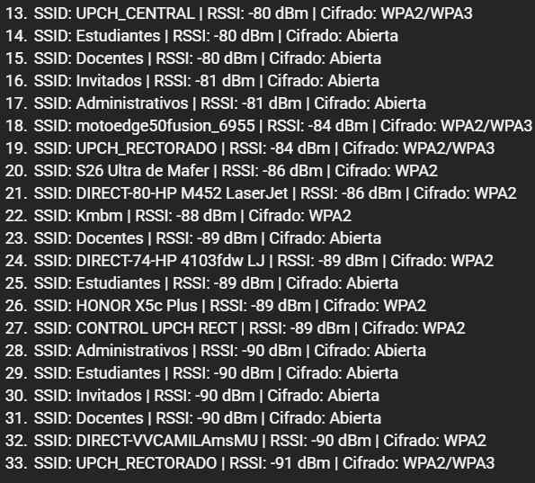

# Guía de Prácticas con ESP32: Sensores, Wi-Fi e IoT

Este repositorio contiene una serie de prácticas y actividades desarrolladas con el microcontrolador **ESP32**, abarcando desde la lectura de señales analógicas básicas hasta la conectividad Wi-Fi y el envío de datos en tiempo real a plataformas en la nube (IoT).

## Contenido de las Actividades

1. [Actividad 01: Lectura Analógica y Promediado con Potenciómetro](#actividad-01)

2. [Actividad 02: Conexión Wi-Fi a Hotspot de Smartphone](#actividad-02)

3. [Actividad 03: Envío de Datos de Potenciómetro a la Nube (IoT)](#actividad-03)

4. [Actividad 04: Envío de Sensores Keystudio a la Nube (IoT)](#actividad-04)

### Actividad 01: Lectura de un Potenciómetro con Promediado y Voltaje

Mejora la lectura analógica básica del ESP32 implementando un filtro de promedio móvil simple para reducir el ruido y realizando la conversión matemática a valores reales de voltaje ($0.0\text{V} - 3.3\text{V}$).

* **Requisitos específicos de la Actividad 01:**

  * **Hardware:** 1x Tarjeta ESP32, 1x Potenciómetro de $10\text{k}\Omega$, Protoboard y cables de conexión (Jumpers).

  * **Conexiones:**

    * Extremo 1 del potenciómetro a $3.3\text{V}$.

    * Extremo 2 del potenciómetro a GND.

    * Pin central (cursor) al **Pin GPIO 34** del ESP32.

  * **Software / IDE:** Arduino IDE con el paquete de tarjetas ESP32 instalado.

* **Diagrama de Conexión:**
  * **
  * **Protoboard y Conexiones:**
  

  * **Monitor Serie funcionando:**
  

* **Código de Ejemplo:**

```
const int potPin = 34; // Pin ADC del ESP32
const int numMuestras = 10;

void setup() {
  Serial.begin(115200);
}

void loop() {
  long sumaLecturas = 0;
  for (int i = 0; i < numMuestras; i++) {
    sumaLecturas += analogRead(potPin);
    delay(5);
  }
  int valorPromedio = sumaLecturas / numMuestras;
  float voltaje = (valorPromedio * 3.3) / 4095.0;

  Serial.print("ADC Promedio: ");
  Serial.print(valorPromedio);
  Serial.print("\t Voltaje: ");
  Serial.print(voltaje, 3);
  Serial.println(" V");
  delay(500);
}

```

### Actividad 02: Conexión Wi-Fi a Hotspot de Smartphone

Crear una red Wi-Fi usando un teléfono inteligente como Hotspot y programar el ESP32 para conectarse a ella, visualizando la dirección IP local asignada en el monitor serie.

* **Requisitos específicos de la Actividad 02:**

  * **Hardware:** 1x Tarjeta ESP32 y un Smartphone con función de Zona Wi-Fi / Hotspot activo.

  * **Configuración de Red:** El Hotspot del celular debe configurarse en la banda de $2.4\text{GHz}$ (el ESP32 no es compatible con redes de $5\text{GHz}$).

  * **Software / Librerías:** Librería nativa `WiFi.h`.

* **Resultado en el Monitor Serie:**
  * **Monitor Serie mostrando la IP asignada:**
  

* **Código de Ejemplo:**

```
#include <WiFi.h>

const char* ssid = "TU_HOTSPOT_SSID";
const char* password = "TU_PASSWORD";

void setup() {
  Serial.begin(115200);
  delay(1000);

  WiFi.begin(ssid, password);
  Serial.print("Conectando a la red");
  
  while (WiFi.status() != WL_CONNECTED) {
    delay(500);
    Serial.print(".");
  }

  Serial.println("\n¡Conexión exitosa!");
  Serial.print("Dirección IP asignada: ");
  Serial.println(WiFi.localIP());
}

void loop() {}

```

### Actividad 03: Envío de Datos del Potenciómetro a la Nube

Escribir un código que muestre en tiempo real la variación del potenciómetro conectado al ESP32 en plataformas de IoT: **Arduino Cloud**, **ThingSpeak** y **Ubidots**.

* **Requisitos específicos de la Actividad 03:**

  * **Hardware:** ESP32 + Potenciómetro en pin analógico (GPIO 34).

  * **Cuentas y Credenciales:**

    * Cuenta activa en ThingSpeak (Channel ID y API Key de escritura).

    * Cuenta en Arduino Cloud o Ubidots (Tokens de acceso / Device Tokens).

  * **Software / Librerías:**

    * `WiFi.h` y `HTTPClient.h` (para ThingSpeak/Ubidots vía HTTP).

    * Librería oficial de Arduino IoT Cloud (si se opta por esta plataforma).

* **Dashboard en la Nube:**
  
  
  
### Actividad 04: Envío de Sensores Keystudio a la Nube

Escribir un código que muestre en tiempo real la variación de uno de los sensores del kit Keystudio (LM35, LDR, etc.) conectado al ESP32 en las plataformas de IoT: **Arduino Cloud**, **ThingSpeak** y **Ubidots**.

* **Requisitos específicos de la Actividad 04:**

  * **Hardware:** ESP32, Sensor del kit Keystudio (Sensor de temperatura LM35 o Fotorresistencia LDR) y cables de conexión.

  * **Conexiones:** Alimentación del sensor a $3.3\text{V}$ o $5\text{V}$ (según especificación del sensor Keystudio) y salida de señal analógica conectada al pin ADC del ESP32.

  * **Plataformas IoT:** Canales configurados previamente en ThingSpeak, Arduino Cloud y Ubidots para recibir el flujo de datos del sensor.

* **Conexión de Sensores Keystudio:**
     
