# Taller de IoT con ESP32

**Curso:** Proyectos de Ingeniería · **Universidad:** UPCH
**Estudiante:** Gael Valentino Milla Fasabi · **Fecha:** 01/10/2026

---

## Introducción

Taller realizado con una **ESP32 WROOM** y el **Arduino IDE** para entender un sistema IoT básico: lectura de señales analógicas, conexión Wi-Fi, envío de datos a la nube y control remoto de un actuador.

## Materiales

- ESP32 WROOM (Dev Kit)
- Potenciómetro y sensor de temperatura LM35 (kit Keystudio 48 en 1)
- LED y resistencia de 220 Ω
- Protoboard, cables y multímetro
- Cable USB con datos
- Celular con hotspot en 2.4 GHz

## Organización del repositorio

```
Taller_IoT_ESP32/
├── Actividad01_Potenciometro_Promedio/
├── Actividad02_WiFi_Hotspot/
├── Actividad03_ThingSpeak/
├── Actividad04_ThingSpeak/
├── Actividad05_LED_ArduinoCloud/
├── images/
└── README.md
```

---

## Actividad 01: Potenciómetro con promedio y conversión a voltaje

**Objetivo:** leer un potenciómetro, estabilizar la medición con un promedio y convertir el valor del ADC a voltaje.

**Conexión:** GND a tierra, VCC a 3.3 V y señal al **GPIO34**. Se eligió este pin porque pertenece al ADC1, que sigue funcionando con el Wi-Fi activo (necesario en las siguientes actividades).

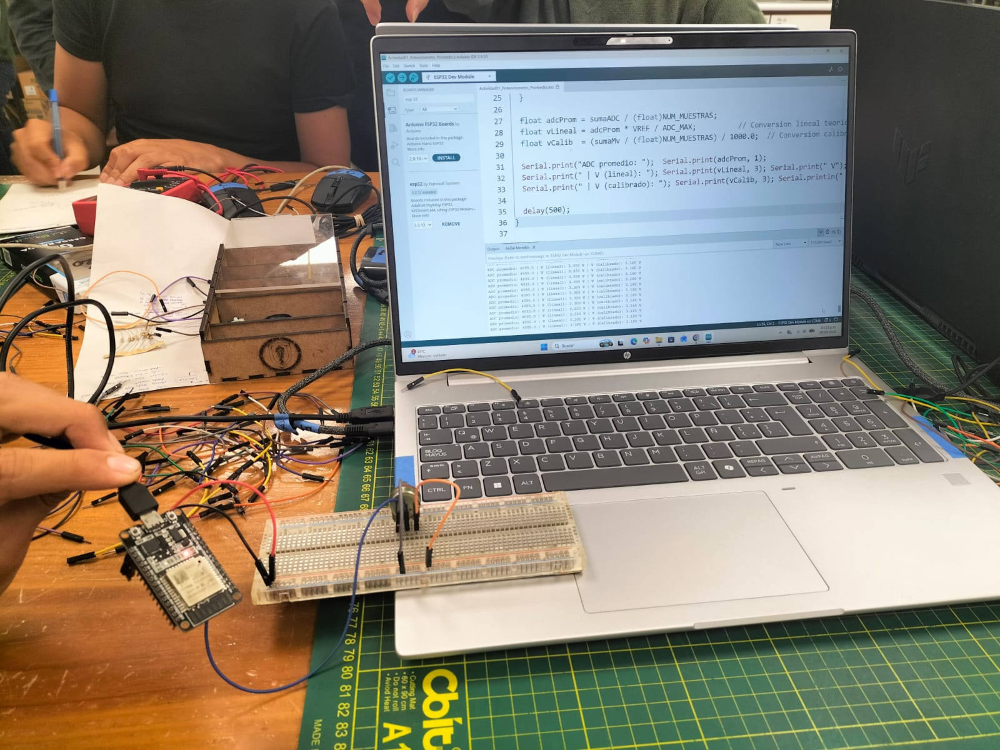
*Figura 1. Potenciómetro en la protoboard, conectado al GPIO34.*

**Desarrollo:** el ADC trabaja con 12 bits (lecturas de 0 a 4095). Se promediaron **32 muestras** y el voltaje se calculó de dos formas: con una conversión lineal y con `analogReadMilliVolts()`, que usa la calibración del ESP32.

**Actividad01_Potenciometro_Promedio.ino**

```cpp
const int   POT_PIN      = 34;
const int   NUM_MUESTRAS = 32;
const float VREF         = 3.3;
const int   ADC_MAX      = 4095;

void setup() {
  Serial.begin(115200);
  analogReadResolution(12);
  analogSetPinAttenuation(POT_PIN, ADC_11db);

  Serial.println("Actividad 01: Potenciometro con promediado");
}

void loop() {
  long sumaADC = 0;
  long sumaMv  = 0;

  for (int i = 0; i < NUM_MUESTRAS; i++) {
    sumaADC += analogRead(POT_PIN);
    sumaMv  += analogReadMilliVolts(POT_PIN);
    delay(2);
  }

  float adcProm = sumaADC / (float)NUM_MUESTRAS;
  float vLineal = adcProm * VREF / ADC_MAX;
  float vCalib  = (sumaMv / (float)NUM_MUESTRAS) / 1000.0;

  Serial.print("ADC promedio: ");
  Serial.print(adcProm, 1);

  Serial.print(" | V (lineal): ");
  Serial.print(vLineal, 3);
  Serial.print(" V");

  Serial.print(" | V (calibrado): ");
  Serial.print(vCalib, 3);
  Serial.println(" V");

  delay(500);
}
```

**Resultados**

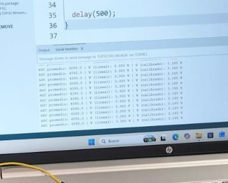

*Figura 2. ADC promedio y voltaje lineal y calibrado en distintas posiciones del potenciómetro.*

**Interpretación:** el promedio de 32 muestras dio lecturas más estables que la lectura directa. Al girar el potenciómetro, el ADC y el voltaje cambian de forma proporcional. La pequeña diferencia entre los dos voltajes se debe a que la conversión lineal parte de una relación teórica, mientras que `analogReadMilliVolts()` corrige parte de la no linealidad del conversor. Con pocas líneas (promediar y convertir) mejora bastante la calidad de la medición.

---

## Actividad 02: Conexión Wi-Fi mediante hotspot

**Objetivo:** conectar el ESP32 al hotspot del celular y mostrar en el Monitor Serie la IP y otros parámetros de la conexión.

**Desarrollo:** se usó `WiFi.h` con el ESP32 en modo estación (`WIFI_STA`), es decir, como cliente de una red existente. El hotspot se dejó en **2.4 GHz**, porque el ESP32 no reconoce redes de 5 GHz. Al conectarse, el programa imprime IP, puerta de enlace, máscara de subred, MAC y RSSI (intensidad de señal). Además, revisa periódicamente la conexión y se reconecta si se pierde.

**Actividad02_WiFi_Hotspot.ino**

```cpp
#include <WiFi.h>

const char* WIFI_SSID     = "TU_SSID";
const char* WIFI_PASSWORD = "TU_PASSWORD";

void conectarWiFi() {
  Serial.printf("\nConectando a: %s\n", WIFI_SSID);

  WiFi.mode(WIFI_STA);
  WiFi.begin(WIFI_SSID, WIFI_PASSWORD);

  unsigned long inicio = millis();

  while (WiFi.status() != WL_CONNECTED &&
         millis() - inicio < 20000) {
    delay(500);
    Serial.print(".");
  }

  if (WiFi.status() == WL_CONNECTED) {
    Serial.println("\nConexion exitosa");

    Serial.print("Direccion IP asignada: ");
    Serial.println(WiFi.localIP());

    Serial.print("Puerta de enlace: ");
    Serial.println(WiFi.gatewayIP());

    Serial.print("Mascara de subred: ");
    Serial.println(WiFi.subnetMask());

    Serial.print("Direccion MAC: ");
    Serial.println(WiFi.macAddress());

    Serial.print("Intensidad (RSSI): ");
    Serial.print(WiFi.RSSI());
    Serial.println(" dBm");
  } else {
    Serial.println("\nNo se pudo conectar.");
  }
}

void setup() {
  Serial.begin(115200);
  delay(1000);
  conectarWiFi();
}

void loop() {
  if (WiFi.status() != WL_CONNECTED) {
    Serial.println("Conexion perdida, reintentando...");
    conectarWiFi();
  }

  delay(5000);
}
```

**Resultados**

| Parámetro | Resultado |
|---|---|
| Estado | Conexión exitosa |
| Dirección IP | 10.28.25.252 |
| Puerta de enlace | 10.28.25.37 |
| Máscara de subred | 255.255.255.0 |
| Dirección MAC | 40:22:D8:60:B2:B0 |
| RSSI inicial / posterior / final | -53 / -40 / -38 dBm |

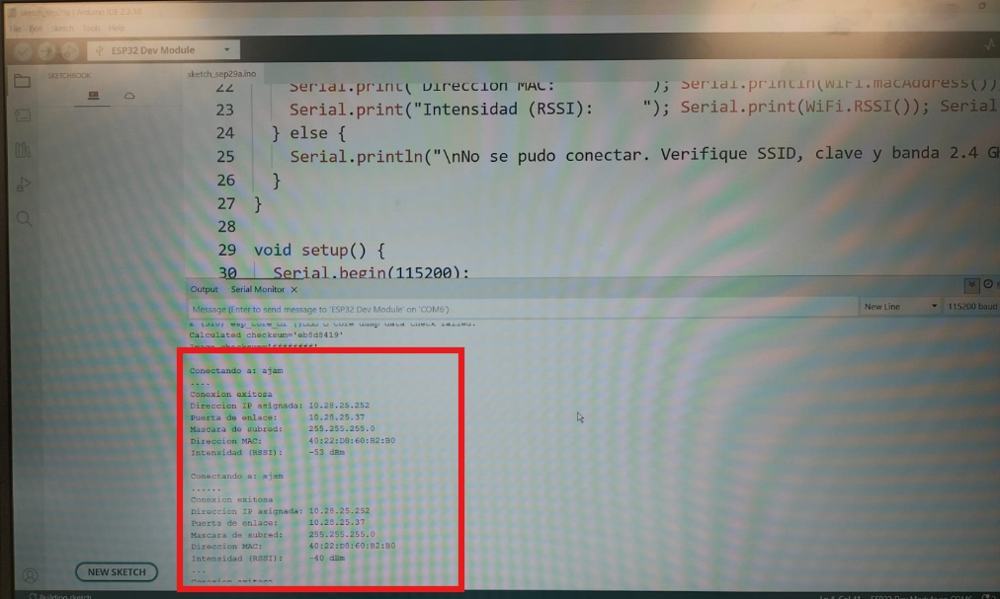
*Figura 3. Monitor serie con la conexión exitosa y los parámetros de red.*

**Interpretación:** el ESP32 se conectó sin problemas y recibió la IP 10.28.25.252. La máscara 255.255.255.0 corresponde a una red /24 y la puerta de enlace es el propio celular actuando como router, de modo que la placa ya tiene salida a internet. El RSSI pasó de -53 a -38 dBm; como los valores cercanos a 0 indican mejor señal, esta mejoró, probablemente por un cambio de distancia o posición entre el celular y la placa.

**Observaciones**

- Al arrancar apareció el aviso *"Core dump data check failed"*. Es informativo (no hay registro de fallos guardado) y la ejecución continuó con normalidad.
- Al subir el código apareció *"Wrong boot mode detected (0x13)"*. Se solucionó manteniendo presionado el botón **BOOT** mientras el IDE mostraba "Connecting..." y soltándolo al empezar la escritura.

---

## Actividad 03: Envío de datos del potenciómetro a la nube

**Objetivo:** visualizar en tiempo real la variación del potenciómetro en una plataforma IoT. Se trabajó solo con **ThingSpeak**; Arduino Cloud no se desarrolló por falta de tiempo y por la comodidad de ThingSpeak.

**Desarrollo:** se creó un canal con dos campos: voltaje (Field 1) y ADC (Field 2). El ESP32 se conecta al Wi-Fi y cada 20 segundos envía una petición HTTP con la *Write API Key* y los valores medidos (promedio de 32 muestras, como en la Actividad 01). El intervalo respeta el mínimo de 15 s de la cuenta gratuita, con un pequeño margen.

**Actividad03_ThingSpeak.ino**

```cpp
#include <WiFi.h>
#include <HTTPClient.h>

const char* WIFI_SSID     = "TU_SSID";
const char* WIFI_PASSWORD = "TU_PASSWORD";
const char* WRITE_API_KEY = "TU_WRITE_API_KEY";

const unsigned long INTERVALO_MS = 20000;
unsigned long ultimoEnvio = 0;

// ---------- Lectura del potenciometro (GPIO34, ADC1) ----------
const int POT_PIN      = 34;
const int NUM_MUESTRAS = 32;

void iniciarSensor() {
  analogReadResolution(12);
  analogSetPinAttenuation(POT_PIN, ADC_11db);
}

// Devuelve el voltaje promedio (V) y el ADC promedio (por referencia)
float leerValor(int &adcProm) {
  long sumaADC = 0, sumaMv = 0;
  for (int i = 0; i < NUM_MUESTRAS; i++) {
    sumaADC += analogRead(POT_PIN);
    sumaMv  += analogReadMilliVolts(POT_PIN);
    delay(2);
  }
  adcProm = sumaADC / NUM_MUESTRAS;
  return (sumaMv / (float)NUM_MUESTRAS) / 1000.0;
}
const char* NOMBRE_VAR = "Voltaje";

void conectarWiFi() {
  WiFi.mode(WIFI_STA);
  WiFi.begin(WIFI_SSID, WIFI_PASSWORD);
  Serial.print("Conectando a Wi-Fi");
  while (WiFi.status() != WL_CONNECTED) { delay(500); Serial.print("."); }
  Serial.print("\nIP: "); Serial.println(WiFi.localIP());
}

void setup() {
  Serial.begin(115200);
  iniciarSensor();
  conectarWiFi();
}

void loop() {
  if (WiFi.status() != WL_CONNECTED) conectarWiFi();

  if (millis() - ultimoEnvio >= INTERVALO_MS) {
    ultimoEnvio = millis();
    int adc;
    float valor = leerValor(adc);

    String url = "http://api.thingspeak.com/update?api_key=" + String(WRITE_API_KEY) +
                 "&field1=" + String(valor, 3) + "&field2=" + String(adc);

    HTTPClient http;
    http.begin(url);
    int codigo = http.GET();   // ThingSpeak responde con el n.° de entrada (0 = error)
    if (codigo > 0) {
      Serial.printf("Enviado -> valor: %.3f | ADC: %d | HTTP: %d | entrada #%s\n",
                    valor, adc, codigo, http.getString().c_str());
    } else {
      Serial.printf("Error HTTP: %s\n", http.errorToString(codigo).c_str());
    }
    http.end();
  }
}
```

**Resultados**

<p align="center">
  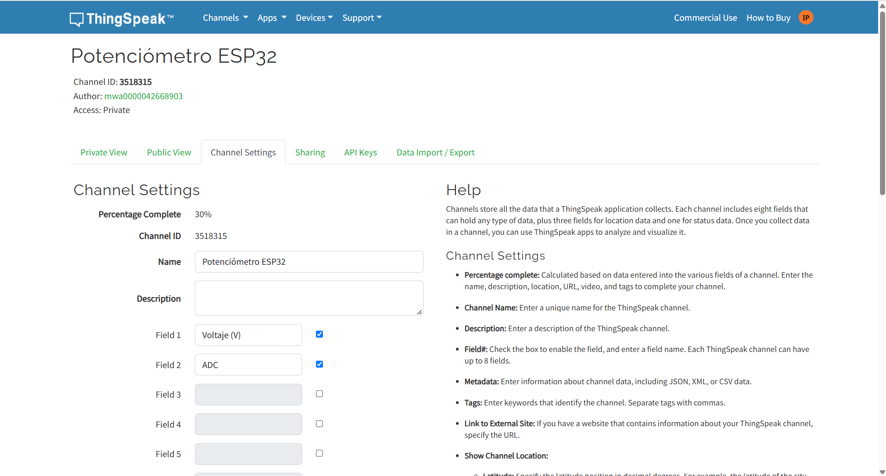<br>
  <em>Figura 4. Canal de ThingSpeak con sus campos configurados.</em>
</p>
<p align="center">
  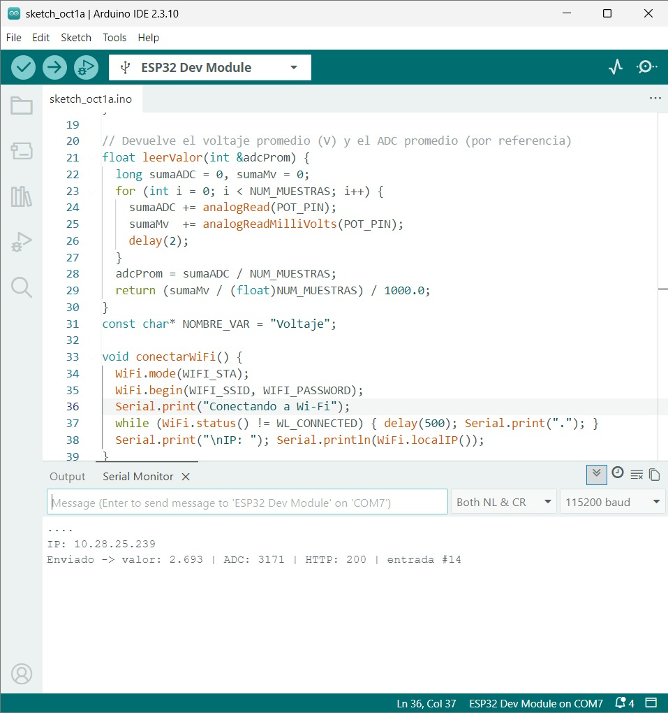<br>
  <em>Figura 5. Monitor serie confirmando cada envío (HTTP 200 y número de entrada).</em>
</p>
<p align="center">
  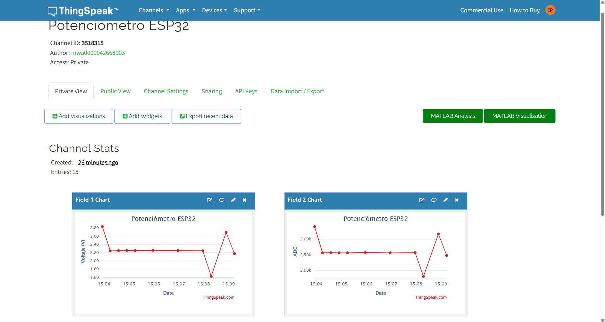<br>
  <em>Figura 6. Gráficas del voltaje y del ADC en el canal.</em>
</p>

**Interpretación:** ThingSpeak registró los envíos y los reflejó en las gráficas; al mover el potenciómetro, el voltaje y el ADC cambiaron. Por el intervalo de 20 s, las gráficas muestran mediciones separadas y no capturan los cambios rápidos.

---

## Actividad 04: Envío de datos de un sensor del kit Keystudio

**Objetivo:** repetir el envío a la nube usando un sensor real en lugar del potenciómetro.

**Desarrollo:** se usó un sensor de temperatura **LM35** conectado al **GPIO35** (también ADC1), alimentado con 5 V desde VIN. Se mantuvo el promedio de 32 muestras y la conversión del LM35 es directa: 10 mV = 1 °C. Los datos se envían a ThingSpeak cada 20 s (Field 1 = temperatura, Field 2 = ADC).

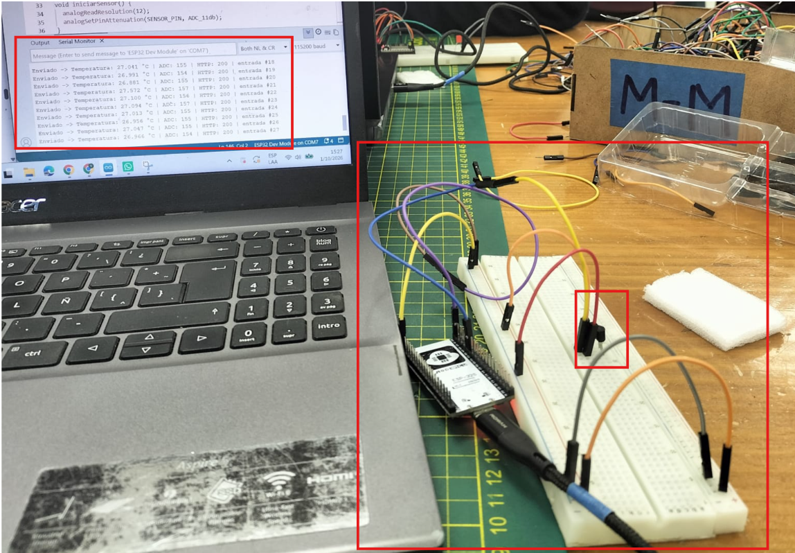
*Figura 7. Conexión del sensor al ESP32.*

**Actividad04_ThingSpeak.ino**

```cpp
/*
  Actividad 04 - Sensor LM35 + ThingSpeak

  Conexiones:
  LM35 VCC  -> ESP32 VIN (5 V)
  LM35 OUT  -> ESP32 GPIO35
  LM35 GND  -> ESP32 GND

  ThingSpeak:
  Field 1 = Temperatura (°C)
  Field 2 = ADC

  El ESP32 envía una medición cada 20 segundos.
*/

#include <WiFi.h>
#include <HTTPClient.h>

// ---------- Datos de conexión ----------
const char* WIFI_SSID     = "TU_SSID";
const char* WIFI_PASSWORD = "TU_PASSWORD";
const char* WRITE_API_KEY = "TU_WRITE_API_KEY";

// ---------- Intervalo de envío ----------
const unsigned long INTERVALO_MS = 20000;
unsigned long ultimoEnvio = 0;

// ---------- Sensor LM35 ----------
const int SENSOR_PIN   = 35;
const int NUM_MUESTRAS = 32;

// Configuración del ADC
void iniciarSensor() {
  analogReadResolution(12);
  analogSetPinAttenuation(SENSOR_PIN, ADC_11db);
}

// Lee el LM35 y devuelve la temperatura en °C
// adcProm recibe el valor ADC promedio
float leerTemperatura(int &adcProm) {
  long sumaADC = 0;
  long sumaMv  = 0;

  // Tomar varias muestras para estabilizar la lectura
  for (int i = 0; i < NUM_MUESTRAS; i++) {
    sumaADC += analogRead(SENSOR_PIN);
    sumaMv  += analogReadMilliVolts(SENSOR_PIN);
    delay(2);
  }

  adcProm = sumaADC / NUM_MUESTRAS;
  float mv = sumaMv / (float)NUM_MUESTRAS;

  // LM35: 10 mV = 1 °C
  return mv / 10.0;
}

// ---------- Conexión Wi-Fi (máximo 20 intentos) ----------
void conectarWiFi() {
  WiFi.mode(WIFI_STA);
  WiFi.begin(WIFI_SSID, WIFI_PASSWORD);

  Serial.print("Conectando a Wi-Fi");

  int intentos = 0;
  while (WiFi.status() != WL_CONNECTED && intentos < 20) {
    delay(500);
    Serial.print(".");
    intentos++;
  }

  if (WiFi.status() == WL_CONNECTED) {
    Serial.println("\nConectado exitosamente");
    Serial.print("IP: ");
    Serial.println(WiFi.localIP());
  } else {
    Serial.println("\nNo se pudo conectar. Verifique SSID, clave y banda 2.4 GHz.");
  }
}

// ---------- Configuración inicial ----------
void setup() {
  Serial.begin(115200);
  delay(1000);

  iniciarSensor();
  conectarWiFi();

  ultimoEnvio = millis() - INTERVALO_MS;   // Primer envío inmediato
}

// ---------- Programa principal ----------
void loop() {
  // Si se cayó el Wi-Fi, reintentar
  if (WiFi.status() != WL_CONNECTED) {
    conectarWiFi();
  }

  // Esperar hasta cumplir el intervalo de envío
  if (millis() - ultimoEnvio >= INTERVALO_MS) {
    ultimoEnvio = millis();

    int adc;
    float temperatura = leerTemperatura(adc);

    if (WiFi.status() == WL_CONNECTED) {
      String url = "http://api.thingspeak.com/update?api_key=" +
                   String(WRITE_API_KEY) +
                   "&field1=" + String(temperatura, 3) +
                   "&field2=" + String(adc);

      HTTPClient http;
      http.begin(url);
      int codigo = http.GET();

      if (codigo > 0) {
        Serial.printf("Enviado -> Temperatura: %.3f °C | ADC: %d | HTTP: %d | entrada #%s\n",
                      temperatura, adc, codigo, http.getString().c_str());
      } else {
        Serial.printf("Error HTTP: %s\n", http.errorToString(codigo).c_str());
      }
      http.end();
    } else {
      Serial.printf("Lectura local -> Temperatura: %.3f °C | ADC: %d (sin Wi-Fi)\n", temperatura, adc);
    }
  }
}
```

**Resultados**

<p align="center">
  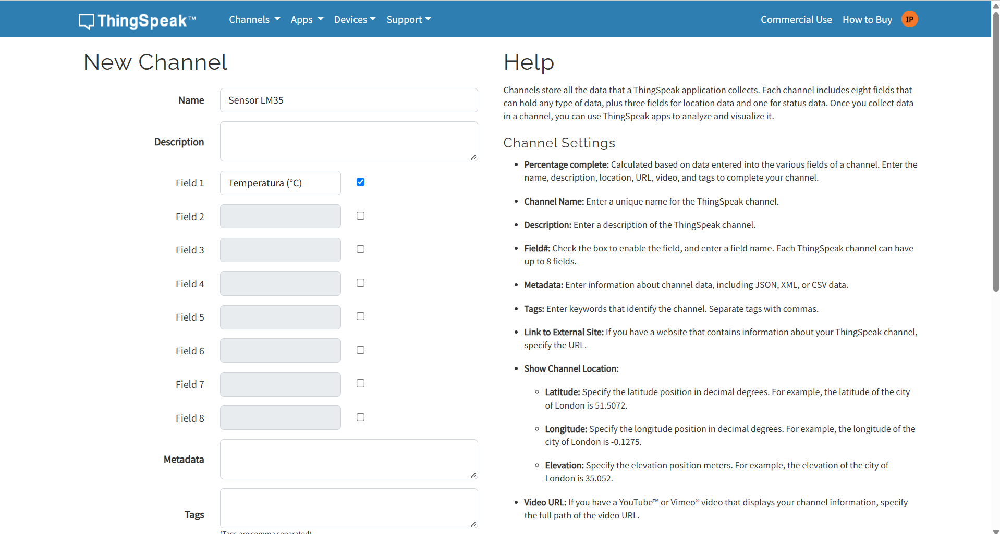<br>
  <em>Figura 8. Canal de ThingSpeak configurado para temperatura y ADC.</em>
</p>
<p align="center">
  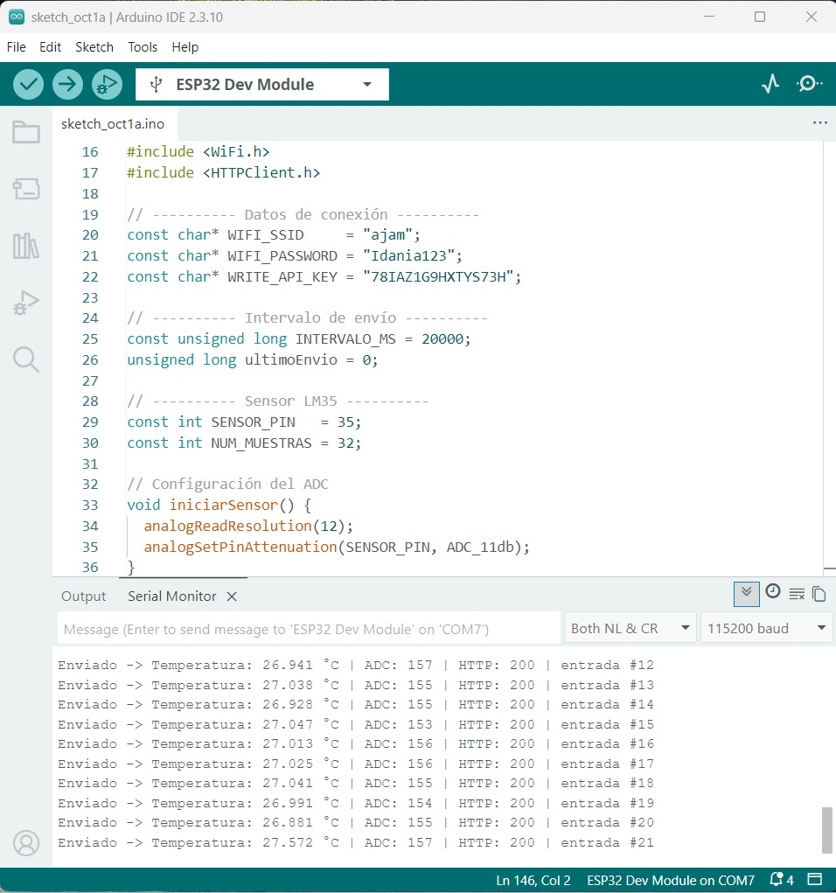<br>
  <em>Figura 9. Monitor serie con los envíos de temperatura y ADC.</em>
</p>
<p align="center">
  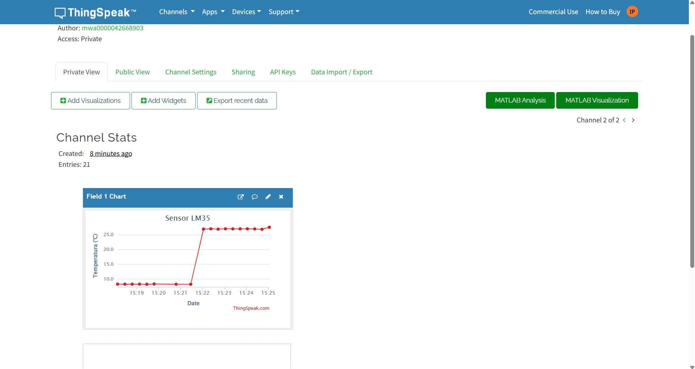<br>
  <em>Figura 10. Temperatura medida, visualizada en la plataforma IoT.</em>
</p>

**Interpretación:** la gráfica responde a los cambios de temperatura sobre el LM35: el valor sube cuando el sensor recibe calor. Se comprobó que el ESP32 puede adquirir variables del entorno y transmitirlas a la nube sin depender de una entrada manual como el potenciómetro.

---

## Actividad 05: Control de un LED desde la nube

**Objetivo:** hacer el camino inverso: recibir una orden desde internet para encender y apagar un LED conectado al ESP32.

**Desarrollo:** se usó **MQTT** (publicación/suscripción). El ESP32 se conecta al Wi-Fi del hotspot y luego al broker público **broker.emqx.io** (puerto 1883), donde se suscribe al topic `esp32/led`. Si llega `ON`, la función `callback()` enciende el LED; si llega `OFF`, lo apaga. Se montó un **LED externo** con resistencia en serie en el **GPIO2**, con el otro extremo a GND, y las órdenes se enviaron desde una app cliente MQTT en el celular. El código genera un ID de cliente aleatorio en cada conexión (para evitar choques en el broker público) y se reconecta y resuscribe solo si la conexión se interrumpe.

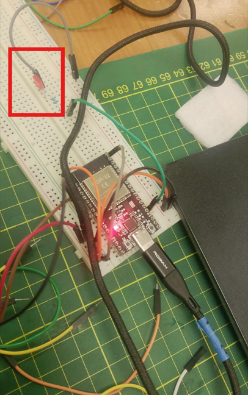
*Figura 11. LED con su resistencia conectado al GPIO2.*

**Actividad05_LED_ArduinoCloud.ino**

```cpp
#include <WiFi.h>
#include <PubSubClient.h>

const char* ssid = "TU_SSID";
const char* password = "TU_PASSWORD";

const char* mqtt_server = "broker.emqx.io";

const int LED_PIN = 2;

WiFiClient espClient;
PubSubClient client(espClient);

void callback(char* topic, byte* payload, unsigned int length) {

  String mensaje = "";

  for (unsigned int i = 0; i < length; i++) {
    mensaje += (char)payload[i];
  }

  Serial.print("Mensaje recibido: ");
  Serial.println(mensaje);

  if (mensaje == "ON") {
    digitalWrite(LED_PIN, HIGH);
    Serial.println("LED ENCENDIDO");
  }

  if (mensaje == "OFF") {
    digitalWrite(LED_PIN, LOW);
    Serial.println("LED APAGADO");
  }
}

void conectarMQTT() {

  while (!client.connected()) {

    Serial.println("Intentando conectar a MQTT...");

    String clientId = "ESP32-";
    clientId += String(random(0xffff), HEX);

    if (client.connect(clientId.c_str())) {

      Serial.println("MQTT CONECTADO");

      client.subscribe("esp32/led");

      Serial.println("Suscrito a: esp32/led");

    } else {

      Serial.print("Fallo MQTT. Estado: ");
      Serial.println(client.state());

      delay(3000);
    }
  }
}

void setup() {

  Serial.begin(115200);

  pinMode(LED_PIN, OUTPUT);
  digitalWrite(LED_PIN, LOW);

  WiFi.mode(WIFI_STA);
  WiFi.disconnect();
  delay(1000);

  WiFi.begin(ssid, password);

  Serial.print("Conectando al WiFi");

  while (WiFi.status() != WL_CONNECTED) {
    delay(500);
    Serial.print(".");
  }

  Serial.println();
  Serial.println("WiFi conectado");

  Serial.print("IP: ");
  Serial.println(WiFi.localIP());

  client.setServer(mqtt_server, 1883);
  client.setCallback(callback);

  conectarMQTT();
}

void loop() {

  if (!client.connected()) {
    conectarMQTT();
  }

  client.loop();
}
```

**Resultados**

<p align="center">
  <br>
  <em>Figura 12. Captura en el computador durante la prueba.</em>
</p>
<p align="center">
  
  
  <br>
  <em>Figuras 13 a 15. Capturas en el celular durante la prueba.</em>
</p>
<p align="center">
  
  <br>
  <em>Figuras 16 y 17. Estado del LED durante la prueba.</em>
</p>

**Interpretación:** desde la app del celular se conectó al mismo broker (Figura 12) y se publicaron mensajes en `esp32/led` (Figuras 13 y 14). Al enviar `ON`, el broker reenvía el mensaje a la placa suscrita y el LED se enciende; con `OFF` se apaga. Se usó calidad de servicio 0 (entrega como máximo una vez), suficiente para un LED. A diferencia de las actividades anteriores, aquí la placa no envía ni consulta nada por iniciativa propia: queda a la escucha y el broker le entrega el mensaje apenas llega.

Esto muestra la comunicación bidireccional típica de IoT y por qué MQTT es tan usado: mensajes pequeños, conexión liviana y un mismo dato puede llegar a varios dispositivos. Como limitación, el broker es público y sin usuario ni contraseña (los campos de credenciales quedaron vacíos en la Figura 12), por lo que cualquiera que conozca el topic podría enviar órdenes a la placa. En una aplicación real convendría un broker con autenticación.

---

## Conclusiones

- El ADC del ESP32 tiene ruido y cierta no linealidad: conviene promediar y, para precisión en voltios, usar la lectura calibrada.
- Con Wi-Fi activo hay que usar pines del ADC1 y redes de 2.4 GHz.
- ThingSpeak (HTTP) es práctico para registrar y graficar datos, pero su límite de un envío cada 15 s lo hace poco adecuado para control en tiempo real. MQTT ofrece comunicación liviana e inmediata en ambos sentidos, aunque exige cuidar la seguridad del broker.
- Un sistema IoT es una cadena completa (sensor, microcontrolador, red y plataforma): si falla un eslabón, los datos no llegan.
- Lo aprendido es aplicable al proyecto integrador: en un sistema automatizado de clarificación de agua con quitosano, un ESP32 podría registrar variables del proceso en la nube y recibir órdenes remotas, como activar o detener la dosificación.

## Herramientas y bibliotecas

- Arduino IDE con el paquete de placas **esp32** (placa "ESP32 Dev Module")
- `WiFi.h` y `HTTPClient.h` (incluidas en el paquete del ESP32) y `PubSubClient` (MQTT)
- ThingSpeak y broker público EMQX (MQTT)

> **Seguridad:** las credenciales de Wi-Fi y las API Keys deben mantenerse privadas; en el código se reemplazan por datos propios de cada dispositivo.
