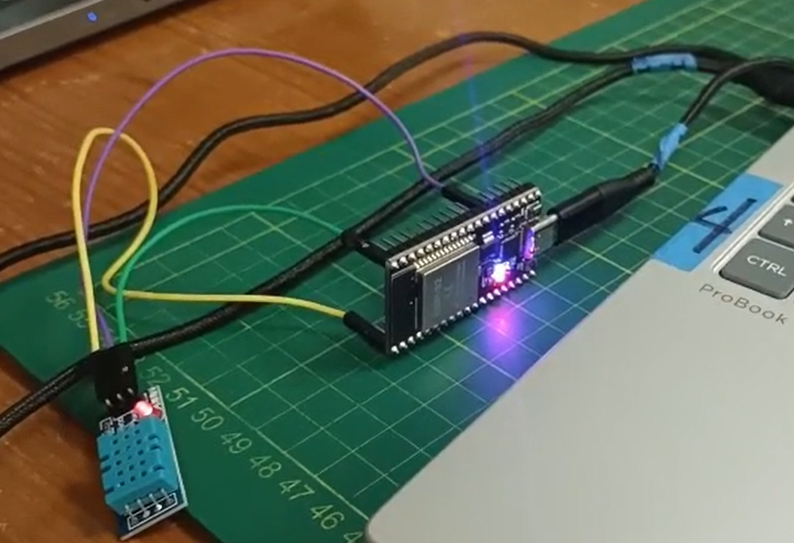
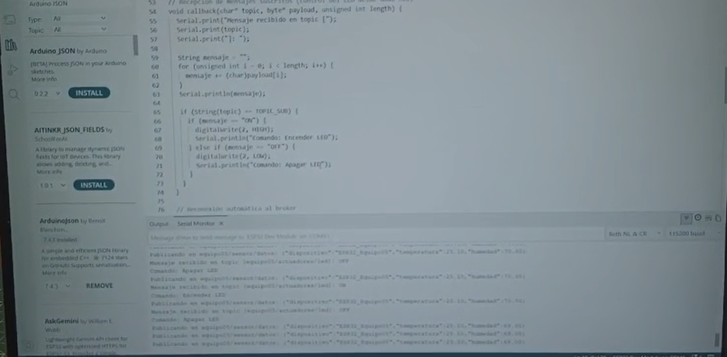
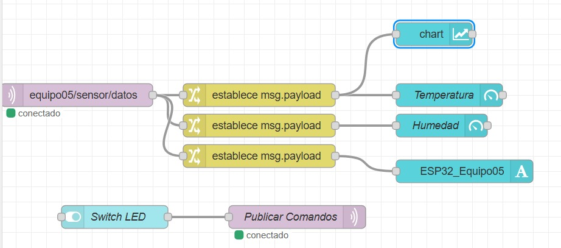
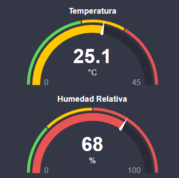
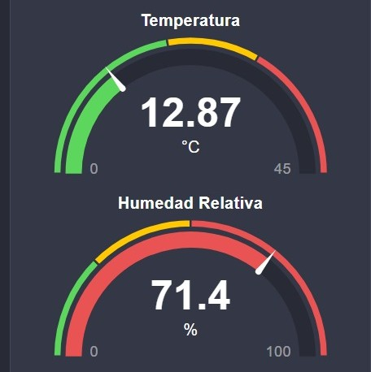
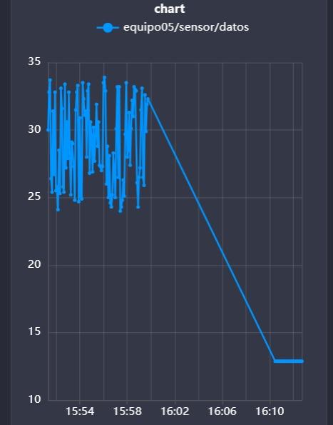

# Sistema de Monitoreo y Control IoT (ESP32 + MQTT + Node-RED)

Este repositorio contiene la implementación de un sistema de Internet de las Cosas (IoT) con comunicación bidireccional en tiempo real utilizando el protocolo MQTT.

## Descripción del Proyecto
El proyecto utiliza un microcontrolador **ESP32** para capturar variables ambientales (temperatura y humedad) a través de un **sensor DHT11**. Estos datos son empaquetados en formato JSON y publicados en un broker MQTT. Simultáneamente, el ESP32 se suscribe a un tópico de control para escuchar comandos remotos y accionar un actuador físico (LED).

La interfaz gráfica y el enrutamiento de los mensajes se gestionan desde **Node-RED**, proporcionando un Dashboard interactivo accesible desde cualquier navegador.

---

## Hardware y Montaje
Para la implementación física de este proyecto se utilizaron los siguientes componentes:
- ESP32 Dev Kit 1
- Sensor de Temperatura y Humedad DHT11
- Diodo LED y Resistencia (220Ω)
- Protoboard y cables jumper



---

## Código del Firmware (ESP32)

El siguiente código en C++ se carga en el ESP32. Maneja la conexión a la red Wi-Fi local, la reconexión automática al broker MQTT y la serialización/deserialización de los datos de forma no bloqueante.

```cpp
#include <WiFi.h>
#include <PubSubClient.h>
#include <ArduinoJson.h>
#include "DHT.h"

#define DHTPIN 4        // Pin de señal del DHT11
#define DHTTYPE DHT11   // Tipo de sensor
DHT dht(DHTPIN, DHTTYPE);

// ================= CONFIGURACIÓN WIFI =================
const char* WIFI_SSID = "ajam";
const char* WIFI_PASS = "Idania123";

// ================= CONFIGURACIÓN MQTT =================
const char* MQTT_SERVER = "mqtt.rcr-labs.com";
const int   MQTT_PORT   = 1883;

const char* MQTT_USER     = "alumno";
const char* MQTT_PASSWORD = "UPCH2026";
const char* CLIENT_ID     = "ESP32_Equipo05";

// Topics MQTT
const char* TOPIC_PUB = "equipo05/sensor/datos";
const char* TOPIC_SUB = "equipo05/actuadores/led";

// ================= OBJETOS Y VARIABLES ===============
WiFiClient espClient;
PubSubClient client(espClient);

unsigned long ultimoEnvio = 0;
const long intervaloEnvio = 2000;   // Envío cada 2 segundos (no bloqueante)

// Conexión a la red Wi-Fi
void setupWiFi() {
  delay(10);
  Serial.println();
  Serial.print("Conectando a Wi-Fi: ");
  Serial.println(WIFI_SSID);

  WiFi.mode(WIFI_STA);
  WiFi.begin(WIFI_SSID, WIFI_PASS);

  while (WiFi.status() != WL_CONNECTED) {
    delay(500);
    Serial.print(".");
  }

  Serial.println("\nWiFi conectado con éxito");
  Serial.print("Dirección IP local: ");
  Serial.println(WiFi.localIP());
}

// Recepción de mensajes suscritos (control del LED desde Node-RED)
void callback(char* topic, byte* payload, unsigned int length) {
  Serial.print("Mensaje recibido en topic [");
  Serial.print(topic);
  Serial.print("]: ");

  String mensaje = "";
  for (unsigned int i = 0; i < length; i++) {
    mensaje += (char)payload[i];
  }
  Serial.println(mensaje);

  if (String(topic) == TOPIC_SUB) {
    if (mensaje == "ON") {
      digitalWrite(2, HIGH);
      Serial.println("Comando: Encender LED");
    } else if (mensaje == "OFF") {
      digitalWrite(2, LOW);
      Serial.println("Comando: Apagar LED");
    }
  }
}

// Reconexión automática al broker
void reconnect() {
  while (!client.connected()) {
    Serial.print("Intentando conectar con broker MQTT...");

    if (client.connect(CLIENT_ID, MQTT_USER, MQTT_PASSWORD)) {
      Serial.println(" ¡Conectado!");
      client.subscribe(TOPIC_SUB);
      Serial.print("Suscrito a: ");
      Serial.println(TOPIC_SUB);
    } else {
      Serial.print(" Falló. Código de error rc=");
      Serial.print(client.state());
      Serial.println(" Reintentando en 5 segundos...");
      delay(5000);
    }
  }
}

void setup() {
  Serial.begin(115200);
  pinMode(2, OUTPUT);
  dht.begin();                       // Inicializar el DHT11

  setupWiFi();

  client.setServer(MQTT_SERVER, MQTT_PORT);
  client.setCallback(callback);
}

void loop() {
  // Reconectar el Wi-Fi si se cayó
  if (WiFi.status() != WL_CONNECTED) {
    setupWiFi();
  }

  // Asegurar persistencia de la sesión MQTT
  if (!client.connected()) {
    reconnect();
  }
  client.loop();

  // Envío periódico sin usar delay()
  unsigned long ahora = millis();
  if (ahora - ultimoEnvio >= intervaloEnvio) {
    ultimoEnvio = ahora;

    float temp = dht.readTemperature();
    float hum  = dht.readHumidity();

    if (isnan(hum) || isnan(temp)) {
      Serial.println(F("Failed to read from DHT sensor!"));
      return;
    }

    // Creación del documento JSON
    StaticJsonDocument<200> doc;
    doc["dispositivo"] = CLIENT_ID;
    doc["temperatura"] = serialized(String(temp, 2));
    doc["humedad"]     = serialized(String(hum, 2));

    char jsonBuffer[256];
    serializeJson(doc, jsonBuffer);

    Serial.print("Publicando en ");
    Serial.print(TOPIC_PUB);
    Serial.print(": ");
    Serial.println(jsonBuffer);

    client.publish(TOPIC_PUB, jsonBuffer);
  }
}
```
## Código del Arduino / DontPad
```cpp
#include <WiFi.h>
#include <PubSubClient.h>
#include <ArduinoJson.h>

// ================= CONFIGURACIÓN WIFI =================
const char* WIFI_SSID = "ajam";
const char* WIFI_PASS = "Idania123";

// ================= CONFIGURACIÓN MQTT =================
// Puedes usar el dominio o la IP directa 108.181.195.81
const char* MQTT_SERVER   = "mqtt.rcr-labs.com"; 
const int   MQTT_PORT     = 1883;

// Credenciales configuradas en EMQX (Autenticación interna)
const char* MQTT_USER     = "equipo05"   // o equipo0, equipo1, etc.
const char* MQTT_PASSWORD = "UPCH2026";
const char* CLIENT_ID     = "ESP32_Equipo05";

// Topics MQTT
const char* TOPIC_PUB     = "equipo05/sensor/datos";
const char* TOPIC_SUB     = "equipo05/actuadores/led";

// ================= OBJETOS Y VARIABLES ===============
WiFiClient espClient;
PubSubClient client(espClient);

unsigned long ultimoEnvio = 0;
const long intervaloEnvio = 5000; // Envío cada 5 segundos (no bloqueante)

// Conexión a la red Wi-Fi
void setupWiFi() {
  delay(10);
  Serial.println();
  Serial.print("Conectando a Wi-Fi: ");
  Serial.println(WIFI_SSID);

  WiFi.mode(WIFI_STA);
  WiFi.begin(WIFI_SSID, WIFI_PASS);

  while (WiFi.status() != WL_CONNECTED) {
    delay(500);
    Serial.print(".");
  }

  Serial.println("\nWiFi conectado con éxito");
  Serial.print("Dirección IP local: ");
  Serial.println(WiFi.localIP());
}

// Recepción de mensajes suscritos (por si deseas controlar actuadores desde Node-RED)
void callback(char* topic, byte* payload, unsigned int length) {
  Serial.print("Mensaje recibido en topic [");
  Serial.print(topic);
  Serial.print("]: ");

  String mensaje = "";
  for (unsigned int i = 0; i < length; i++) {
    mensaje += (char)payload[i];
  }
  Serial.println(mensaje);

  // Ejemplo: procesar comando
  if (String(topic) == TOPIC_SUB) {
    if (mensaje == "ON") {
      digitalWrite(2, HIGH);
      Serial.println("Comando: Encender LED");
    } else if (mensaje == "OFF") {
      digitalWrite(2, LOW);
      Serial.println("Comando: Apagar LED");
    }
  }
}

// Reconexión automática al broker EMQX
void reconnect() {
  while (!client.connected()) {
    Serial.print("Intentando conectar con broker MQTT...");
    
    // Autenticación con credenciales en EMQX
    if (client.connect(CLIENT_ID, MQTT_USER, MQTT_PASSWORD)) {
      Serial.println(" ¡Conectado!");
      
      // Suscribirse a tópicos de control si es necesario
      client.subscribe(TOPIC_SUB);
      Serial.print("Suscrito a: ");
      Serial.println(TOPIC_SUB);
    } else {
      Serial.print(" Falló. Código de error rc=");
      Serial.print(client.state());
      Serial.println(" Reintentando en 5 segundos...");
      delay(5000);
    }
  }
}

void setup() {
  Serial.begin(115200);
  setupWiFi();

  client.setServer(MQTT_SERVER, MQTT_PORT);
  client.setCallback(callback);
  pinMode(2,OUTPUT);
}

void loop() {
  // Asegurar persistencia de la sesión MQTT
  if (!client.connected()) {
    reconnect();
  }
  client.loop();

  // Envío periódico sin usar delay() para no congelar la recepción
  unsigned long ahora = millis();
  if (ahora - ultimoEnvio >= intervaloEnvio) {
    ultimoEnvio = ahora;

    // Simulación de lectura de sensores (ej. DHT22 o BMP280)
    float tempSimulada = 24.0 + (random(0, 100) / 10.0);
    float humSimulada  = 55.0 + (random(0, 200) / 10.0);

    // Creación del documento JSON
    StaticJsonDocument<200> doc;
    doc["dispositivo"] = CLIENT_ID;
    doc["temperatura"] = serialized(String(tempSimulada, 2));
    doc["humedad"]     = serialized(String(humSimulada, 2));

    char jsonBuffer[256];
    serializeJson(doc, jsonBuffer);

    // Publicación hacia EMQX
    Serial.print("Publicando en ");
    Serial.print(TOPIC_PUB);
    Serial.print(": ");
    Serial.println(jsonBuffer);

    client.publish(TOPIC_PUB, jsonBuffer);
  }
}
```



---

## Procesamiento de Datos (Node-RED)

El procesamiento de la información en el lado del servidor/cliente se realiza mediante flujos visuales en Node-RED. 

1. **Recepción (Subscriber):** Un nodo MQTT recibe el JSON en el tópico `equipo05/sensor/datos`.
2. **Parseo y Enrutamiento:** Se extraen las variables específicas mediante nodos intermedios (`msg.payload`) y se dirigen a los componentes de la interfaz de usuario (UI).
3. **Control (Publisher):** Un nodo de tipo *Switch* genera un payload con los comandos `ON`/`OFF` y los publica en el tópico `equipo05/actuadores/led`.



---

## Dashboard Interactivo y Pruebas

El panel de control IoT provee una interfaz gráfica intuitiva para el monitoreo y control del hardware a distancia.

### Indicadores en Tiempo Real
Visualización inmediata de las condiciones ambientales a través de medidores semicirculares (*Gauges*), indicando grados Celsius y porcentaje de humedad relativa. En la esquina superior derecha se ubica el interruptor de control remoto.





### Histórico de Telemetría (Charts)
Se incorporan gráficas lineales que registran el histórico de las variables, permitiendo visualizar tendencias, caídas de temperatura o variaciones a lo largo del tiempo.



### Prueba de Comunicación Bidireccional
Interacción en tiempo real accionando el actuador físico desde la nube. Al cambiar el interruptor a "ON" en Node-RED, el ESP32 recibe el comando MQTT y enciende el LED de manera instantánea se puede ver en el siguiente link:
