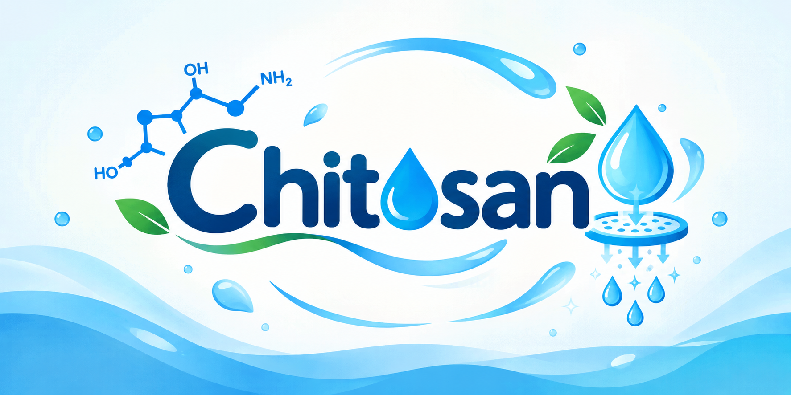
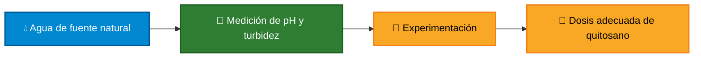
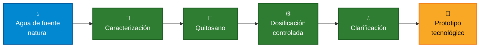
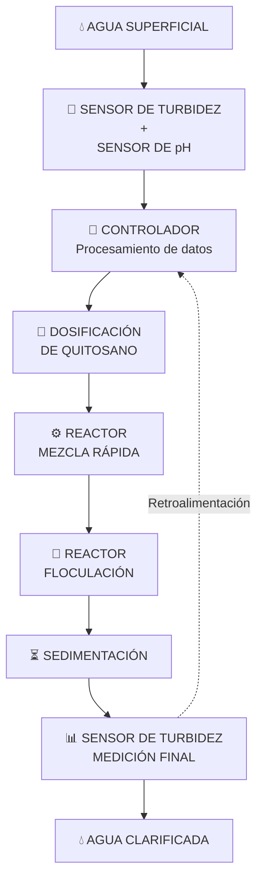
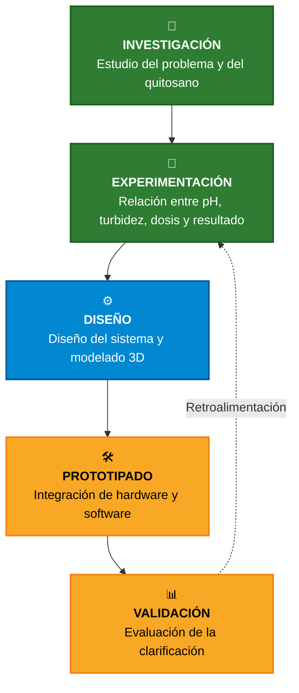

<p align="center">
  
</p>

<p align="center">
  
</p>

<p align="center">
  <b>🌱 Ingeniería Ambiental</b> &nbsp;•&nbsp;
  <b>💻 Ingeniería Informática</b> &nbsp;•&nbsp;
  <b>⚙️ Ingeniería Industrial</b>
</p>

<p align="center">
  <b>Universidad Peruana Cayetano Heredia</b>
</p>

<p align="center">
  
  
  
</p>

---

# 📑 Contenido

* [🌍 Sobre Nosotros](#-sobre-nosotros)
* [📸 Fotografía del Equipo](#-fotografía-del-equipo)
* [👥 Nuestro Equipo](#-nuestro-equipo)
* [💧 El Proyecto](#-el-proyecto)
* [🌎 El Contexto](#-el-contexto)
* [💡 Nuestra Propuesta](#-nuestra-propuesta)
* [✨ ¿Dónde está la innovación?](#-dónde-está-la-innovación)
* [♻️ Economía Circular](#️-economía-circular)
* [⚙️ Concepto del Sistema](#️-concepto-del-sistema)
* [🎯 Objetivos de Desarrollo Sostenible](#-objetivos-de-desarrollo-sostenible)
* [🧪 Hacia el Prototipo](#-hacia-el-prototipo)
* [🚀 Hacia dónde queremos llegar](#-hacia-dónde-queremos-llegar)
* [🎯 Nuestra Visión](#-nuestra-visión)

---

# 🌍 Sobre Nosotros

Somos el **Equipo 05** del curso **Proyecto Integrador 2026-II** de la **Universidad Peruana Cayetano Heredia**.

Nuestro equipo reúne estudiantes de diferentes áreas de ingeniería, integrando conocimientos para desarrollar una propuesta sostenible y tecnológica aplicada a un problema relacionado con la clarificación del agua.

### 🌱 Ambiente  •  🧪 Investigación  •  💻 Tecnología  •  ⚙️ Automatización

Nuestro proyecto parte de una idea:

## ¿Cómo podemos utilizar tecnología y experimentación para adaptar el proceso de clarificación a las características del agua?

---

# 📸 Fotografía del Equipo

<p align="center">
  
</p>

<p align="center">
  <i>Equipo 05 · Proyecto Integrador 2026-II</i>
</p>

---

# 👥 Nuestro Equipo

<p align="center">
  <i>Diferentes conocimientos. Un mismo objetivo.</i>
</p>

| Foto | Integrante | Rol | Intereses |
| -------------------------------------------------------------------------------------------------------------------------------- | --------------------------- | -------------------------- | ---------------------------------------------- |
|  | **Marcelo Alarcón Camones** | 👑 Líder del equipo | Innovación social, sostenibilidad, modelado 3D |
|  | **Brad Cárdenas Parián** | 🔎 Investigación | Diseño de aplicaciones, análisis de datos |
|  | **Leonel Urbano Castillo** | 🎨 Diseño | Diseño de prototipos, modelado 3D |
|  | **Idania Parhuay Meza** | 📝 Documentación | Comunicación científica, redacción técnica |
|  | **Gael Milla Fasabi** | 💻 Programación / Modelado | Programación, documentación de hallazgos |

---

# 💧 El Proyecto

## Desarrollo de un sistema automatizado para la clarificación de agua mediante dosificación de quitosano

### De la caracterización del agua a una solución tecnológica

Nuestra propuesta busca desarrollar un **sistema automatizado de clarificación de agua** utilizando **quitosano** como agente clarificante.

El proyecto no busca quedarse únicamente en la experimentación del clarificante.

La idea es avanzar progresivamente hacia un sistema capaz de:

### 💧 Caracterizar → 🧪 Dosificar → ⚙️ Procesar → 📊 Monitorear → 🔬 Evaluar

---

# 🌎 El Contexto

El proyecto nace a partir de dos aspectos principales:

### 💧 La variabilidad de las características del agua proveniente de fuentes naturales.

### ♻️ La necesidad de explorar alternativas sostenibles para la clarificación del agua.

El agua proveniente de ríos y otras fuentes de agua superficial puede presentar diferentes niveles de **turbidez** y características fisicoquímicas.

Debido a esta variabilidad, utilizar una cantidad fija de agente clarificante no necesariamente permite obtener un tratamiento adecuado para todas las muestras.

Nuestra propuesta busca estudiar el uso del **quitosano** como agente clarificante y desarrollar un sistema que utilice las características iniciales del agua, principalmente **pH y turbidez**, como variables de entrada para determinar una dosis adecuada a partir de datos obtenidos mediante experimentación.

---

# 💡 Nuestra Propuesta

Buscamos llevar esta idea más allá de un experimento de laboratorio.

La propuesta consiste en desarrollar un **sistema automatizado de clarificación de agua mediante dosificación de quitosano**, capaz de caracterizar inicialmente una muestra y controlar las principales etapas del proceso.

El sistema utilizará sensores de **pH y turbidez** para obtener información sobre el agua. Estas mediciones serán utilizadas junto con los resultados obtenidos previamente mediante experimentación para determinar una dosis adecuada de quitosano y realizar su dosificación de manera controlada.

Después de la dosificación, el sistema realizará las etapas necesarias del proceso, como **mezcla o agitación y sedimentación**, para posteriormente evaluar el resultado mediante una nueva medición de turbidez.

El proyecto se encuentra en una etapa inicial, por lo que:

* 🧪 La relación entre las características del agua, la dosis de quitosano y el resultado de la clarificación será determinada mediante experimentación.
* ⚙️ El proceso será evaluado y optimizado progresivamente.
* 🤖 La automatización permitirá controlar y monitorear las etapas principales del proceso.
* 📊 Los resultados serán registrados y analizados mediante las variables seleccionadas para el proyecto.

> **La experimentación define la dosificación. Los sensores proporcionan la información. El prototipado integra ambos con la tecnología.**

---
# 💧 Tipo de agua estudiada

El proyecto se enfocará en el tratamiento experimental de:

> **Agua del río Rimac utilizada como agua cruda para estudiar un proceso de clarificación.**

Las aguas superficiales pueden contener partículas suspendidas y coloidales que contribuyen a la turbidez y que pueden ser removidas parcialmente mediante procesos de coagulación, floculación y sedimentación.

La normativa peruana establece los **Estándares de Calidad Ambiental para Agua (ECA-Agua)** mediante el Decreto Supremo N.° 004-2017-MINAM [1].

---
### ⚠️ Alcance del proyecto

El objetivo del prototipo es estudiar y desarrollar un **proceso de clarificación**, no producir directamente agua potable.

La clarificación constituye una etapa dentro de un tratamiento de agua más amplio. Para obtener agua apta para consumo humano se requieren etapas adicionales, como filtración y desinfección, además del cumplimiento de los parámetros establecidos por la normativa correspondiente.

---
# 🔬 ¿Qué es la turbidez?

La **turbidez** es una propiedad óptica del agua relacionada con la presencia de partículas suspendidas que dispersan la luz y reducen la transparencia del agua.

Entre las partículas que pueden contribuir a la turbidez se encuentran:

* Arcillas.
* Limos.
* Materia orgánica.
* Microorganismos.
* Partículas minerales.
* Otros sólidos suspendidos.

La turbidez se expresa normalmente en **NTU (Nephelometric Turbidity Units)** y constituye una variable importante para evaluar procesos de clarificación.

En nuestro proyecto, la turbidez será utilizada tanto como:

* **variable de entrada**, para caracterizar el agua antes del tratamiento;
* **variable de salida**, para evaluar la eficiencia del proceso.

La eficiencia de clarificación podrá expresarse mediante el porcentaje de remoción de turbidez:

$$
\text{Remoción de turbidez (\%)} =
\frac{T_i-T_f}{T_i}\times100
$$

donde:

* \(T_i\) = turbidez inicial.
* \(T_f\) = turbidez final.

De esta manera, el desempeño del sistema podrá evaluarse cuantitativamente mediante la comparación entre las condiciones iniciales y finales.

---
  

# ✨ ¿Dónde está la innovación?

La innovación no se encuentra únicamente en utilizar quitosano como agente clarificante.

Se encuentra en **integrar diferentes elementos dentro de una misma propuesta**:

* 🌱 Uso de un agente clarificante de origen natural.
* 🧪 Experimentación científica para establecer condiciones de dosificación.
* ⚙️ Automatización del proceso de clarificación.
* 📡 Medición de pH y turbidez.
* 📊 Monitoreo y registro de variables.
* 💻 Integración de hardware y software.
* 📐 Diseño y modelado 3D del prototipo.

### De un proceso experimental...



### ...hacia una solución tecnológica


<p align="center">
  
</p>

> **Buscamos transformar conocimiento científico en una propuesta tangible, medible y progresivamente automatizable.**

---
---

# 🧪 Fundamento químico

## Coagulación y floculación

La clarificación mediante coagulación-floculación comprende diferentes fenómenos fisicoquímicos.

### Coagulación

La **coagulación** corresponde a la desestabilización de las partículas suspendidas o coloidales presentes en el agua.

Muchas partículas coloidales presentan cargas superficiales que favorecen su permanencia en suspensión.

El coagulante puede reducir esta estabilidad y favorecer la posterior agregación de las partículas.

### Floculación

La **floculación** ocurre posteriormente mediante una mezcla controlada.

Durante esta etapa, las partículas previamente desestabilizadas pueden colisionar y formar agregados de mayor tamaño denominados **flóculos**.

Estos flóculos pueden posteriormente separarse mediante sedimentación.

De forma simplificada:

```text
Partículas suspendidas
          ↓
Desestabilización
          ↓
Colisión entre partículas
          ↓
Formación de flóculos
          ↓
Sedimentación
          ↓
Agua clarificada
```

En el caso del quitosano, la literatura ha relacionado su comportamiento con mecanismos como la **neutralización de carga y la formación de puentes entre partículas** [2], [3].

---

# 🧪 Agentes químicos considerados

Para comprender la selección del quitosano se consideran diferentes alternativas utilizadas en procesos de tratamiento de agua.

| Agente                      | Función principal          | Mecanismo / efecto                                                                            | Consideración                                           |
| --------------------------- | -------------------------- | --------------------------------------------------------------------------------------------- | ------------------------------------------------------- |
| **Óxido de calcio (CaO)**   | Ajuste de alcalinidad y pH | Reacción con el agua y generación de condiciones alcalinas                                    | No es equivalente al quitosano como polímero floculante |
| **Cloruro férrico (FeCl₃)** | Coagulación                | Formación de especies de hierro que favorecen la desestabilización y separación de partículas | Coagulante convencional                                 |
| **Quitosano**               | Coagulación / floculación  | Neutralización de carga y formación de puentes                                                | Biopolímero de interés para el proyecto                 |

### ⚠️ Precisión química

El **óxido de hierro** y el **cloruro férrico** no deben tratarse como si fueran el mismo compuesto.

Para la comparación con coagulantes convencionales se utilizarán preferentemente **sales de hierro, como FeCl₃**, debido a su utilización como coagulantes en tratamiento de agua.

Por otro lado, el **CaO** se considera principalmente como un agente relacionado con el ajuste de alcalinidad y pH, no como equivalente directo del quitosano.

La literatura ha comparado experimentalmente el quitosano con coagulantes convencionales como el sulfato de aluminio y el cloruro férrico para evaluar la eliminación de turbidez y materia orgánica natural [4].

---
# 🦐 Quitosano

El **quitosano** es un biopolímero obtenido mediante la desacetilación de la quitina.

Sus grupos amino pueden adquirir carga positiva dependiendo de las condiciones del medio, permitiendo interacciones con partículas suspendidas y favoreciendo los procesos de coagulación y floculación.

Entre las características relevantes del quitosano se encuentran:

* Peso molecular.
* Grado de desacetilación.
* Dosis.
* Solubilidad.
* Condiciones de pH.
* Tiempo de mezcla.
* Características del agua.

La eficiencia del quitosano no es constante para todas las muestras. Depende tanto de las características del polímero como de las condiciones del agua.

Por ello, la selección de la dosis debe ser determinada experimentalmente.

---

# 🧬 Quitosano hidrolizado y no hidrolizado

Una de las variables consideradas en el proyecto será el **tipo de quitosano**.

Se estudiará la diferencia entre:

* **Quitosano no hidrolizado.**
* **Quitosano hidrolizado.**

La hidrólisis o degradación de las cadenas poliméricas puede producir materiales con menor peso molecular.

La modificación del peso molecular puede afectar propiedades como:

* Viscosidad.
* Movilidad de las cadenas.
* Interacción con las partículas.
* Formación de puentes.
* Formación y estabilidad de los flóculos.

Estudios experimentales han demostrado que el **peso molecular y el grado de desacetilación** pueden influir en la eficiencia de coagulación y floculación del quitosano [2].

En particular, Roussy et al. observaron que diferentes preparaciones de quitosano presentaban diferencias en la remoción de turbidez y que las condiciones de pH también influían en el comportamiento del proceso [2].

### Variable experimental

Por este motivo, el proyecto no asumirá inicialmente que el quitosano hidrolizado sea mejor que el no hidrolizado.

Se propone determinar experimentalmente:

> **¿Cómo influye el tipo de quitosano en la formación de flóculos y en la remoción de turbidez?**

---

# ♻️ Economía Circular

## 🦞 De residuo a recurso

El proyecto incorpora un enfoque de aprovechamiento y valorización de materiales.



### 🌱 Un material con potencial de aprovechamiento

⬇️

### 🧪 Una transformación basada en investigación

⬇️

### 💧 Un clarificante natural

⬇️

### 🤖 Una propuesta tecnológica

---

# ⚙️ Concepto del Sistema

Como primera aproximación, imaginamos un sistema capaz de integrar diferentes etapas del proceso de clarificación.

```mermaid
flowchart LR

    A["💧<br/><b>Agua de fuente natural</b><br/><br/>Ingreso de la muestra"]
    B["📡<br/><b>Caracterización</b><br/><br/>Medición de pH y turbidez"]
    C["🧠<br/><b>Procesamiento</b><br/><br/>Uso de datos experimentales"]
    D["🧪<br/><b>Dosificación</b><br/><br/>Incorporación controlada de quitosano"]
    E["⚙️<br/><b>Mezcla</b><br/><br/>Agitación de la muestra"]
    F["⏳<br/><b>Sedimentación</b><br/><br/>Formación y separación de flóculos"]
    G["📊<br/><b>Evaluación</b><br/><br/>Medición de turbidez final"]

    A --> B --> C --> D --> E --> F --> G

    classDef water fill:#0288D1,color:#FFFFFF,stroke:#01579B,stroke-width:2px;
    classDef process fill:#2E7D32,color:#FFFFFF,stroke:#1B5E20,stroke-width:2px;
    classDef result fill:#F9A825,color:#000000,stroke:#F57F17,stroke-width:2px;

    class A water;
    class B,C,D,E,F process;
    class G result;
```



| Etapa                      | Función                                     |
| -------------------------- | ------------------------------------------- |
| 💧 **1. Agua turbia**      | Ingreso de la muestra al sistema            |
| 🧪 **2. Dosificación**     | Incorporación controlada del clarificante   |
| ⚙️ **3. Mezcla**           | Favorecer la interacción con las partículas |
| 🔄 **4. Floculación**      | Favorecer la formación de flóculos          |
| ⏳ **5. Sedimentación**     | Permitir la separación de sólidos           |
| 💧 **6. Agua clarificada** | Obtención de la muestra después del proceso |

> **Este esquema representa nuestro concepto inicial. La configuración final del sistema dependerá de los resultados obtenidos durante la investigación, experimentación y diseño del prototipo.**

---
# 📊 Variables del proceso

El sistema será analizado mediante variables de entrada, variables de proceso y variables de salida.

| Tipo      | Variable                 | Función                                |
| --------- | ------------------------ | -------------------------------------- |
| Entrada   | Turbidez inicial         | Caracterizar el agua                   |
| Entrada   | pH inicial               | Caracterizar las condiciones químicas  |
| Entrada   | Tipo de agua             | Definir la muestra de trabajo          |
| Proceso   | Tipo de quitosano        | Comparar formulaciones                 |
| Proceso   | Dosis de quitosano       | Determinar la cantidad necesaria       |
| Proceso   | Tiempo de mezcla         | Controlar la dispersión del coagulante |
| Proceso   | Intensidad de mezcla     | Favorecer las interacciones            |
| Proceso   | Tiempo de floculación    | Favorecer el crecimiento de flóculos   |
| Proceso   | Tiempo de sedimentación  | Permitir la separación                 |
| Salida    | Turbidez final           | Evaluar la clarificación               |
| Salida    | pH final                 | Evaluar cambios químicos               |
| Indicador | Remoción de turbidez (%) | Medir eficiencia                       |

---
# ⚙️ Proceso de ingeniería propuesto

El sistema se plantea como un **proceso de clarificación por lotes (batch)** compuesto por diferentes unidades funcionales.

```mermaid
flowchart LR

    A["💧<br/><b>AGUA CRUDA</b><br/><br/>Ingreso de muestra"]

    B["📡<br/><b>CARACTERIZACIÓN</b><br/><br/>pH + Turbidez"]

    C["🧪<br/><b>DOSIFICACIÓN</b><br/><br/>Adición controlada de quitosano"]

    D["⚙️<br/><b>REACTOR DE MEZCLA RÁPIDA</b><br/><br/>Dispersión del reactivo"]

    E["🔄<br/><b>REACTOR DE FLOCULACIÓN</b><br/><br/>Crecimiento de flóculos"]

    F["⏳<br/><b>UNIDAD DE SEDIMENTACIÓN</b><br/><br/>Separación sólido-líquido"]

    G["📊<br/><b>EVALUACIÓN</b><br/><br/>Turbidez + pH"]

    A --> B --> C --> D --> E --> F --> G

    classDef water fill:#0288D1,color:#FFFFFF,stroke:#01579B,stroke-width:2px;
    classDef process fill:#2E7D32,color:#FFFFFF,stroke:#1B5E20,stroke-width:2px;
    classDef result fill:#F9A825,color:#000000,stroke:#F57F17,stroke-width:2px;

    class A water;
    class B,C,D,E,F process;
    class G result;
```



---

## 1. Caracterización de la alimentación

El agua ingresa al sistema como **agua cruda**.

Antes de iniciar el tratamiento se determinan las condiciones iniciales mediante:

* pH.
* Turbidez.

Estas variables constituyen información de entrada para el proceso.

---

## 2. Dosificación del quitosano

Se incorpora una cantidad determinada de solución de quitosano.

La dosificación deberá estar relacionada con los resultados experimentales obtenidos previamente.

La finalidad del sistema automatizado será controlar la cantidad incorporada de acuerdo con la estrategia de dosificación definida.

---

## 3. Reactor de mezcla rápida

Después de la dosificación se requiere una etapa de mezcla rápida.

Su objetivo es:

> **favorecer la dispersión homogénea del quitosano en el volumen de agua.**

En esta etapa es importante controlar las condiciones de agitación para evitar una mezcla insuficiente o excesivamente agresiva.

---

## 4. Reactor de floculación

Posteriormente, el agua pasa a una etapa de floculación.

El objetivo es favorecer las colisiones entre las partículas desestabilizadas y permitir el crecimiento progresivo de los flóculos.

En esta etapa se plantea utilizar una agitación más controlada que durante la mezcla rápida.

---

## 5. Unidad de sedimentación

Después de la floculación, la suspensión pasa a una etapa de sedimentación.

Los flóculos formados pueden separarse mediante la acción de la gravedad.

El objetivo es obtener una fase líquida con menor concentración de partículas suspendidas.

---

## 6. Evaluación

Finalmente se realiza una nueva medición de:

* Turbidez.
* pH.

Los resultados se comparan con las condiciones iniciales.

El principal indicador será:

$$
\text{Remoción de turbidez (\%)} =
\frac{T_i-T_f}{T_i}\times100
$$

---

# 🔄 Concepto de funcionamiento del sistema



---

# 🎯 Objetivos de Desarrollo Sostenible

El proyecto se relaciona principalmente con los siguientes Objetivos de Desarrollo Sostenible:

| ODS            | Meta                   | Relación con el proyecto                                                                  |
| -------------- | ---------------------- | ----------------------------------------------------------------------------------------- |
| 💧 **ODS 6**   | **6.3**                | Investigación de procesos destinados a mejorar la calidad del agua mediante clarificación |
| 🏭 **ODS 9**   | **9.4**                | Desarrollo de un proceso tecnológico con enfoque de eficiencia y sostenibilidad           |
| 🔬 **ODS 9**   | **9.5**                | Investigación, experimentación y desarrollo tecnológico                                   |
| 💡 **ODS 9**   | **9.b**                | Desarrollo de tecnología e innovación                                                     |
| ♻️ **ODS 12**  | **12.2** | Optimización experimental de la dosis de quitosano y uso eficiente de los recursos del proceso.         |
| 🌡️ **ODS 13** | **13.2**   | Relación indirecta mediante el diseño de un proceso tecnológico que considera eficiencia y sostenibilidad.    |

---                                  |

## 🎯 Priorización

# 💧 ODS 6 — Agua limpia y saneamiento

## Meta 6.3

La Meta 6.3 busca mejorar la calidad del agua mediante la reducción de la contaminación, la disminución de aguas residuales sin tratamiento y el incremento del reciclaje y reutilización segura.

El proyecto se relaciona con esta meta mediante el estudio de un proceso de clarificación orientado a reducir la turbidez del agua.

La relación se establece principalmente desde la perspectiva de **investigación y desarrollo de procesos de tratamiento**, no como afirmación de que el prototipo produzca directamente agua potable.

---

# 🏭 ODS 9 — Industria, innovación e infraestructura

## Meta 9.4

La Meta 9.4 promueve la modernización de infraestructura y la adopción de procesos más sostenibles y eficientes.

El proyecto se relaciona con esta meta mediante el desarrollo de un sistema que integra:

* Sensores.
* Automatización.
* Dosificación controlada.
* Monitoreo.
* Procesamiento de datos.
* Diseño de un sistema de tratamiento a escala de prototipo.

## Meta 9.5

La Meta 9.5 promueve el fortalecimiento de la investigación científica y de las capacidades tecnológicas.

Esta relación es directa porque el proyecto contempla:

* Investigación del comportamiento del quitosano.
* Experimentación.
* Análisis de variables.
* Desarrollo del prototipo.
* Integración de hardware y software.
* Validación experimental.

## Meta 9.b

La Meta 9.b busca apoyar el desarrollo tecnológico, la investigación y la innovación.

El proyecto contribuye mediante el desarrollo de una solución tecnológica experimental orientada a automatizar un proceso de clarificación.

---

# ♻️ ODS 12 — Producción y consumo responsables
## Meta 12.2 — Uso sostenible y eficiente de los recursos
Meta 12.2 — Uso sostenible y eficiente de los recursos.
El proyecto investiga el uso de quitosano como biopolímero para la clarificación de agua, buscando una alternativa de tratamiento que pueda aprovechar un material de origen biológico. Además, el diseño del proceso permite estudiar y optimizar variables como la dosis de quitosano, evitando establecer una cantidad fija sin considerar las características del agua.

---

# 🌡️ ODS 13 — Acción por el clima

## Meta 13.2 — Integración de medidas relativas al cambio climático
Esta meta busca incorporar medidas relacionadas con el cambio climático en políticas, estrategias y planificación.
El proyecto puede vincularse indirectamente mediante el desarrollo de una alternativa tecnológica que considera la eficiencia del proceso, el uso de recursos y la sostenibilidad desde la etapa de diseño.

---

# 🎯 Priorización de los ODS

### 🥇 ODS 6 — Eje principal

Relacionado directamente con la investigación de la clarificación y mejora de la calidad del agua.

### 🥈 ODS 9 — Innovación tecnológica

Relacionado con la investigación, automatización, desarrollo del prototipo y aplicación tecnológica.

### 🥉 ODS 12 — Sostenibilidad

Relacionado con el estudio de un biopolímero y la búsqueda de alternativas de proceso.

### 🌡️ ODS 13 — Complementario

Relacionado con el enfoque ambiental general del proyecto.
<p align="center">
  
  
  
</p>
---


---

# 🧪 Hacia el Prototipo

## Del concepto a una demostración funcional

La propuesta busca evolucionar progresivamente desde la investigación hasta un **prototipo funcional y validable**.



---

# 🚀 Hacia dónde queremos llegar

Buscamos desarrollar progresivamente una propuesta que conecte diferentes áreas:

### 🔬 Ciencia

Comprender y evaluar el comportamiento del quitosano durante la clarificación del agua.

### 💡 Innovación

Integrar sensores y automatización para adaptar la dosificación del clarificante a las características de la muestra.

### ♻️ Economía circular

Explorar una alternativa de clarificación basada en un agente de origen natural.

### 🤖 Tecnología

Integrar hardware, software y modelado 3D para automatizar y monitorear etapas del proceso.

### 📊 Validación

Analizar los resultados obtenidos mediante experimentación y comparar la turbidez antes y después del tratamiento.

---

# 🌱 ¿Qué buscamos aportar?

El proyecto busca conectar:

## 🔬 Ciencia + 💡 Innovación + ♻️ Economía Circular + 🤖 Tecnología

Con ello buscamos:


* 💧 Explorar una alternativa basada en quitosano para la clarificación de agua de fuentes naturales.
* 🧪 Evaluar experimentalmente la relación entre pH, turbidez, dosis de quitosano y resultado de la clarificación.
* 📡 Utilizar sensores para caracterizar las condiciones iniciales de la muestra.
* 🤖 Automatizar la dosificación y el monitoreo del proceso.
* 💻 Integrar hardware y software en un sistema funcional.
* 📐 Diseñar y modelar en 3D los elementos físicos necesarios para el prototipo.
* 🌎 Generar una propuesta tecnológica con potencial de impacto ambiental.

---

# 🎯 Nuestra Visión

> **Transformar el potencial del quitosano en una solución tecnológica sostenible para la clarificación del agua, avanzando desde la investigación científica hacia el desarrollo de un producto y un prototipo funcional.**

<br>

### FUENTES BIBLIOGRÁFICAS
Referencias científicas

[1] Ministerio del Ambiente, “Decreto Supremo N.° 004-2017-MINAM: Aprueban Estándares de Calidad Ambiental (ECA) para Agua y establecen Disposiciones Complementarias,” Lima, Perú, 2017.

[2] J. Roussy, M. Van Vooren, B. A. Dempsey, and E. Guibal, “Influence of chitosan characteristics on the coagulation and the flocculation of bentonite suspensions,” Water Research, vol. 39, no. 14, pp. 3247–3258, 2005, doi: 10.1016/j.watres.2005.05.039.

[3] A. Soros, J. E. Amburgey, C. E. Stauber, M. D. Sobsey, and L. M. Casanova, “Turbidity reduction in drinking water by coagulation-flocculation with chitosan polymers,” Journal of Water and Health, vol. 17, no. 2, pp. 204–218, 2019, doi: 10.2166/wh.2019.114.

[4] L. Rizzo, A. Di Gennaro, M. Gallo, and V. Belgiorno, “Coagulation/chlorination of surface water: A comparison between chitosan and metal salts,” Separation and Purification Technology, vol. 62, no. 1, pp. 79–85, 2008, doi: 10.1016/j.seppur.2007.12.020.

[5] L. S. Abebe, X. Chen, and M. D. Sobsey, “Chitosan coagulation to improve microbial and turbidity removal by ceramic water filtration for household drinking water treatment,” International Journal of Environmental Research and Public Health, vol. 13, no. 3, p. 269, 2016, doi: 10.3390/ijerph13030269.

### 🌱 Equipo 05 · Proyecto Integrador 2026-II

**Universidad Peruana Cayetano Heredia**

</p>
