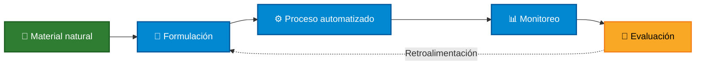
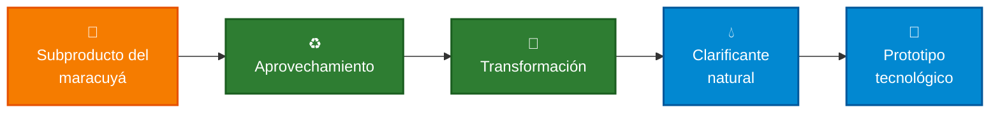
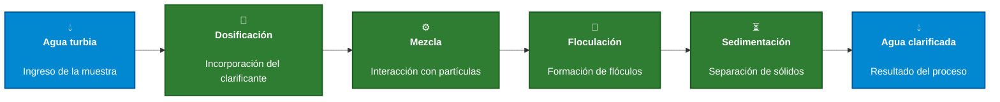
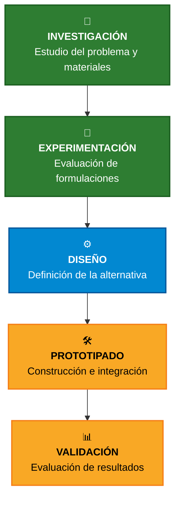

  

  

  <b>🌱 Ingeniería Ambiental</b> &nbsp;•&nbsp;
  <b>💻 Ingeniería Informática</b> &nbsp;•&nbsp;
  <b>⚙️ Ingeniería Industrial</b>

  <b>Universidad Peruana Cayetano Heredia</b>

  
  
  

# 📑 Contenido

* [🌍 Sobre Nosotros](#-sobre-nosotros)
* [📸 Fotografía del Equipo](#-fotografía-del-equipo)
* [👥 Nuestro Equipo](#-nuestro-equipo)
* [💧 El Proyecto](#-el-proyecto)
* [🌎 El Contexto](#-el-contexto)
* [💡 Nuestra Propuesta](#-nuestra-propuesta)
* [✨ ¿Dónde está la innovación?](#-dónde-está-la-innovación)
* [♻️ Economía Circular](#️-economía-circular)
* [⚙️ Concepto del Sistema](#️-concepto-del-sistema)
* [🎯 Objetivos de Desarrollo Sostenible](#-objetivos-de-desarrollo-sostenible)
* [🧪 Hacia el Prototipo](#-hacia-el-prototipo)
* [🚀 Hacia dónde queremos llegar](#-hacia-dónde-queremos-llegar)
* [🎯 Nuestra Visión](#-nuestra-visión)

---

# 🌍 Sobre Nosotros

Somos el **Equipo 05** del curso **Proyecto Integrador 2026-II** de la **Universidad Peruana Cayetano Heredia**.

Nuestro equipo reúne estudiantes de diferentes áreas de ingeniería, integrando conocimientos para desarrollar una propuesta sostenible y tecnológica aplicada a un problema relacionado con la clarificación del agua.

### 🌱 Ambiente  •  🧪 Investigación  •  💻 Tecnología  •  ⚙️ Automatización

Nuestro proyecto parte de una idea:

## ¿Cómo podemos aprovechar recursos naturales y tecnología para explorar nuevas alternativas en la clarificación del agua?

---

# 📸 Fotografía del Equipo

  

  <i>Equipo 05 · Proyecto Integrador 2026-II</i>

---

# 👥 Nuestro Equipo

  <i>Diferentes conocimientos. Un mismo objetivo.</i>

| Foto                                                                                                                             | Integrante                  | Rol                        | Intereses                                      |
| -------------------------------------------------------------------------------------------------------------------------------- | --------------------------- | -------------------------- | ---------------------------------------------- |
|  | **Marcelo Alarcón Camones** | 👑 Líder del equipo        | Innovación social, sostenibilidad, modelado 3D |
|    | **Brad Cárdenas Parián**    | 🔎 Investigación           | Diseño de aplicaciones, análisis de datos      |
|                           | **Leonel Urbano Castillo**  | 🎨 Diseño                  | Diseño de prototipos, modelado 3D              |
|                           | **Idania Parhuay Meza**     | 📝 Documentación           | Comunicación científica, redacción técnica     |
|       | **Gael Milla Fasabi**       | 💻 Programación / Modelado | Programación, documentación de hallazgos       |

---

# 💧 El Proyecto

## Clarificador de agua natural a base de maracuyá y quitosano

### De los recursos naturales a una solución tecnológica

Nuestra propuesta busca explorar el desarrollo de un **sistema de clarificación de agua** utilizando materiales naturales relacionados con el **maracuyá y el quitosano**.

El proyecto no busca quedarse únicamente en la experimentación de un clarificante.

La idea es avanzar progresivamente hacia un sistema capaz de:

### 🧪 Formular  →  ⚙️ Procesar  →  📊 Monitorear  →  🔬 Evaluar

---

# 🌎 El Contexto

El proyecto nace a partir de dos aspectos principales:

### 💧 La necesidad de explorar alternativas sostenibles para la clarificación del agua.

### ♻️ El potencial de aprovechamiento de subproductos y recursos de origen natural.

Nuestra propuesta busca estudiar el potencial del **maracuyá y el quitosano** como parte de una formulación clarificante, tomando como punto de partida investigaciones relacionadas con sus propiedades y aplicaciones en el tratamiento del agua.

  

---

# 💡 Nuestra Propuesta

Buscamos llevar esta idea más allá de un experimento de laboratorio.

La propuesta consiste en explorar el desarrollo de un **clarificante natural** y, posteriormente, integrarlo dentro de un **prototipo tecnológico** que permita realizar y monitorear el proceso de clarificación.

El proyecto se encuentra en una etapa inicial, por lo que:

* 🧪 La formulación será definida mediante investigación y experimentación.
* ⚙️ El proceso será evaluado y optimizado progresivamente.
* 🤖 El nivel de automatización será definido según la viabilidad técnica.
* 📊 Los resultados serán analizados mediante las variables seleccionadas para el proyecto.

> **La investigación define la formulación. La experimentación define el proceso. El prototipado conecta ambos con la tecnología.**

---

# ✨ ¿Dónde está la innovación?

La innovación no se encuentra únicamente en utilizar un material natural.

Se encuentra en **integrar diferentes elementos dentro de una misma propuesta**:

* 🌱 Aprovechamiento de recursos naturales.
* 🧪 Experimentación científica.
* ♻️ Enfoque de economía circular.
* ⚙️ Automatización del proceso.
* 📊 Monitoreo de variables.
* 💻 Integración de tecnología.

### De un proceso experimental...

### ...hacia una solución tecnológica

  

> **Buscamos transformar conocimiento científico en una propuesta tangible, medible y progresivamente automatizable.**

---

# ♻️ Economía Circular

## 🍊 De residuo a recurso

El proyecto incorpora un enfoque de aprovechamiento y valorización de materiales.

### 🌱 Un material con potencial de aprovechamiento

⬇️

### 🧪 Una transformación basada en investigación

⬇️

### 💧 Un clarificante natural

⬇️

### 🤖 Una propuesta tecnológica

---

# ⚙️ Concepto del Sistema

Como primera aproximación, imaginamos un sistema capaz de integrar diferentes etapas del proceso de clarificación.

| Etapa                      | Función                                     |
| -------------------------- | ------------------------------------------- |
| 💧 **1. Agua turbia**      | Ingreso de la muestra al sistema            |
| 🧪 **2. Dosificación**     | Incorporación controlada del clarificante   |
| ⚙️ **3. Mezcla**           | Favorecer la interacción con las partículas |
| 🔄 **4. Floculación**      | Favorecer la formación de flóculos          |
| ⏳ **5. Sedimentación**     | Permitir la separación de sólidos           |
| 💧 **6. Agua clarificada** | Obtención de la muestra después del proceso |

> **Este esquema representa nuestro concepto inicial. La configuración final del sistema dependerá de los resultados obtenidos durante la investigación, experimentación y diseño del prototipo.**

---

# 🎯 Objetivos de Desarrollo Sostenible

El proyecto se relaciona principalmente con los siguientes Objetivos de Desarrollo Sostenible:

| ODS            | Objetivo                              | Relación con el proyecto                                                                                                        |
| -------------- | ------------------------------------- | ------------------------------------------------------------------------------------------------------------------------------- |
| 💧 **ODS 6**   | **Agua limpia y saneamiento**         | Relacionado directamente con la exploración de alternativas para la mejora de procesos de clarificación y tratamiento del agua. |
| ♻️ **ODS 12**  | **Producción y consumo responsables** | Vinculado con el aprovechamiento de recursos y posibles subproductos para generar una propuesta de mayor valor.                 |
| 🌡️ **ODS 13** | **Acción por el clima**               | Complementa el proyecto mediante un enfoque de sostenibilidad y sensibilización ambiental.                                      |

## 🎯 Priorización

### 💧 ODS 6 — Eje principal

El proyecto se centra en explorar alternativas relacionadas con la clarificación y mejora de procesos vinculados con la calidad del agua.

### ♻️ ODS 12 — Economía circular

Se relaciona con la posibilidad de aprovechar materiales naturales y dar valor a posibles subproductos.

### 🌡️ ODS 13 — Sostenibilidad

Complementa la propuesta mediante una visión orientada al desarrollo de soluciones tecnológicas con enfoque ambiental.

  
  
  

---

# 🧪 Hacia el Prototipo

## Del concepto a una demostración funcional

La propuesta busca evolucionar progresivamente desde la investigación hasta un **prototipo funcional y validable**.

---

# 🚀 Hacia dónde queremos llegar

Buscamos desarrollar progresivamente una propuesta que conecte diferentes áreas:

### 🔬 Ciencia

Comprender y evaluar el comportamiento de los materiales utilizados.

### 💡 Innovación

Explorar nuevas formas de integrar recursos naturales dentro de una solución.

### ♻️ Economía circular

Investigar el aprovechamiento y valorización de materiales.

### 🤖 Tecnología

Automatizar y monitorear etapas del proceso.

### 📊 Validación

Analizar los resultados obtenidos mediante experimentación.

---

# 🌱 ¿Qué buscamos aportar?

El proyecto busca conectar:

## 🔬 Ciencia + 💡 Innovación + ♻️ Economía Circular + 🤖 Tecnología

Con ello buscamos:

* 💧 Explorar una alternativa natural para la clarificación del agua.
* ♻️ Investigar el potencial de aprovechamiento de materiales derivados del maracuyá.
* 🧪 Evaluar experimentalmente diferentes formulaciones y condiciones.
* 🤖 Explorar la automatización y el monitoreo del proceso.
* 💡 Transformar conocimiento científico en una propuesta tangible.
* 🌎 Generar una solución con potencial de impacto ambiental y tecnológico.

---

# 🎯 Nuestra Visión

> **Transformar el potencial del maracuyá y el quitosano en una solución tecnológica sostenible para la clarificación del agua, avanzando desde la investigación científica hacia el desarrollo de un producto y un prototipo funcional.**

 

## 🌱 RECURSO NATURAL

### ↓

## 🧪 CLARIFICANTE

### ↓

## ⚙️ PROTOTIPO

### ↓

## 💧 SOLUCIÓN TECNOLÓGICA

---

### 🌱 Equipo 05 · Proyecto Integrador 2026-II

**Universidad Peruana Cayetano Heredia**

