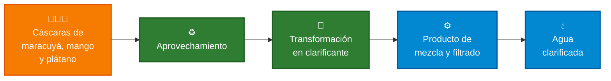
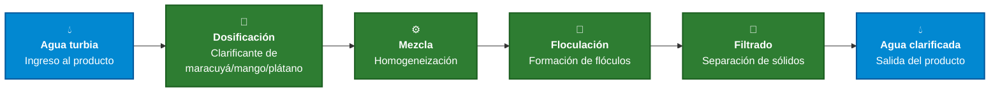
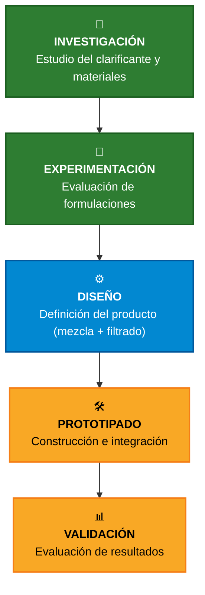

  

  

  <b>🌱 Ingeniería Ambiental</b> &nbsp;•&nbsp;
  <b>💻 Ingeniería Informática</b> &nbsp;•&nbsp;
  <b>⚙️ Ingeniería Industrial</b>

  <b>Universidad Peruana Cayetano Heredia</b>

  
  
  

# 📑 Contenido

* [🌍 Sobre Nosotros](#-sobre-nosotros)
* [📸 Fotografía del Equipo](#-fotografía-del-equipo)
* [👥 Nuestro Equipo](#-nuestro-equipo)
* [💧 El Proyecto](#-el-proyecto)
* [🌎 El Contexto](#-el-contexto)
* [💡 Nuestra Propuesta](#-nuestra-propuesta)
* [✨ ¿Dónde está la innovación?](#-dónde-está-la-innovación)
* [♻️ Economía Circular](#️-economía-circular)
* [⚙️ Concepto del Sistema](#️-concepto-del-sistema)
* [🎯 Objetivos de Desarrollo Sostenible](#-objetivos-de-desarrollo-sostenible)
* [🧪 Hacia el Prototipo](#-hacia-el-prototipo)
* [🚀 Hacia dónde queremos llegar](#-hacia-dónde-queremos-llegar)
* [🎯 Nuestra Visión](#-nuestra-visión)

---

# 🌍 Sobre Nosotros

Somos el **Equipo 05** del curso **Proyecto Integrador 2026-II** de la **Universidad Peruana Cayetano Heredia**.

Nuestro equipo reúne estudiantes de diferentes áreas de ingeniería, integrando conocimientos para desarrollar una propuesta sostenible y tecnológica aplicada a un problema relacionado con la clarificación del agua.

### 🌱 Ambiente  •  🧪 Investigación  •  💻 Tecnología  •  ⚙️ Automatización

Nuestro proyecto parte de una idea:

## ¿Cómo podemos diseñar un producto que facilite la mezcla y el filtrado de un clarificante natural elaborado a partir de cáscaras de maracuyá, mango y plátano?

---

# 📸 Fotografía del Equipo

  

  <i>Equipo 05 · Proyecto Integrador 2026-II</i>

---

# 👥 Nuestro Equipo

  <i>Diferentes conocimientos. Un mismo objetivo.</i>

| Foto                                                                                                                             | Integrante                  | Rol                        | Intereses                                      |
| -------------------------------------------------------------------------------------------------------------------------------- | --------------------------- | -------------------------- | ---------------------------------------------- |
|  | **Marcelo Alarcón Camones** | 👑 Líder del equipo        | Innovación social, sostenibilidad, modelado 3D |
|    | **Brad Cárdenas Parián**    | 🔎 Investigación           | Diseño de aplicaciones, análisis de datos      |
|                           | **Leonel Urbano Castillo**  | 🎨 Diseño                  | Diseño de prototipos, modelado 3D              |
|                           | **Idania Parhuay Meza**     | 📝 Documentación           | Comunicación científica, redacción técnica     |
|       | **Gael Milla Fasabi**       | 💻 Programación / Modelado | Programación, documentación de hallazgos       |

---

## 💧 El Proyecto
### Producto para el filtrado y mezcla de un clarificante a base de cáscara de maracuyá, mango y plátano
De los residuos de fruta a un producto tecnológico
 
Nuestra propuesta consiste en diseñar y desarrollar un **producto** —no solo una fórmula— capaz de facilitar dos etapas críticas del proceso de clarificación del agua:
 
1. 🧪 **Mezcla**: dosificar y disolver de forma homogénea el polvo clarificante obtenido de cáscaras de maracuyá, mango y plátano en el agua a tratar.
2. 🧹 **Filtrado**: separar de manera práctica los flóculos y residuos sólidos generados tras la coagulación, entregando agua clarificada lista para su siguiente uso.
El proyecto no busca quedarse en la experimentación del clarificante en sí, sino resolver el problema práctico de **cómo un usuario final mezcla y filtra** esa solución de forma sencilla, segura y repetible.
 
🧪 Formular → ⚙️ Mezclar → 🧹 Filtrar → 📊 Evaluar

### 🧪 Formular  →  ⚙️ Procesar  →  📊 Monitorear  →  🔬 Evaluar

---
## 🌎 El Contexto
El proyecto nace de dos aspectos principales:
 
- 💧 La necesidad de un producto accesible que facilite la aplicación de clarificantes naturales, ya que hoy la mayoría de estas fórmulas se prueban solo en laboratorio (jar test) y no llegan a un producto usable.
- ♻️ El potencial de aprovechamiento de subproductos como las cáscaras de maracuyá, mango y plátano, que normalmente se desechan como residuo orgánico.
Diversos estudios respaldan el uso de cáscaras de fruta como coagulantes naturales para el tratamiento de agua. Por ejemplo, un estudio encontró que las cáscaras de mango lograron un 92.7% de remoción de turbidez, superando al alumbre, que alcanzó un 79.2%, usando NaOH 2.0M como solvente óptimo y una dosis de 110 mg/L a pH 2; el mismo estudio reportó que las cáscaras de plátano fueron las que produjeron mayor rendimiento de coagulante, con un 37.4%. Para el caso del maracuyá, una investigación sobre pectina extraída de residuos de fruta reportó que la pectina derivada de maracuyá alcanzó una eficiencia de remoción de turbidez del 67.6%, resultado que respalda su uso como parte de una formulación coagulante.

  

---
## 💡 Nuestra Propuesta
Buscamos llevar esta idea más allá de un experimento de laboratorio.
 
La propuesta consiste en desarrollar un **producto físico** que permita a una persona sin conocimientos técnicos:
- Dosificar el clarificante en polvo (a base de maracuyá, mango y plátano) en una cantidad de agua determinada.
- Mezclar la solución de forma uniforme, favoreciendo la coagulación-floculación.
- Filtrar el agua resultante, separando los flóculos formados del agua clarificada.
El proyecto se encuentra en una etapa inicial, por lo que:
- 🧪 La formulación (proporción de cáscaras y método de extracción) será definida mediante investigación y experimentación.
- ⚙️ El mecanismo de mezcla y filtrado será evaluado y optimizado progresivamente.
- 🤖 El nivel de automatización será definido según la viabilidad técnica.
- 📊 Los resultados serán analizados mediante variables como turbidez (NTU), tiempo de sedimentación y facilidad de uso.
La investigación define la formulación. La experimentación define el proceso. **El producto conecta la mezcla y el filtrado con el usuario final.**
 
---
## 📚 Respaldo Científico
Estas fuentes respaldan la efectividad del uso de cáscaras de fruta como clarificante natural y sirven de comparación frente a otros coagulantes:
 
- **Potential of Fruit Peels in Becoming Natural Coagulant for Water Treatment** (Int. J. Integrated Engineering, Vol. 11 No. 1, 2019): comparó cáscaras de plátano, naranja y mango frente al alumbre, encontrando que el mango con NaOH 2.0M logró 92.7% de remoción de turbidez frente a 79.2% del alumbre. Enlace: https://journal.uthm.edu.my/index.php/ijie/issue/view/208
- **Fruit Waste-Sourced Pectin as Natural Co-Coagulant** (Cellulose Chemistry and Technology, 2025): reporta remociones de turbidez de 58.1% con naranja, 67.6% con maracuyá y 83.8% con manzana, usando pectina extraída de las cáscaras.
- **Citrus fruit peel waste as a source of natural coagulant for water turbidity removal** (IOPscience / ResearchGate, 2019): estudio comparativo entre dos variedades de cítricos, con remociones de turbidez de 75.6% y 74%, que confirma que distintas cáscaras de fruta pueden sustituir coagulantes químicos.
---
## ✨ ¿Dónde está la innovación?
La innovación no se encuentra únicamente en utilizar un material natural, sino en el **producto** que permite aplicarlo:
- 🌱 Aprovechamiento de cáscaras de maracuyá, mango y plátano como residuo.
- 🧪 Formulación basada en evidencia científica.
- ⚙️ Un mecanismo simple de mezcla y dosificación.
- 🧹 Un sistema de filtrado integrado y reutilizable.
- ♻️ Enfoque de economía circular.
- 📊 Monitoreo de variables del proceso.

### De un proceso experimental...

 
Buscamos transformar un residuo agrícola en un producto tangible, medible y de uso práctico.
 
## ♻️ Economía Circular
🍊🥭🍌 De residuo a recurso
 

 
## ⚙️ Concepto del Sistema
Como primera aproximación, imaginamos un **producto** que integre las etapas de dosificación, mezcla y filtrado.
 

 
## 🧾 Lista de Exigencias del Producto
Estas exigencias se refieren **únicamente al diseño del producto** (presentación, tamaño, componentes y mecanismo), no a la efectividad del clarificante en sí.
 
| Exigencia | Descripción | Fuente / justificación |
|---|---|---|
| 📦 Presentación en polvo dosificable | El clarificante debe presentarse en polvo, similar a un sachet o cartucho, para facilitar su dosificación y almacenamiento | Diseños de coagulantes naturales en polvo dosificados por peso (g/L o mg/L) para su aplicación práctica en el hogar mezclando la pasta o polvo con una cantidad definida de agua limpia y agitando para activar el coagulante |
| ⚖️ Tamaño de dosis por unidad de agua | El producto debe incluir una medida o cartucho calibrado para tratar un volumen fijo de agua (p. ej. 1 L o 20 L) | Estudios de dosificación de coagulantes naturales trabajan en rangos de 0.1 a 0.6 g por 500 ml, lo que exige que el producto incluya un sistema de medición precisa |
| 🌀 Componente de agitación/mezcla | El producto debe incorporar un mecanismo de agitación (manual o motorizado) que garantice la dispersión uniforme del clarificante | Patentes de purificadores portátiles incluyen una pala mezcladora accionada por manivela o motor para asegurar la dispersión del coagulante |
| 🧹 Componente de filtrado integrado | El producto debe incluir una etapa de filtrado (malla, cono o cartucho filtrante) para separar los flóculos del agua tratada | Diseños de purificadores portátiles usan un filtro cónico moldeado en el interior del contenedor, con salida por succión |
| 🧴 Tamaño portátil y de uso doméstico | El producto debe ser compacto y manejable por una sola persona, orientado a uso doméstico o comunitario, no industrial | Contraste con sistemas industriales de gran escala, que usan tanques desde varios pies de diámetro y bombas de alto volumen, inadecuados para uso doméstico |
| ⏱️ Tiempo de mezcla y sedimentación definidos | El producto debe especificar tiempos de agitación y reposo, alineados a lo validado experimentalmente | Protocolos de coagulación natural usan agitación a 120 rpm durante 1 minuto y sedimentación de hasta 24 horas como referencia de proceso |
| 🧩 Materiales seguros para contacto con agua potable | Los componentes del producto (contenedor, filtro, mezclador) deben ser de materiales aptos para agua de consumo | Requisito derivado de diseños de purificadores portátiles domésticos, que priorizan materiales plásticos duros aptos para uso alimentario |
| 💰 Bajo costo y accesibilidad | El producto debe mantener un costo bajo frente a alternativas químicas o industriales | Diseños de tratamiento portátil con coagulante natural han demostrado ser menos costosos que otros tratamientos de agua residual existentes |
 
## 🎯 Objetivos de Desarrollo Sostenible
| ODS | Objetivo | Relación con el proyecto |
|---|---|---|
| 💧 ODS 6 | Agua limpia y saneamiento | Relacionado directamente con el desarrollo de un producto que facilite el acceso a procesos de clarificación del agua |
| ♻️ ODS 12 | Producción y consumo responsables | Vinculado con el aprovechamiento de cáscaras de maracuyá, mango y plátano como subproducto de valor |
| 🌡️ ODS 13 | Acción por el clima | Complementa el proyecto mediante un enfoque de sostenibilidad y sensibilización ambiental |
 
### 🎯 Priorización
- 💧 **ODS 6 — Eje principal**: el producto se centra en facilitar procesos de clarificación y mejora de la calidad del agua.
- ♻️ **ODS 12 — Economía circular**: aprovechamiento de residuos de maracuyá, mango y plátano.
- 🌡️ **ODS 13 — Sostenibilidad**: visión orientada al desarrollo de soluciones tecnológicas con enfoque ambiental.
## 🧪 Hacia el Prototipo
Del concepto a una demostración funcional. La propuesta busca evolucionar progresivamente desde la investigación del clarificante hasta un **producto** prototipo funcional y validable.
 

 
## 🚀 Hacia dónde queremos llegar
- 🔬 **Ciencia**: comprender y evaluar el comportamiento del clarificante de maracuyá, mango y plátano.
- 💡 **Innovación**: diseñar un producto que facilite su mezcla y filtrado.
- ♻️ **Economía circular**: investigar el aprovechamiento de cáscaras como subproducto.
- 🤖 **Tecnología**: automatizar y monitorear el proceso de mezcla y filtrado.
- 📊 **Validación**: analizar los resultados obtenidos mediante experimentación.
### 🌱 ¿Qué buscamos aportar?
- 💧 Un producto accesible para la clarificación de agua con base natural.
- ♻️ Aprovechamiento del potencial de cáscaras de maracuyá, mango y plátano.
- 🧪 Evaluación experimental de distintas formulaciones y condiciones.
- 🤖 Exploración de automatización y monitoreo del proceso.
- 💡 Transformación de conocimiento científico en un producto tangible.
- 🌎 Generación de una solución con impacto ambiental y tecnológico.
## 🎯 Nuestra Visión
Transformar el potencial de las cáscaras de maracuyá, mango y plátano en un **producto** tecnológico sostenible que facilite la mezcla y el filtrado en la clarificación del agua, avanzando desde la investigación científica hacia un prototipo funcional.
 
🌱 CÁSCARAS DE FRUTA → 🧪 CLARIFICANTE → ⚙️ PRODUCTO (MEZCLA + FILTRADO) → 💧 AGUA CLARIFICADA
### 🌱 Equipo 05 · Proyecto Integrador 2026-II

**Universidad Peruana Cayetano Heredia**

